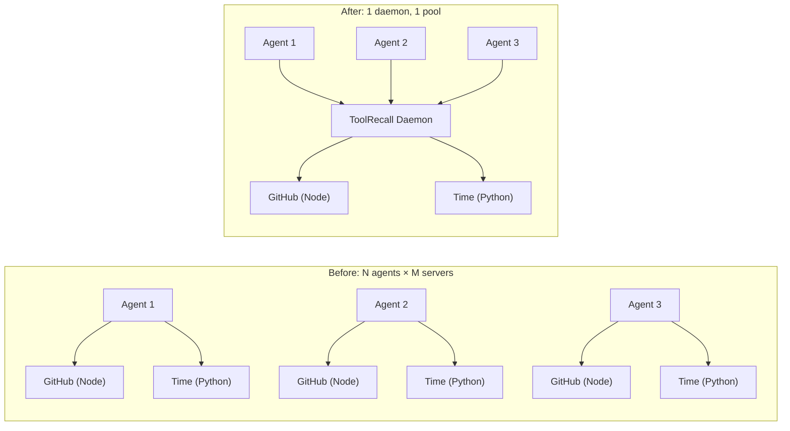
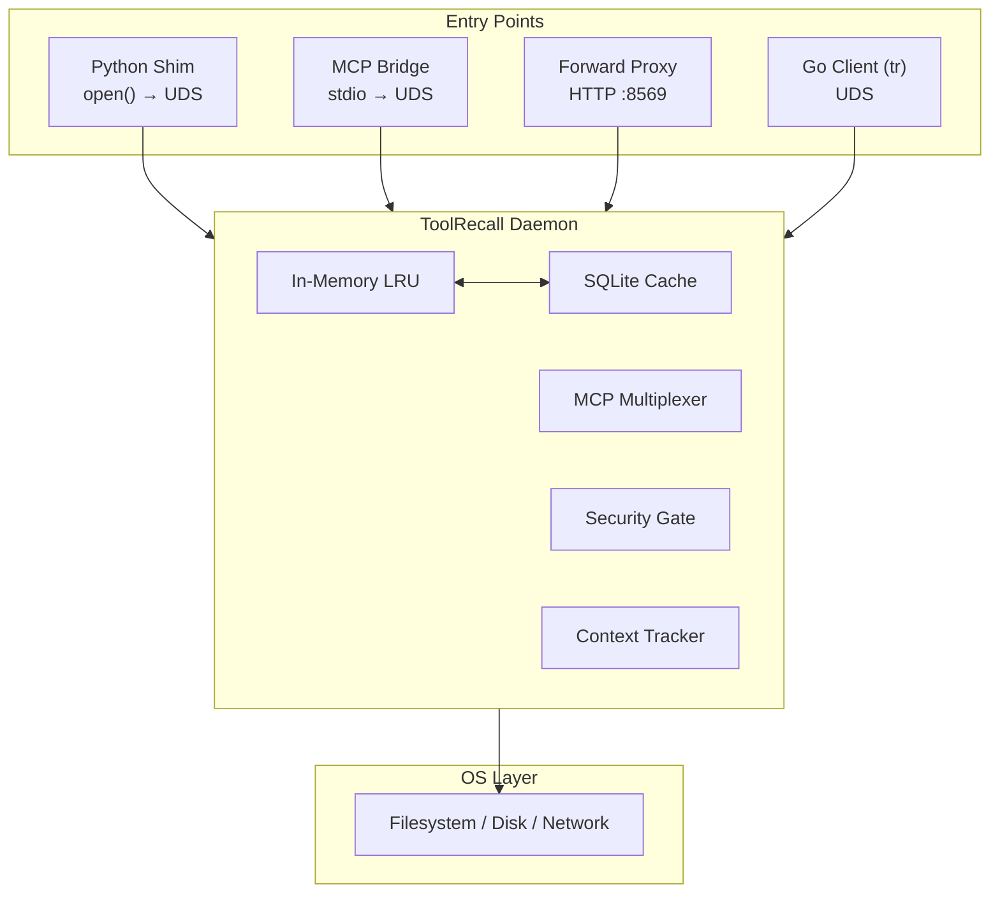

# ToolRecall — Deterministic Execution Layer for Agent Tools

You run agents. Every session spawns its own MCP servers, every test run hits live APIs, every tool call is unrepeatable, and your agent can read `~/.ssh` if it feels like it.

ToolRecall is one shared daemon that pools your MCP servers, records and replays tool results, caches repeated API calls, and enforces filesystem/terminal policy for any agent framework.

**One warm daemon instead of five cold Node processes — and 1 tick instead of 4 for cache hits.** ~132 KB install. Python 3.11+ stdlib only.

```bash
pipx install toolrecall
toolrecall setup          # One-shot: config → systemd → daemon start
# Done — all agents on this machine now share one MCP pool
```

> **Zero config mode:** Every `toolrecall` command (`status`, `mcp`, `serve`, etc.) auto-starts the daemon if it isn't running. You never need to think about it.

---

## What ToolRecall Actually Solves

The table below ranks features by real, defensible value — not by how often they're used in a session, but by how much pain they solve that nothing else does.

| Priority | Feature | What it solves | Competition |
|----------|---------|---------------|-------------|
| **1** | **MCP Multiplexer** | One shared, persistent pool of MCP servers across all agent sessions instead of N Node processes per session. 5 Claude Code sessions + 3 Cursor instances = 8× the RAM for the same tools. | Nobody in the MCP ecosystem has a good answer. |
| **2** | **Replay Mode** | Record an agent session's tool results, re-run it deterministically in CI. Agent developers currently cannot write reliable tests — flaky tools and non-deterministic APIs make CI for agents nearly impossible. | No incumbent. |
| **3** | **Forward API Proxy** | Repeated identical LLM calls cost $0 in dev/CI loops. Every byte-identical request returns from local cache — no API call, no token cost. | Proxy-only tools exist, but none integrated with MCP multiplexing + replay. |
| **4** | **Security Gate** | A policy layer (path allowlist, terminal allowlist, sensitive-file blocklist) that sits between *any* agent and the machine. Framework-independent, works even with caching disabled. | Most agent frameworks have weak or no sandboxing. |
| **5** | **MCP Result Caching** | Legitimate for slow, idempotent external calls (search, fetch, docs). | Standalone, no daemon sharing. |
| **6** | **File / Terminal Cache** | Marginal for most workflows (microseconds saved on operations that were never the bottleneck). Useful when paired with the Context Tracker. | Many tools cache file reads. |

The strategic error in most tool-caching tools is leading with #6 and burying #1–#4. ToolRecall is not a faster `open()` — it's a deterministic tool layer.

---

## Quickstart — MCP Bridge (the wedge feature)

Connect **any MCP agent** by registering one server. That one server gives your agent access to all multiplexed MCP servers, caching, and security — with zero per-agent configuration.

```json
// ~/.claude/settings.json  or  ~/.cursor/mcp.json  or  ~/.config/cline/mcp_settings.json
{
  "mcpServers": {
    "toolrecall": {
      "command": "toolrecall",
      "args": ["mcp"]
    }
  }
}
```

**Before ToolRecall:** 5 agents × 3 MCP servers each = 15 cold Node processes, ~25 MB RAM per server.
**After ToolRecall:** 5 agents × 1 `toolrecall mcp` endpoint = 3 warm subprocesses, shared across all agents.



```toml
# ~/.config/toolrecall/toolrecall.toml
[mcp_multiplex]
servers = ["time", "github", "fetch"]
```

- **Lazy loading:** servers boot on first call, not at daemon start (~0.01s vs ~1.7s per server)
- **Idle timeout:** inactive subprocesses killed after 15 min (configurable)
- **Failure isolation:** one server crash doesn't affect others (auto-reconnect, max 3 attempts)
- **Auto-resolution:** Server names auto-resolve from the built-in registry — no `command`/`args` needed for common servers

See [MCP Multiplexer](docs/MCP_MULTIPLEXER.md) for full configuration, built-in servers, and external server setup.

---

## Replay Mode — Deterministic CI for Agents

The hardest problem in agent development is testing. Tool results are non-deterministic, network-dependent, and change between runs. Replay mode solves this:

```python
# Record a session
toolrecall replay record --output session.json

# Re-run it in CI — same inputs, same outputs, every time
toolrecall replay run session.json
```

On replay, every `cached_read`, `cached_terminal`, and `cached_mcp_check` call returns the recorded result — no disk I/O, no network, no API calls. Your CI pipeline becomes deterministic.

```yaml
# .github/workflows/agent-test.yml
steps:
  - run: pipx install toolrecall
  - run: toolrecall daemon
  - run: toolrecall replay run recorded-session.json
  - run: pytest tests/agent_trajectory.py  # assert on transcript
```

See [Replay Mode](docs/REPLAY_MODE.md) for full documentation.

---

## Forward API Proxy — $0 Dev Loops

Cache full API responses before they leave your machine. The forward proxy starts **automatically** with the daemon — no extra command needed.

```bash
# Point any OpenAI-compatible SDK at the forward proxy
export OPENAI_BASE_URL=http://localhost:8569/v1
```

| Provider SDK | How to connect | Token savings |
|-------------|---------------|---------------|
| **Any OpenAI-compatible client** | Set base URL to `http://localhost:8569/v1` | **Zero tokens consumed** — cache hit never reaches the provider |
| **Custom port** | `toolrecall serve --port 9090` | Same |

Supported providers: OpenAI, Anthropic, Google Gemini, DeepSeek, xAI, Mistral, Groq, Together, OpenRouter. See [Forward Proxy](docs/FORWARD_PROXY.md) for the full provider list and usage examples.

---

## Security Gate

ToolRecall doesn't prevent prompt injection — it cages the consequences.

- **Path allowlist (default-deny):** No paths are readable without explicit config. `toolrecall init` prompts interactively.
- **Sensitive file blocklist:** `.env`, `.ssh/`, `.pem`, `.aws/`, etc. are blocked even inside allowed paths.
- **Terminal allowlist (default: off):** When enabled, only commands matching the regex allowlist can execute. `allow_terminal = false` means no shell access at all.
- **Fail-closed fallback:** If the daemon is unreachable, gated operations (terminal, writes, unrestricted reads) are refused — no silent fallback to unsafe behavior.
- **Daemon IPC via UDS:** No open ports on POSIX, immune to SSRF. The forward proxy listens on TCP `:8569` — intentional, separate from daemon transport.

```toml
# ~/.config/toolrecall/toolrecall.toml
[mcp]
allowed_paths = ["/home/user/projects"]  # Add your project dirs — default-deny!
allow_terminal = false
allow_invalidate = false
```

The security gate works standalone: set `caching = false` to use it as a pure policy layer with zero staleness risk. See [Security Architecture](SECURITY.md).

---

## Caching Semantics

ToolRecall caches are TTL-based with explicit opt-in per command. Nothing is cached implicitly — every cacheable pattern is declared in code.

| Mechanism | What gets cached | Invalidation | Notes |
|-----------|----------------|-------------|-------|
| **File cache** | First disk read per file | `mtime` changes → fresh read | Source of truth; cache reduces redundant reads within a turn |
| **Terminal cache** | Static commands only: `hostname`, `whoami`, `pwd`, `uname -a`, `uptime`, `free -h`, `df -h /`, `crontab -l` | TTL-based (300s default) | Dynamic commands (`git`, `ls`, `curl`) always execute live |
| **MCP cache** | External MCP server responses (GitHub, time, fetch…) | TTL-based (60s default, per-server override) | Only for idempotent, slow external calls |
| **Script/Code cache** | `cached_run`, `cached_exec` output | `ttl=0` disables caching | Opt-in per call |
| **Forward proxy** | Full API responses (chat completions to OpenAI, Anthropic, DeepSeek…) | Body hash — same request → same response | **Zero tokens consumed** — cache hit never reaches the provider |
| **Context Tracker** | Tracks dirty/clean files via checkpoints + auto-hint on every tool call | In-memory (resets on daemon restart) | Per-turn hints that tell your agent which files are safe to drop from context (advisory — effectiveness depends on the model) |

**ttl=0 bypass:** Pass `ttl=0` to any cached function to execute fresh every time. No cache lookup, no storage. Three docs sections confirm this behavior.

### Measured effect

In a 13-hour session (Hermes + Gemini 3.1 Pro, 386 messages, 13 project files):

- **89% hit rate** (91% file cache): 827 tool calls served from SQLite instead of OS
- **73% fewer file-read tokens** at 3× re-read (~204K → ~55K unique)
- **~20 min less wait time** — each cache hit avoids ~1.5s subprocess fork
- **Provider prefix-caching** becomes reliable: byte-identical payloads qualify for Anthropic/OpenAI's up-to-90% discount on every call

Source: [Benchmark](docs/BENCHMARK.md)

---

## Agent Integration

ToolRecall provides three integration layers. Choose the one that fits your workflow.

### Layer 1: MCP Bridge (recommended, any MCP agent)

Register one MCP server in your agent config. All multiplexed servers, caching, and security are available through it. See [Quickstart](#quickstart--mcp-bridge-the-wedge-feature) above.

**Hermes Agent:** Hermes already ships with ToolRecall built in — the tools `cached_read`, `cached_terminal`, `mcp_call`, etc. are available directly in your toolset.

**Aider:**
```bash
aider --mcp-toolrecall
```

### Layer 2: Go Client (`tr` binary) — any language or shell

The `tr` binary connects directly to the ToolRecall daemon over UDS. Cached file reads, terminal commands, and status checks — all from the shell, no Python runtime needed.

```bash
tr read main.py            # Cached file read
tr cat /etc/os-release     # Alias for read
tr term "hostname"         # Cached terminal command
tr status                  # Daemon health & cache stats
tr ping                    # Fast connectivity check
tr read --bypass file.py   # Force fresh read
tr write /tmp/test.txt "hello"  # Write (invalidates cache)
```

Use it when: **herdr panes** (every agent in any pane uses `tr` directly), CI/CD pipelines, Rust/Ruby/Java agents, any shell script.

```bash
# Build from source
cd go-client && go build -o /usr/local/bin/tr .
```

See [Go Client](go-client/README.md) for full details.

### Layer 3: Python Shim (opt-in, experimental)

An opt-in `.pth` shim gives Python processes inside the ToolRecall environment transparent caching of `open()` and `subprocess.run()` — no code changes needed.

```bash
toolrecall shim --install     # Enable .pth shim (opt-in)
```

- **Known caveats:** The shim patches `builtins.open()` and `subprocess.run()` globally. StringIO and subprocess matching may have edge cases. See [Agent Compatibility](docs/AGENT_COMPATIBILITY.md) for details.
- **Scope:** Only affects Python processes running inside the ToolRecall environment (pipx-installed). Node.js agents (Claude Code, Codex CLI, OpenCode) are unaffected by the shim.

> ⚠️ **Claude Code users:** Adding ToolRecall as an MCP server can cause stale-state issues in code edit loops. See [Agent Compatibility](docs/AGENT_COMPATIBILITY.md) before configuring.

---

## Architecture



**Daemon layer:** Holds the hybrid in-memory LRU + SQLite WAL cache, the MCP Multiplexer (manages subprocesses for external MCP servers), the Forward Proxy (caches full API responses via body hash), and the Security Gate (path allowlist, terminal allowlist, sensitive file blocklist).

**How they work together:**
1. **Agent** calls `cached_read()` via MCP → Daemon → returns cached bytes or reads from disk
2. **Python process** with shim calls `open("file.py")` → Shim intercepts → `cached_read()` via Daemon UDS → same cache
3. **Any SDK** sends API request to `localhost:8569` → Forward Proxy hashes body → checks same SQLite cache
4. **Shell script** runs `tr read file.py` → binary connects via UDS → same cache

---

## One-Time Setup

ToolRecall should be installed once per machine, then it works transparently for all agents.

```bash
pipx install toolrecall         # installs CLI + daemon
toolrecall setup                # config → systemd service → daemon start
```

### What `toolrecall setup` does

| Step | Details |
|------|---------|
| **Config** | Creates `~/.config/toolrecall/toolrecall.toml` with default-deny security |
| **Systemd** | Generates `~/.config/systemd/user/toolrecall-daemon.service` (enables auto-restart) |
| **Daemon** | Starts the cache daemon (background process with LRU + SQLite) |

### What happens on every CLI command

Every `toolrecall` command that needs the daemon (`status`, `mcp`, `serve`, `stats`, etc.) automatically:

1. **Checks if the daemon is running** — auto-starts it if not

This means you can run `toolrecall status` on a fresh install and it "just works" — no extra steps.

### Daemon auto-start (fallback chain)

| Try | Method | When |
|-----|--------|------|
| 1 | `systemctl --user start toolrecall-daemon` | Linux with systemd |
| 2 | `os.fork()` + `run_daemon()` | Docker, macOS, Codespaces |
| 3 | `subprocess.DETACHED_PROCESS` | Windows |

---

## Quick Reference — CLI

```
toolrecall setup          One-shot: config + systemd service + daemon start  [required once]
toolrecall init           Create default config.toml and .env
toolrecall status         Cache status and stats               [auto-starts daemon]
toolrecall stats          Detailed cache statistics (JSON)     [auto-starts daemon]
toolrecall invalidate     Clear all caches                     [auto-starts daemon]
toolrecall restart        Health check + clean daemon restart  [auto-starts daemon]
toolrecall mcp            Start MCP Bridge                     [auto-starts daemon]
toolrecall serve          Forward proxy (cache API responses)  [auto-starts daemon]
toolrecall serve --port 9000  Forward proxy on custom port
toolrecall debug          Start debug/demo server              [auto-starts daemon]
toolrecall index          Build/update FTS5 knowledge database [auto-starts daemon]
toolrecall config-set     Set a config value
toolrecall daemon         Start/stop/manage cache daemon
toolrecall shim           Install/uninstall OS-level cache shim (.pth file)
toolrecall nginx          Generate nginx config
```

---

## Configuration

TOML (stdlib `tomllib`) or YAML (optional, requires `pyyaml`).

```toml
# ~/.config/toolrecall/toolrecall.toml (created by toolrecall init)
[norm]
# Cache key normalization (v0.9.0) — deterministic JSON sorting + noise stripping.
# When enabled, tool call arguments are normalized before cache key generation:
# keys sorted, whitespace stripped, timestamps/session IDs removed.
# This broadens cache hits when agents rephrase or reorder arguments.
# ⚠️ Changes existing cache keys — existing entries become orphans.
enabled = false

[mcp]
allowed_paths = ["/home/user/projects"]  # Add your project dirs — default-deny!
allow_terminal = false
allow_invalidate = false

[cache]
# Terminal cache default TTL (seconds) — commands matching the terminal
# command allowlist will be cached for this duration.
terminal_default_ttl = 60

[mcp_multiplex]
enabled = true
servers = ["time", "sequential-thinking"]

[forward_proxy]
# Forward proxy starts on :8569 automatically with the daemon
```

`TOOLRECALL_*` environment variables override TOML.

---

## Platform Support

| Platform | Transport | Status |
|----------|-----------|--------|
| **Linux** | Unix Domain Sockets | ✅ Tested in CI |
| **macOS** | Unix Domain Sockets | ✅ Should work (POSIX). Not in CI. |
| **Windows** | TCP localhost:8568 fallback | ⚠️ Experimental — not in CI |

---

## Contributing

```bash
git clone https://github.com/whiskybeer/toolrecall.git
cd toolrecall
make setup      # one-time: install dev deps
make test       # run tests
make check      # lint + format check
```

See the [Testing Guide](docs/TESTING.md) and [Makefile](./Makefile) for all targets.

## Uninstall

```bash
systemctl --user stop toolrecall-daemon
systemctl --user disable toolrecall-daemon
pipx uninstall toolrecall
rm -rf ~/.toolrecall ~/.config/toolrecall
```

---

## Documentation

- [Agent Compatibility](docs/AGENT_COMPATIBILITY.md) — per-agent value, config, and caveats
- [Architecture](docs/ARCHITECTURE.md) — daemon design, layers, IPC
- [Architecture Diagram](docs/ARCHITECTURE_DIAGRAM.md) — system and sequence diagrams, token costs, Context Tracker
- [CLI Reference](docs/CLI.md) — all subcommands explained
- [Configuration Reference](docs/CONFIG_REFERENCE.md) — config.toml, config.py, all env vars
- [Context Tracker](docs/CONTEXT_TRACKER.md) — checkpoint-based dirty-file tracking, O(n²) breakdown
- [How It Works](docs/HOW_IT_WORKS.md) — quick technical overview
- [MCP Multiplexer](docs/MCP_MULTIPLEXER.md) — single-daemon MCP management, server registry
- [Testing Guide](docs/TESTING.md) — test philosophy, organization, per-file coverage
- [Benchmark](docs/BENCHMARK.md) — measured performance, token savings
- [Real-Agent Debug Loop](docs/REAL_AGENT_BENCHMARK.md) — edit-heavy session benchmark
- [Knowledge DB](docs/KNOWLEDGE_DB.md) — FTS5 indexing guide
- [Normalizer](docs/NORMALIZER.md) — cache key normalization, deterministic JSON sorting
- [Replay Mode](docs/REPLAY_MODE.md) — record/replay tool calls for deterministic CI testing
- [Docker Deployment](docs/DOCKER.md) — containerized stack
- [Forward Proxy](docs/FORWARD_PROXY.md) — cache API responses by body hash, provider list, usage
- [Security Architecture](SECURITY.md) — policy gate details, trust boundary
- [Troubleshooting](docs/TROUBLESHOOTING.md) — common fixes
- [Appendix](docs/APPENDIX.md) — comparison tables, OSI model, ROI, vision, audit
- [Hermes Transparent Cache](docs/HERMES_TRANSPARENT_CACHE.md) — auto-patching for Hermes Agent
- **Framework Adapters:**
  - [Google ADK](docs/google-adk.md) — `@cached_tool` decorator + forward proxy + runtime patch
  - [LangChain / LangGraph](docs/langchain.md) — `ToolRecallCache` BaseCache + callback handler
  - [herdr](docs/herdr.md) — `tr` binary + MCP bridge for any agent in any pane