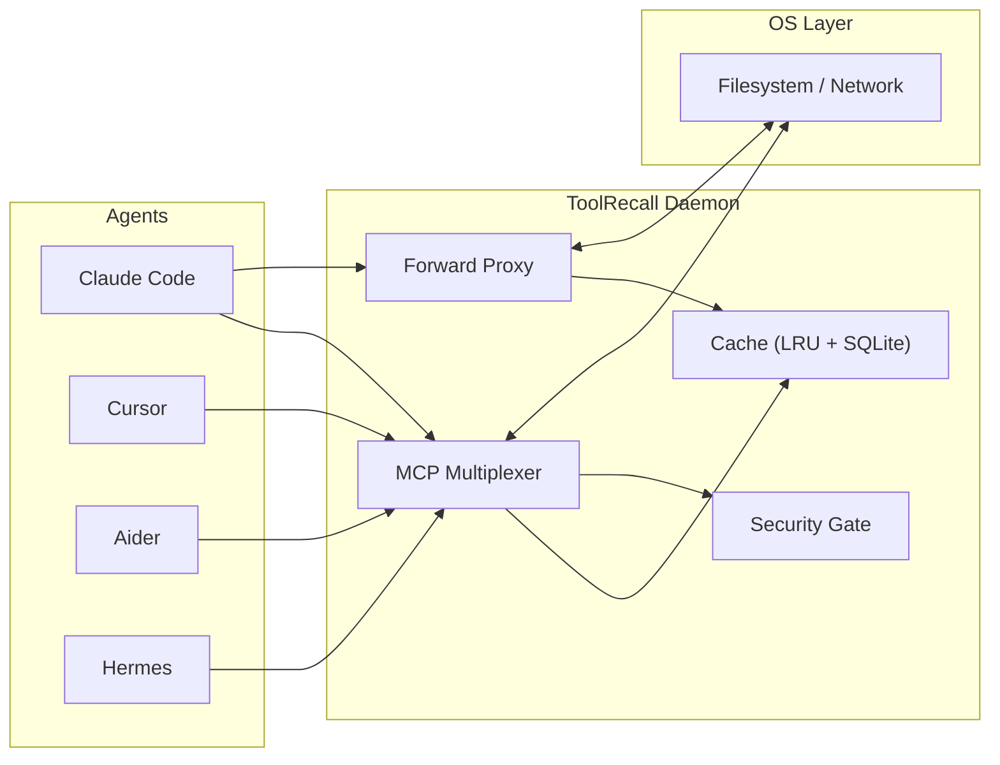

# ToolRecall — Deterministic Execution Layer for Agent Tools

You run agents. Every session spawns its own MCP servers, every test run hits live APIs, every tool call is unrepeatable, and your agent can read `~/.ssh` if it feels like it.

ToolRecall is one shared daemon that pools your MCP servers, records and replays tool results, caches repeated API calls, and enforces filesystem/terminal policy for any agent framework.

**One warm daemon instead of five cold Node processes.** ~132 KB install. Python 3.11+ stdlib only.

```bash
pipx install toolrecall
toolrecall setup          # One-shot: config -> systemd -> daemon start
```

> **Zero config mode:** Every `toolrecall` command auto-starts the daemon if it isn't running. You never need to think about it.

---

## Quickstart — MCP Bridge (30 seconds)

Connect any MCP agent by registering one server:

```json
// ~/.claude/settings.json  or  ~/.cursor/mcp.json  or  ~/.config/cline/mcp_settings.json
{
  "mcpServers": {
    "toolrecall": {
      "command": "toolrecall",
      "args": ["mcp"]
    }
  }
}
```

```toml
# ~/.config/toolrecall/toolrecall.toml
[mcp_multiplex]
servers = ["time", "github", "fetch"]
```

That's it. Your agent now has access to all multiplexed MCP servers, caching, and security — with zero per-agent configuration.

```
Before: 5 agents x 3 MCP servers = 15 cold Node processes, ~25 MB RAM per server
After:  5 agents x 1 toolrecall mcp = 3 warm subprocesses, shared across all agents
```

Features:
- **Lazy loading**: servers boot on first call, not at daemon start
- **Idle timeout**: inactive subprocesses killed after 15 min (configurable)
- **Failure isolation**: one server crash doesn't affect others (auto-reconnect)
- **Auto-resolution**: server names resolve from built-in registry

See [MCP Multiplexer](docs/MCP_MULTIPLEXER.md) for full configuration.

---

## What ToolRecall Does

| Feature | What it solves |
|---------|---------------|
| **MCP Multiplexer** | One shared pool of MCP servers instead of N processes per agent session |
| **Forward API Proxy** | Cache API responses by body hash — hit = zero tokens to provider |
| **Replay Mode** | Record agent sessions, replay deterministically in CI |
| **Security Gate** | Path allowlist, terminal policy, sensitive-file blocklist — any agent |
| **File / Terminal Cache** | Reduce redundant reads within a turn. Static commands only |
| **Context Tracker** | Track dirty/clean files, auto-hint agents what to drop from context |
| **Framework Adapters** | Drop-in wrappers for ADK, LangChain, herdr, Odysseus |

Full detail in [Architecture](docs/ARCHITECTURE.md).

---

## How It Works



One daemon, five access paths: Python client, MCP bridge, HTTP bridge, forward proxy, OS-level shim. All share one cache, one security gate, one multiplexer. See [Architecture](docs/ARCHITECTURE.md).

---

## When To Use It

| You want this... | Use this... |
|-----------------|-------------|
| Warm MCP servers across sessions | MCP Multiplexer |
| $0 dev loops — repeated API calls cost nothing | Forward Proxy |
| Deterministic CI tests for agent behavior | Replay Mode |
| Guardrails between agents and your machine | Security Gate |
| All of the above | `toolrecall setup` then add the MCP bridge |

---

## Installation

### One-time setup

```bash
pipx install toolrecall        # or: uv tool install toolrecall
                               # or: pip install toolrecall (inside a venv)
toolrecall setup                # config -> systemd service -> daemon start
```

> **PATH check:** After installation, make sure `toolrecall` is on your `$PATH`.  
> `pipx` puts binaries in `~/.local/bin/`, `uv tool install` in `~/.local/share/uv/tools/`.  
> If `toolrecall` isn't found, add the right directory to your PATH or reinstall inside the venv your agent uses.

> **Shim in the right venv:** `toolrecall shim --install` installs the `.pth` shim into the
> **current Python environment**. If you installed via `pipx` or `uv tool install`, the
> shim goes into that isolated environment — not your agent's venv. The agent won't see it.
> `toolrecall setup` auto-detects common agent venvs and installs the shim there too.
> `toolrecall shim --install --all` scans for agent venvs (Hermes, OpenCode) and installs
> into all of them at once.
> If you need to target a specific venv manually:
> ```bash
> toolrecall shim --install --venv ~/.hermes/hermes-agent/venv
> toolrecall shim --install --venv ~/.local/share/uv/tools/hermes-agent
> ```
> The `toolrecall` package must also be installed in that venv (`import toolrecall` must work).

`toolrecall setup` creates `~/.config/toolrecall/toolrecall.toml` with default-deny security, generates a systemd user unit, and starts the daemon. After this, every `toolrecall` command "just works".

Daemon auto-start fallback: systemd -> os.fork() -> DETACHED_PROCESS (Linux -> Docker/macOS -> Windows).

### Per-agent integration

| Method | How | When to use |
|--------|-----|-------------|
| **MCP Bridge** | `toolrecall mcp` in agent's MCP config | Any MCP-capable agent (recommended) |
| **Go Client (tr)** | `tr read file.py`, `tr term "hostname"` | Shell scripts, CI, any language |
| **Python Shim** | `toolrecall shim --install` | Every Python process auto-caches open/subprocess |
| **Python Client** | `from toolrecall.client import cached_read` | Direct embedding in Python code |
| **HTTP Bridge** | `toolrecall serve` on :8569 | Any HTTP client (curl, Go, Rust...) |
| **Forward Proxy** | Set `OPENAI_BASE_URL=http://localhost:8569/v1` | Cache API responses, zero tokens on hit |

### Extra storage backends

```bash
pip install toolrecall[libsql]       # libSQL local backend
pip install toolrecall[libsql-sync]  # libSQL + Turso Cloud sync
```

---

## CLI Quick Reference

```
toolrecall setup          One-shot: config + systemd + daemon start  [required once]
toolrecall status         Cache status and stats                     [auto-starts]
toolrecall stats          Detailed cache statistics (JSON)           [auto-starts]
toolrecall invalidate     Clear all caches                           [auto-starts]
toolrecall mcp            Start MCP Bridge                           [auto-starts]
toolrecall serve          Forward proxy (cache API responses)        [auto-starts]
toolrecall serve --9000   Forward proxy on custom port
toolrecall replay         Record/replay agent sessions
toolrecall shim --install Install OS-level cache shim (.pth file)
toolrecall turso          Turso Cloud sync: init, enable, disable, status
toolrecall init           Create default config.toml and .env
toolrecall config-set     Set a config value
toolrecall index          Index knowledge DB (FTS5 search)  [not file cache pre-warm]
toolrecall index-memory   Index agent memory stores
toolrecall index-dir      Index a directory for FTS5 search [not file cache pre-warm]
```

> **Knowledge indexing ≠ cache warming:** `toolrecall index*` commands build an FTS5 search index for knowledge retrieval (`docs_search()`). They do NOT pre-warm the file/terminal/API response cache. The daemon's file cache warms naturally as the agent reads files — no separate command needed.

Full reference: [CLI.md](docs/CLI.md)

---

## Configuration

```toml
# ~/.config/toolrecall/toolrecall.toml
[mcp]
allowed_paths = ["/home/user/projects"]  # Default-deny!
allow_terminal = false

[cache]
terminal_default_ttl = 60

[mcp_multiplex]
enabled = true
servers = ["time", "sequential-thinking"]

[forward_proxy]
# Starts on :8569 automatically with the daemon
```

`TOOLRECALL_*` env vars override TOML. Full reference: [Configuration Reference](docs/CONFIG_REFERENCE.md)

---

## Platform Support

| Platform | Transport | Status |
|----------|-----------|--------|
| **Linux** | Unix Domain Sockets | Tested in CI |
| **macOS** | Unix Domain Sockets | Should work (POSIX) |
| **Windows** | TCP localhost:8568 | Experimental |

---

## Documentation

- [Architecture](docs/ARCHITECTURE.md) — system design, components, data flow, token costs
- [MCP Multiplexer](docs/MCP_MULTIPLEXER.md) — daemon-managed MCP server pool
- [Forward Proxy](docs/FORWARD_PROXY.md) — API response caching, provider list, auth routing
- [Replay Mode](docs/REPLAY_MODE.md) — record/replay tool calls for deterministic CI
- [Security Architecture](SECURITY.md) — policy gate, trust boundary
- [Agent Compatibility](docs/AGENT_COMPATIBILITY.md) — per-agent value, config, caveats
- [Benchmark](docs/BENCHMARK.md) — three-arm controlled measurement (naive vs prefix vs toolrecall), context efficiency, billed cost
- [Bench Infrastructure](bench/README.md) — reproduce the three-arm benchmark
- [Test Suite](tests/README.md) — test runner documentation
- [CLI Reference](docs/CLI.md) — all subcommands
- [Configuration Reference](docs/CONFIG_REFERENCE.md) — config.toml, env vars
- [Context Stale](docs/CONTEXT_STALE.md) — provably stale files in agent conversations
- [Context Tracker](docs/CONTEXT_TRACKER.md) — checkpoint-based dirty-file tracking
- [Testing Guide](docs/TESTING.md) — test philosophy, per-file coverage
- [How It Works](docs/HOW_IT_WORKS.md) — quick technical overview
- [libSQL Backend](docs/LIBSQL_COMPARISON.md) — multi-writer, vector search, cloud sync
- [Docker Deployment](docs/DOCKER.md) — containerized stack
- [Troubleshooting](docs/TROUBLESHOOTING.md) — common fixes
- [Changelog](CHANGELOG.md) — version history
- [Go Client](go-client/README.md) — standalone `tr` binary for any language/shell
- [Agent Configs](configs/README.md) — ready-to-use MCP configs for popular agents
- **Framework Adapters:**
  - [Google ADK](docs/google-adk.md) — `@cached_tool` decorator + forward proxy
  - [LangChain / LangGraph](docs/langchain.md) — `ToolRecallCache` BaseCache + callback
  - [herdr](docs/herdr.md) — `tr` binary + MCP bridge for any pane
  - [Odysseus](docs/odysseus.md) — `cached_tool` decorator + MCP server caching
- [Hermes Transparent Cache](docs/HERMES_TRANSPARENT_CACHE.md) — auto-patching for Hermes
- [Normalizer](docs/NORMALIZER.md) — cache key normalization, deterministic JSON
- [Knowledge DB](docs/KNOWLEDGE_DB.md) — FTS5 indexing guide
- [Real-Agent Benchmark](docs/REAL_AGENT_BENCHMARK.md) — edit-heavy session results
- [Appendix](docs/APPENDIX.md) — comparison tables, OSI model, ROI, audit

---

## Contributing

```bash
git clone https://github.com/whiskybeer/toolrecall.git
cd toolrecall
make setup    # one-time dev deps
make test     # run tests
make check    # lint + format
```

See [Testing Guide](docs/TESTING.md) and [Makefile](./Makefile).

## Uninstall

```bash
systemctl --user stop toolrecall-daemon
systemctl --user disable toolrecall-daemon
pipx uninstall toolrecall
rm -rf ~/.toolrecall ~/.config/toolrecall
```