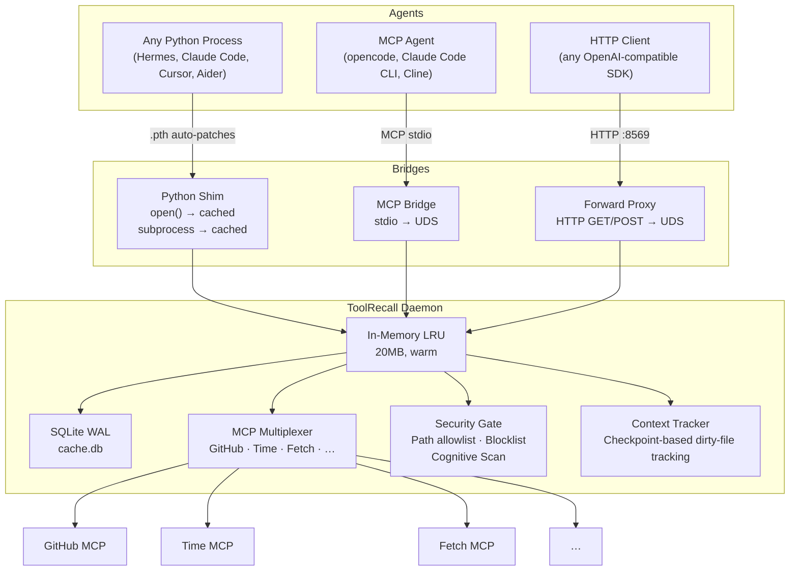

# ToolRecall — Deterministic Tool Cache for LLM Agents

ToolRecall sits between your agent and the OS (or your API provider). On repeat calls it serves cached results from local SQLite instead of re-executing system commands or re-sending requests to the LLM. Caching is deterministic — byte-identical until mtime/TTL expiry — which qualifies every API call for provider prefix-caching discounts (up to 90% at Anthropic/OpenAI).

**1 tick instead of 4:** A file read normally needs `stat → open → read → close`. ToolRecall needs only `stat` (mtime check) — on cache hit the bytes come from memory, bypassing disk entirely.

> **⚠️ Best fit: stateless & open-source agents (Hermes, OpenCode, Cline, Aider)**
>
> ToolRecall excels where agents have limited context budgets and benefit from deterministic cache + MCP multiplexing. If you run **Claude Code** or **Codex CLI**, the shim and MCP bridge can cause stale-state issues — those agents manage their own in-memory tool tracking natively. See [Agent Compatibility](docs/AGENT_COMPATIBILITY.md).

**Zero pip dependencies. Python 3.11+ stdlib only.** 76 KB install. Everything starts automatically.

```bash
pipx install toolrecall
toolrecall setup          # One-shot: config → systemd → shim → daemon start
```

> **Zero config mode:** After `toolrecall setup`, every command like `toolrecall status`, `toolrecall mcp`, or `toolrecall serve` auto-starts the daemon if it isn't running. You never need to think about it.

**Three layers of caching (all active by default):**

| Path | What it does | How to connect | Default |
|------|-------------|---------------|---------|
|| **OS-level Shim** | Patches every Python process — `open()` and `subprocess.run()` are transparently cached. **Zero imports needed.** | Installed via `toolrecall setup` or auto-installed on first command. | ✅ Installed via `.pth` in site-packages (Python only) |
| **Forward proxy** | Intercepts HTTP requests to API providers (OpenAI, Anthropic, etc.) — caches full responses by body hash. **Zero tokens consumed on cache hit.** | Set base URL to `http://localhost:8569` — or set any SDK's base URL | ✅ On (`:8569`) |
| **MCP bridge** | Caches tool output (file reads, terminal commands) — agent connects as an MCP client. Server names auto-resolve from registry. | Add to your agent's MCP config or run `toolrecall mcp` | ✅ On (stdio) |

**Requirements:** Python 3.11+ (`sqlite3`, `tomllib`, `json`, `http.server`, `urllib` from stdlib).

---

## What It Does

ToolRecall intercepts tool calls at the daemon level and returns cached results when inputs haven't changed:

| Mechanism | What gets cached | Invalidation | Token saving |
|-----------|----------------|-------------|-----------|
| **File cache** | First disk read per file | `mtime` changes → fresh read | Smaller context → provider prefix-cache discounts |
| **Terminal cache** | Static commands (hostname, whoami, pwd, uname, uptime, df, free, crontab) | TTL-based (default 300s) | Same output never re-sent to LLM |
| **MCP cache** | External MCP server responses (GitHub, time, fetch…) | TTL-based (default 60s, per-server override) | Repeated tool results served from local cache |
| **Script/Code cache** | `cached_run`, `cached_exec` output | `ttl=0` disables caching | Same as file cache |
| **Forward proxy** | Full API responses (chat completions to OpenAI, Anthropic, DeepSeek…) | Body hash — same request → same response | **Zero tokens consumed** — cache hit never reaches the provider |
| **Context Tracker** | Tracks dirty/clean files via checkpoints | In-memory (resets on daemon restart) | **93.8% O(n²) reduction** — drop clean files from context |

Dynamic commands (`git`, `ls`, `curl`) and state-changing operations always execute live.

### Cache Invalidation

| Cache Type | Invalidation | How it works |
|------------|-------------|--------------|
| **File cache** | **mtime-based** (automatic) | `os.path.getmtime()` checked on every `cached_read()`. File modified → next read fetches fresh from disk. No user action needed. |
| **Terminal cache** | **TTL-based** | Only cached for the 8 static commands in the allowlist (hostname, whoami, pwd, etc.). Default TTL 300s. |
| **MCP cache** | **TTL-based** | Configurable per server via `servers_config.<name>.ttl`. Default 60s. |
| **Forward proxy** | **Request-body hash** | Same request body → same response. New body = fresh API call. No expiry — cached until overwritten. |
| **Write invalidation** | **Explicit** | Every `cached_write()`, `cached_patch()`, or native `write_file` through the shim immediately deletes stale cache entries. The next read after a write is always a cache miss and fetches fresh data. |

**Stale data cannot persist.** File modifications change mtime, writes invalidate explicitly, TTLs expire automatically. The cache always returns the freshest available data within its invalidation model.

### Script & Code Cache (Python API)

`cached_run` and `cached_exec` cache script executions and inline Python code via SQLite:

```python
from toolrecall import cached_run, cached_exec

# Run a script — cached by path+args hash, invalidated on mtime change
result = cached_run("/path/to/script.sh", args="--flag value", ttl=300)
result["output"]    # stdout
result["exit_code"] # return code
result["cached"]    # True if served from cache

# Execute Python code string — cached by content hash
result = cached_exec("print('hello')", ttl=60)
```

| Parameter | Default | Description |
|-----------|---------|-------------|
| `ttl` | `0` | Seconds to cache. `0` = always execute fresh (no caching). |
| `args` | `""` | Arguments passed to the script (shlex-split, no shell). |

Cached results are stored in the same SQLite DB as file/terminal caches, share the same invalidation rules, and count toward the same stats.

### Measured effect

In a 13-hour session (Hermes + Gemini 3.1 Pro, 386 messages, 13 project files):

- **89% hit rate** (91% file cache): 827 tool calls served from SQLite instead of OS
- **73% fewer file-read tokens** at 3× re-read (~204K → ~55K unique)
- **~81% fewer** at 10× re-read (~630K → ~55K unique)
- **~20 min less wait time** — each cache hit avoids ~1.5s subprocess fork
- **Provider prefix-caching** becomes reliable: byte-identical payloads qualify for Anthropic/OpenAI's up-to-90% discount on every call

**Real-agent debug loop (10 turns, 5 writes):** A Hermes agent fixing bugs in ToolRecall's own code shows **36.4% input token savings** — 63,326 input tokens without TR → 40,270 with TR. Write-invalidation resets the cache on every edit, so savings are lower than read-only benchmarks (98%+) but reflect actual edit-heavy sessions. At 50 turns with the same write frequency, estimated savings climb to ~68%. [Full methodology](docs/REAL_AGENT_BENCHMARK.md).

Source: [Benchmark](docs/BENCHMARK.md)

---

## One-Time Setup

ToolRecall should be installed once per machine, then it works transparently for all agents.

```bash
pipx install toolrecall         # installs CLI + Shim (.pth file activates on next Python start)
toolrecall setup               # config → systemd service → shim → daemon start
```

That's it. Now **every** Python process on this machine transparently caches file reads and terminal commands through ToolRecall.

### What `toolrecall setup` does

| Step | Details |
|------|---------|
| **Config** | Creates `~/.config/toolrecall/toolrecall.toml` with default-deny security |
| **Systemd** | Generates `~/.config/systemd/user/toolrecall-daemon.service` (enables auto-restart) |
| **Shim** | Installs `tr_shim.pth` in your site-packages — every Python process auto-caches |
| **Daemon** | Starts the cache daemon (background process with LRU + SQLite) |

### What happens on every CLI command

Every `toolrecall` command that needs the daemon (`status`, `mcp`, `serve`, `stats`, etc.) automatically:

1. **Checks if the shim is installed** — auto-installs it if missing
2. **Checks if the daemon is running** — auto-starts it if not

This means you can run `toolrecall status` on a fresh install and it "just works" — no extra steps.

### Daemon auto-start (fallback chain)

| Try | Method | When |
|-----|--------|------|
| 1 | `systemctl --user start toolrecall-daemon` | Linux with systemd |
| 2 | `os.fork()` + `run_daemon()` | Docker, macOS, Codespaces |
| 3 | `subprocess.DETACHED_PROCESS` | Windows |

---

## Architecture



**Shim layer (at the OS level):** When `tr_shim.pth` is in `site-packages`, every Python process on the machine auto-patches `builtins.open()` and `subprocess.run()` — no imports needed. This is the truly agent-agnostic path: any Python agent (Hermes, Aider, Cline) transparently benefits without any configuration. (Claude Code, Codex CLI, and OpenCode are Node.js binaries — the Python shim doesn't apply to them.)

**Daemon layer (process level):** Holds the hybrid in-memory LRU + SQLite WAL cache, the MCP Multiplexer (manages subprocesses for external MCP servers), the Forward Proxy (caches full API responses via body hash), and the Security Gate (path allowlist, sensitive file blocklist, cognitive scan).

**How they work together:**

1. **Python process** calls `open("file.py")` → Shim intercepts → `cached_read()` via Daemon UDS → returns cached bytes or reads from disk
2. **Agent** calls `cached_read()` via MCP → Daemon → same cache (shared with Shim)
3. **Any SDK** sends API request to `localhost:8569` → Forward Proxy hashes body → checks same SQLite cache

---

## MCP Multiplexer

When running multiple agents on the same machine (5 Claude Code sessions + 3 Cursor instances), each one normally spawns its own subprocess for every MCP server (GitHub, Postgres, time…). That's 10× the RAM for the same tool.

The daemon's multiplexer shares one subprocess per server across **all** agents:

- **Lazy loading:** servers boot on first call, not at daemon start (~0.01s vs ~1.7s per server)
- **Idle timeout:** inactive subprocesses killed after 15 min (configurable)
- **Failure isolation:** one server crash doesn't affect others (auto-reconnect, max 3 attempts)
- **Secrets:** API tokens loaded from `~/.toolrecall/.env`, never exposed to the LLM
- **Auto-resolution:** Server names auto-resolve from the built-in registry — no `command`/`args` needed for common servers

All agents connect to **one** MCP server in their config: `toolrecall mcp`.

### Quick Config Example

```toml
# ~/.config/toolrecall/toolrecall.toml
[mcp_multiplex]
servers = ["time", "github", "fetch"]
```

### Built-in Servers (zero deps)

| Server | What it does |
|--------|-------------|
| `time` | Current time in any timezone — stdlib only |
| `github` | GitHub API (create repo, push files, list commits) — `urllib` only |
| `sequential-thinking` | Reasoning validation, contradiction detection — no network |
| `fetch` | Fetch URLs — stdlib only (`urllib.request`), 500KB configurable limit via `TOOLRECALL_FETCH_MAX_BYTES` |

### External Servers (needs `uvx`)

| Server | Package |
|--------|---------|
| `filesystem` | `mcp-server-filesystem` — safe file access |
| `git` | `mcp-server-git` — Git operations |
| `memory` | `mcp-server-memory` — knowledge graph |
| `brave-search` | `@anthropic/mcp-server-brave-search` — web search |
| `playwright` | `@playwright/mcp` — browser automation |
| `slack` | `mcp-server-slack` — Slack workspace |

### Naming Collisions

When two MCP servers expose tools with the same name (e.g., `github` and `git` both register `list_issues`), the **first server registered wins** — its tool takes priority and a warning is logged. The second server's conflicting tool is silently skipped. Per-server tools are always unique (no two servers share a tool name in the same config), so collisions are rare in practice. If you need both servers with overlapping tool names, use the `servers_config.<name>.ttl` to stagger them, or configure one server via Hermes `mcp_servers` instead of the multiplexer.

See [MCP Multiplexer](docs/MCP_MULTIPLEXER.md) for full configuration details.

---

## Security

ToolRecall doesn't prevent prompt injection — it cages the consequences:

- **Default-deny path allowlist:** Without config, NO paths are readable. `toolrecall init` prompts for paths interactively.
- **Sensitive file blocklist:** `.env`, `.ssh/`, `.pem`, `.aws/`, etc. are blocked even inside allowed paths.
- **`allow_terminal=true`** (default): allows read-only commands matching the regex allowlist (27 patterns for `ls`, `cat`, `git status`, etc.). Set `false` to disable all terminal caching.
- **`os.path.realpath()`:** catches `../../../etc/shadow` traversal before OS is touched.
- **Cognitive Pre-Fight:** Deterministic regex scan on MCP tool arguments for override instructions, jailbreak tags, exfiltration URLs. Zero LLM, ~0.001ms hot path.
- **AST injection check:** Parses tool arguments as Python AST — blocks `exec()`, `eval()`, `__import__()` calls.
- **Daemon IPC via UDS:** No open ports, immune to SSRF.

See [Security Architecture](SECURITY.md) for the full trust boundary.

---

## Quick Reference — CLI

```
toolrecall setup          One-shot: config + systemd service + shim + daemon start  [required once]
toolrecall init           Create default config.toml and .env
toolrecall status         Cache status and stats               [auto-starts daemon]
toolrecall stats          Detailed cache statistics (JSON)     [auto-starts daemon]
toolrecall invalidate     Clear all caches                     [auto-starts daemon]
toolrecall restart        Health check + clean daemon restart  [auto-starts daemon]
toolrecall mcp            Start MCP Bridge                     [auto-starts daemon]
toolrecall serve          Forward proxy (cache API responses)  [auto-starts daemon]
toolrecall serve --port 9000  Forward proxy on custom port
toolrecall debug          Start debug/demo server              [auto-starts daemon]
toolrecall index          Build/update FTS5 knowledge database [auto-starts daemon]
toolrecall config-set     Set a config value
toolrecall daemon         Start/stop/manage cache daemon
toolrecall shim           Install/uninstall OS-level cache shim (.pth file)
toolrecall nginx          Generate nginx config
```

### FTS5 Knowledge Base — Query via MCP or HTTP

The SQLite FTS5 index built by `toolrecall index` is queryable by the agent itself:

- **MCP tool** (active when MCP bridge is connected): `mcp_toolrecall_docs_search(query="...")` — returns BM25-ranked results with snippets
- **HTTP endpoint** (active when Forward Proxy is running): `GET http://localhost:8569/__docs/search?q=<query>` — returns JSON, any HTTP-speaking client can use it

This means the agent can search its own cached docs, memory stores, and indexed files without leaving the tool loop. Index with `toolrecall index`. See [Knowledge DB](docs/KNOWLEDGE_DB.md).

## Agent Integration — zero-config for any agent

ToolRecall's daemon provides three agent-agnostic caching layers. None require per-agent configuration:

### Layer 1: Python Shim (transparent, any Python agent)

After `toolrecall setup`, every Python process on this machine auto-caches `open()` and `subprocess.run()` through ToolRecall. Hermes, Aider, Cline — all benefit without any config change.

```bash
pipx install toolrecall
toolrecall setup              # One-shot: shim + daemon
# Done — every Python process now transparently caches
```

> Node.js agents (Claude Code, Codex CLI, OpenCode) are unaffected by the shim — see [Agent Compatibility](docs/AGENT_COMPATIBILITY.md) for their recommended integration.

### Layer 2: MCP Bridge (any MCP-compatible agent)

Connect **any MCP agent** by registering one server. The same config works for all agents.

```json
// ~/.claude/settings.json  or  ~/.cursor/mcp.json  or  ~/.config/cline/mcp_settings.json
// or any other MCP agent config
{
  "mcpServers": {
    "toolrecall": {
      "command": "toolrecall",
      "args": ["mcp"]
    }
  }
}
```

For OpenCode (v1.17+), `toolrecall setup` writes this automatically to `~/.opencode/opencode.jsonc`:

```jsonc
// ~/.opencode/opencode.jsonc
{
  "$schema": "https://opencode.ai/config.json",
  "mcp": {
    "toolrecall": {
      "type": "local",
      "command": "toolrecall",
      "args": ["mcp"],
      "enabled": true
    }
  }
}
```

**Hermes Agent:** Hermes already ships with ToolRecall built in — the tools `cached_read`, `cached_terminal`, `mcp_call`, etc. are available directly in your toolset.

**Aider:**
```bash
aider --mcp-toolrecall
# or add to ~/.aider.mcp.json with the same format as above
```

All agents share **one daemon** and **one cache** — no duplication, no conflict.

### Layer 3: Go Client (`tr` binary) — for any language or shell

**For OpenCode, Claude Code, Codex CLI, or any non-Python agent:** The `tr` binary connects directly to the ToolRecall daemon over UDS. Cached file reads, terminal commands, and status checks — all from the shell, no Python runtime needed.

```bash
tr read main.py            # Cached file read
tr cat /etc/os-release     # Alias for read
tr term "hostname"         # Cached terminal command
tr status                  # Daemon health & cache stats
tr ping                    # Fast connectivity check
tr read --bypass file.py   # Force fresh read
tr read --refresh file.py  # Alias for bypass
tr write /tmp/test.txt "hello"  # Write (invalidates cache)
```

Use it when: **OpenCode** and **Claude Code** (Node.js, no Python shim), CI/CD pipelines, Rust/Ruby/Java agents, any shell script.

```bash
# Build from source
cd go-client && go build -o /usr/local/bin/tr .
```

See [Go Client](go-client/README.md) for full details.

> ⚠️ **Claude Code users:** Adding ToolRecall as an MCP server can cause stale-state issues in code edit loops. See [Agent Compatibility](docs/AGENT_COMPATIBILITY.md) before configuring.

---

## Forward Proxy (API-level caching)

Cache API responses before they leave your machine. The forward proxy starts **automatically** with the daemon — no extra command needed.

```bash
# Point any OpenAI-compatible SDK at the forward proxy
export OPENAI_BASE_URL=http://localhost:8569/v1
# or set your SDK's base_url / base_path accordingly
```

| Provider SDK | How to connect | Token savings |
|-------------|---------------|---------------|
| **Any OpenAI-compatible client** | Set base URL to `http://localhost:8569/v1` | **Zero tokens consumed** — cache hit never reaches the provider |
| **Custom port** | `toolrecall serve --port 9090` | Same |

Supported providers: OpenAI, Anthropic, Google Gemini, DeepSeek, xAI, Mistral, Groq, Together, OpenRouter. See [Forward Proxy docs](docs/FORWARD_PROXY.md) for the full provider list and usage examples.

### MCP Bridge (tool-level caching)

```json
{
  "mcpServers": {
    "toolrecall": {
      "command": "toolrecall",
      "args": ["mcp"]
    }
  }
}
```

Works for any MCP-compatible agent (Hermes, Cline, Cursor, Windsurf, Continue). See [Agent Compatibility](docs/AGENT_COMPATIBILITY.md) for per-agent guidance.

### OS-level Shim (zero-config caching)

Once `toolrecall setup` is run (or any CLI command auto-installs it), the **shim .pth file** lives in `site-packages/tr_shim.pth`. Every Python process on the machine automatically caches `open()` and `subprocess.run()` through the ToolRecall daemon — **no imports, no agent configuration**.

| Agent | How to connect | Best for | Notes |
|-------|---------------|----------|-------|
| **Any Python binary** | Just `pipx install toolrecall` — the `.pth` in site-packages auto-patches `open()` / `subprocess.run()` | Hermes, Aider, Cline, custom scripts | ✅ Transparent, agent-agnostic. Not available for Node.js binaries. |
| **Any MCP agent** | Add `toolrecall` server to your MCP config (example below) | OpenCode, Cline, Hermes | ✅ Universal MCP-based integration |
| **Forward proxy** | Set base URL to `http://localhost:8569` | Any OpenAI-compatible SDK | ✅ Zero-token cache hits |

---

## Configuration

TOML (stdlib `tomllib`) or YAML (optional, requires `pyyaml`).

```toml
# ~/.config/toolrecall/toolrecall.toml (created by toolrecall init)
[norm]
# Cache key normalization (v0.9.0) — deterministic JSON sorting + noise stripping.
# When enabled, tool call arguments are normalized before cache key generation:
# keys sorted, whitespace stripped, timestamps/session IDs removed.
# This broadens cache hits when agents rephrase or reorder arguments.
# ⚠️ Changes existing cache keys — existing entries become orphans.
enabled = false

[mcp]
allowed_paths = ["/home/user/projects"]  # Add your project dirs — default-deny!
allow_terminal = true

# Terminal command allowlist — only commands matching these regex patterns
# are eligible for caching. See config.toml for the full list.
allow_invalidate = false
default_ttl = 60

[mcp_multiplex]
enabled = true
servers = ["time", "sequential-thinking"]

[forward_proxy]
# Forward proxy starts on :8569 automatically with the daemon
```

`TOOLRECALL_*` environment variables override TOML.

---

## Uninstall

```bash
toolrecall shim --uninstall          # Remove .pth from site-packages
systemctl --user stop toolrecall-daemon
systemctl --user disable toolrecall-daemon
pipx uninstall toolrecall
rm -rf ~/.toolrecall ~/.config/toolrecall
```

---

## Platform Support

| Platform | Transport | Status |
|----------|-----------|--------|
| **Linux** | Unix Domain Sockets | ✅ Tested in CI |
| **macOS** | Unix Domain Sockets | ✅ Should work (POSIX). Not in CI. |
| **Windows** | TCP localhost:8568 fallback | ⚠️ Core + transport tested. CLI works. |

|---

## Contributing

```bash
git clone https://github.com/whiskybeer/toolrecall.git
cd toolrecall
make setup      # one-time: install dev deps
make test       # run tests
make check      # lint + format check
```

See the [Testing Guide](docs/TESTING.md) and [Makefile](./Makefile) for all targets.
## Documentation

- [Agent Compatibility](docs/AGENT_COMPATIBILITY.md) — per-agent value, config, and caveats
- [Architecture](docs/ARCHITECTURE.md) — daemon design, layers, IPC
- [Architecture Diagram](docs/ARCHITECTURE_DIAGRAM.md) — system and sequence diagrams, token costs, Context Tracker
- [CLI Reference](docs/CLI.md) — all subcommands explained
- [Configuration Reference](docs/CONFIG_REFERENCE.md) — config.toml, config.py, all env vars
- [Context Tracker](docs/CONTEXT_TRACKER.md) — checkpoint-based dirty-file tracking, O(n²) breakdown
- [How It Works](docs/HOW_IT_WORKS.md) — quick technical overview
- [MCP Multiplexer](docs/MCP_MULTIPLEXER.md) — single-daemon MCP management, server registry
- [Testing Guide](docs/TESTING.md) — test philosophy, organization, per-file coverage
- [Benchmark](docs/BENCHMARK.md) — measured performance, token savings
- [Knowledge DB](docs/KNOWLEDGE_DB.md) — FTS5 indexing guide
- [Docker Deployment](docs/DOCKER.md) — containerized stack
- [Forward Proxy](docs/FORWARD_PROXY.md) — cache API responses by body hash, provider list, usage
- [Security Architecture](SECURITY.md) — WAF details, trust boundary
- [Troubleshooting](docs/TROUBLESHOOTING.md) — common fixes
- [Appendix](docs/APPENDIX.md) — comparison tables, OSI model, ROI, vision, audit
- [Hermes Transparent Cache](docs/HERMES_TRANSPARENT_CACHE.md) — auto-patching for Hermes Agent