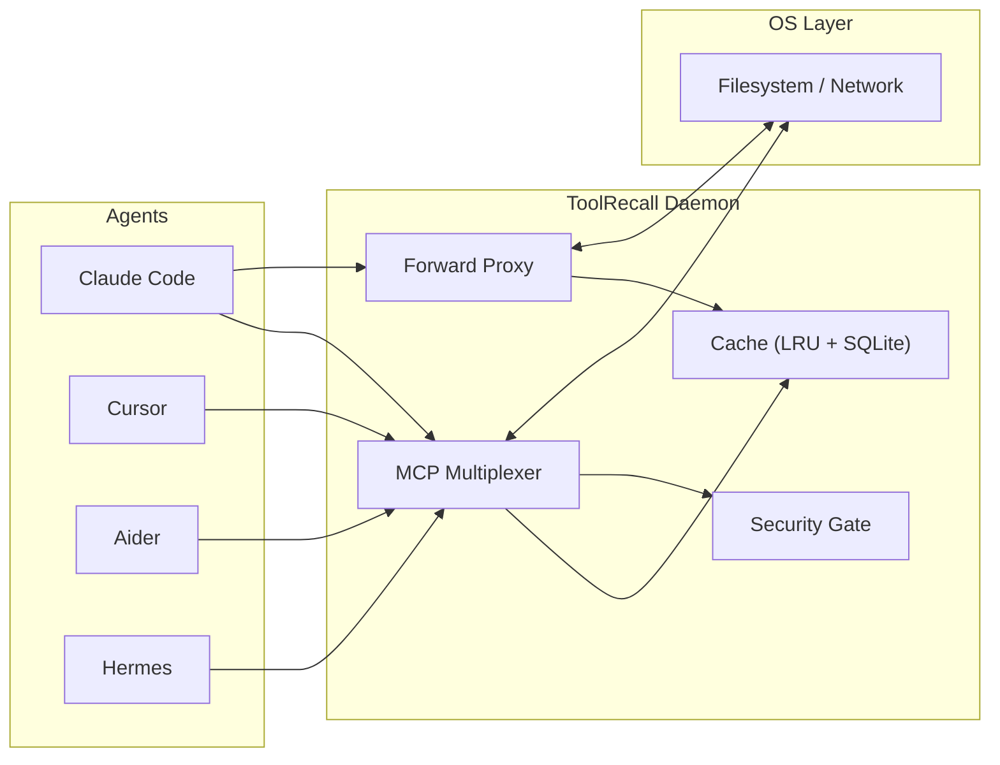

# ToolRecall — Deterministic Execution Layer for Agent Tools

**🌐 [toolrecall.dev](https://toolrecall.dev) — documentation, benchmarks, downloads**

You run agents. Every session spawns its own MCP servers, every test run hits live APIs, every tool call is unrepeatable, and your agent can read `~/.ssh` if it feels like it.

ToolRecall is one shared daemon that pools your MCP servers, records and replays tool results, caches repeated API calls, and enforces filesystem/terminal policy for any agent framework.

**One warm daemon instead of five cold Node processes.** Under 200 KB install. Python 3.11+ stdlib only.

> **⚠️ Who this is for:** ToolRecall's file cache shines for **stateless agents** (Hermes, OpenCode, Cline, Google ADK) — agents with limited or no built-in context management. If your agent already manages its own context (Claude Code, Cursor), the forward proxy and MCP multiplexer still save real money, but file caching through MCP may **increase** costs. See [Agent Compatibility](docs/AGENT_COMPATIBILITY.md).

```bash
pipx install toolrecall
toolrecall setup          # One-shot: config -> systemd -> daemon start
```

> **Zero config mode:** Every `toolrecall` command auto-starts the daemon if it isn't running. You never need to think about it.

---

## Why ToolRecall — stop paying for tokens you already saw

Two capabilities are the reason to run it. Both are measured, both target the same waste: your agent re-encountering content that's already in its context.

| Capability | What it does | Measured |
|-----------|--------------|----------|
| **Context Tracker** | Tells the agent which files it only *read* (vs edited) are safe to drop from its context window, so a long session stops growing larger every turn. By keeping your context small it helps **prefix and non-prefix models alike**. | **9.5× fewer request tokens per turn** and **7.4× longer sessions** before the context wall (measured on real runs, prefix-caching model) — [Context Tracker](#context-tracker) |
| **Input Dedup Hook** | Agents re-paste the same file contents into the message over and over. The hook spots a repeat and sends a short "same content as before" placeholder instead of the full copy again — you pay for each block once, and the model still sees it. | **−32.3% input tokens / −30% billed cost** on real coding tasks (SWE-bench Lite, billing-verified) — [Dedup Hook](#input-dedup-hook) |

---

## Quickstart — MCP Bridge (30 seconds)

Connect any MCP agent by registering one server:

```json
// ~/.claude/settings.json  or  ~/.cursor/mcp.json  or  ~/.config/cline/mcp_settings.json
{
  "mcpServers": {
    "toolrecall": {
      "command": "toolrecall",
      "args": ["mcp"]
    }
  }
}
```

```toml
# ~/.config/toolrecall/toolrecall.toml
[mcp_multiplex]
servers = ["time", "github", "fetch"]
```

That's it. Your agent now has access to all multiplexed MCP servers, caching, and security — with zero per-agent configuration.

```
Before: 5 agents x 3 MCP servers = 15 cold Node processes, ~25 MB RAM per server
After:  5 agents x 1 toolrecall mcp = 3 warm subprocesses, shared across all agents
```

Features:
- **Lazy loading**: servers boot on first call, not at daemon start
- **Idle timeout**: inactive subprocesses killed after 15 min (configurable)
- **Failure isolation**: one server crash doesn't affect others (auto-reconnect)
- **Auto-resolution**: server names resolve from built-in registry

See [MCP Multiplexer](docs/MCP_MULTIPLEXER.md) for full configuration.

---

## What ToolRecall Does

| Feature | What it solves |
|---------|---------------|
| **MCP Multiplexer** | One shared pool of MCP servers instead of N processes per agent session |
| **Forward API Proxy** | Cache API responses by body hash — hit = zero tokens billed. Below the context wall, prefix caching competes; above it TR wins on cost by not exhausting. |
| **Replay Mode** | Record agent sessions, replay deterministically in CI |
| **Security Gate** | Path allowlist, terminal policy, sensitive-file blocklist — any agent |
| **File / Terminal Cache** | Reduce redundant reads within a turn; bounded context growth for stateless agents without built-in context management |
| **Context Tracker** | Track dirty/clean files, auto-hint agents what to drop from context |
| **Framework Adapters** | Drop-in wrappers for ADK, LangChain, herdr, Odysseus, LiteLLM |
| **LiteLLM Gateway Hook** | Dedup repeated content in proxy requests — **32.3% fewer prompt tokens / 30% lower billed cost, measured on 10 real SWE-bench Lite instances (billing-verified, OpenRouter)** — [benchmark & methodology](bench/litellm_dedup/README.md) |

Full detail in [Architecture](docs/ARCHITECTURE.md).

---

## Context Tracker

> **TL;DR:** ToolRecall caches file reads so re-reading is instant (~0.1ms). The Context Tracker adds **dirty-file awareness**: the agent drops old file content from its context window and re-reads on demand from cache — keeping context bounded and breaking the O(n²) attention-cost snowball.

Every turn, an agent appends all prior tool output to its history, and the LLM computes attention over the whole sequence — **O(n²) in tokens**. ToolRecall caches the *I/O* but not the *context window*; without help, file content the agent read ten turns ago still sits in context as redundant overhead.

The Context Tracker records which files were **written** (made *dirty*) since a user-defined checkpoint. Clean files (read but not modified) are safe to drop: a cache hit returns the same content in ~0.1ms, so dropping costs nothing.

| Category | Meaning | Agent action |
|----------|---------|--------------|
| **Dirty** | Modified by the agent since checkpoint | **Keep** — uncommitted work |
| **Clean** | Read but not modified | **Drop from context**, re-read from cache if needed |
| **Untracked** | Never read | Not in context — no action |

**Available in the MCP Bridge as five tools** — `context_set_checkpoint`, `context_get_dirty`, `context_get_stats`, `context_reset`, `context_get_hint`. The bridge **auto-appends a hint to every tool response** telling the agent which clean files to drop, so no agent-side config is required beyond the pattern.

**Measured, not modeled.** On real runs (Hermes agent, DeepSeek V4 Flash — a model with prefix caching already on), the tracker sent **9.5× fewer request tokens per turn** (8,077 vs 76,430 at turn 10) and the session ran **7.4× longer** (140 vs 19 turns) before hitting the context wall. Because it shrinks the context window itself — not just what the provider caches — the benefit holds for **prefix and non-prefix models alike**.

How far it goes depends on the workload: an agent that rewrites whole files every turn saves less than one that re-reads the same files. The table below is the **modeled ceiling** — it assumes an idealized re-read-heavy agent that drops every clean file each turn (~7 files/turn):

| Agents × Turns | Baseline (attention pairs) | With Tracker (every-turn drops) | Reduction |
|:---:|:---:|:---:|:---:|
| 1 × 30 | 1.27T | 127B | **90%** |
| 5 × 30 | 6.35T | 635B | **90%** |
| 10 × 30 | 12.7T | 1.27T | **90%** |
| 20 × 30 | 25.4T | 2.54T | **90%** |
| 10 × 100 | 171T | 4.23T | **97.5%** |

**Read this number carefully:** the ~90% (up to 97.5%) is a **modeled upper bound** for an idealized re-read-heavy session — **not** a measured benchmark. The measured headline is the **9.5× fewer tokens / 7.4× longer endurance** above. Two caveats hold either way: the daemon can't *force* the agent to drop — it provides the data, the agent must act on it — and append-only harnesses (Claude Code, Cursor) can't use the tracker at all. See [Agent Compatibility](docs/AGENT_COMPATIBILITY.md).

Full detail: [Context Tracker](docs/CONTEXT_TRACKER.md) · [Agent integration](docs/AGENTS.md) · [Stale-file detection](docs/CONTEXT_STALE.md)

---

## Input Dedup Hook

> **TL;DR:** AI agents re-read the same files over and over, and every read pastes that file into the message they send to the model. This hook removes the repeated copies before they're billed — cutting input tokens with cost measured, not estimated.

**Why this matters, in plain English.** When an agent works on a task it re-reads the same files many times, and each read sends that file's contents to the model again. On a long session the same file can be sent five, ten, twenty times — and normal billing charges you for *every* copy. The hook keeps the **first** copy (so the model still has the information, and the provider's own caching stays intact) and turns every later repeat into a short note like *"same content as before — see message 4."* You pay for each block once, not once per read. How much you save depends on your agent: one that re-reads the same files a lot saves the most.

| Metric (80 req/arm, SWE-bench Lite × 8 turns) | WITH dedup | WITHOUT dedup | Saved |
|---|---|---|---|
| **Total prompt tokens** | 282,688 | 417,256 | **134,568 (−32.3%)** |
| **Billed cost (OpenRouter)** | $0.0134 | $0.0191 | **$0.0057 (−30.0%)** |

**Prefix caching preserved.** Effective per-token rate is near-identical between arms (Δ $0.0015/M) — the keep-first design stubs only *later* duplicates, so each block's first occurrence is byte-identical to the non-dedup arm. The honest shape of the method: it saves on *re-reads* (savings appear from turn 4, growing to **−49.9%** by turn 8), not first reads.

**Honesty (stated explicitly):** token savings are **billing-verified**; **task-quality is not**. A SWE-bench pass@1 A/B was attempted but inconclusive (the baseline model scored 0 on the chosen tasks even in isolation), so the defensible claim is: *"the hook removes wasted input tokens; its effect on task success is unverified."* Savings are also workload-dependent — an agent that rewrites whole files each turn saves less.

**Zero-trust customer triage:** `bench/litellm_dedup/measure_duplicates.py` measures *your own* duplicate ratio from a JSONL export of your request bodies, entirely inside your perimeter, no network, no API key — so you know what you'd save before any pilot. It reports volume stubbable, deliberately *not* billed-$, because real savings depend on prefix-cache economics.

Full benchmark & methodology: [LiteLLM Dedup Benchmark](bench/litellm_dedup/README.md) · ready-to-use config: [litellm-proxy-config.yaml](docs/examples/litellm-proxy-config.yaml)

---

## How It Works


```mermaid
flowchart LR
    subgraph Agents
        A1["Claude Code"]
        A2["Cursor"]
        A3["Aider"]
        A4["Hermes"]
    end
    subgraph Daemon["ToolRecall Daemon"]
        MP["MCP Multiplexer"]
        CA["Cache (LRU + SQLite)"]
        SG["Security Gate"]
        FP["Forward Proxy"]
    end
    subgraph OS["OS Layer"]
        FS["Filesystem / Network"]
    end

    A1 --> MP
    A2 --> MP
    A3 --> MP
    A4 --> MP
    MP --> CA
    MP --> SG
    MP <--> FS
    A1 --> FP
    FP --> CA
    FP <--> FS
```

One daemon, five access paths: Python client, MCP bridge, HTTP bridge, forward proxy, OS-level shim. All share one cache, one security gate, one multiplexer. See [Architecture](docs/ARCHITECTURE.md).

---

## When To Use It

| You want this... | Use this... | Works for |
|-----------------|-------------|-----------|
| Warm MCP servers across sessions | MCP Multiplexer | Any agent |
| $0 dev loops — repeated API calls cost nothing | Forward Proxy | Any agent |
| Deterministic CI tests for agent behavior | Replay Mode | Any agent |
| Guardrails between agents and your machine | Security Gate | Any agent |
| Cached file reads, lower context bloat | File / Terminal Cache | Stateless agents (Hermes, Cline, ADK) — bounded context growth. **Not** for agents with built-in context management |
| All of the above | `toolrecall setup` then add the MCP bridge | See per-agent notes |

---

## Installation

### One-time setup

```bash
pipx install toolrecall        # or: uv tool install toolrecall
                               # or: pip install toolrecall (inside a venv)
toolrecall setup                # config -> systemd service -> daemon start
```

> **PATH check:** After installation, make sure `toolrecall` is on your `$PATH`.  
> `pipx` puts binaries in `~/.local/bin/`, `uv tool install` in `~/.local/share/uv/tools/`.  
> If `toolrecall` isn't found, add the right directory to your PATH or reinstall inside the venv your agent uses.

> **Shim in the right venv:** `toolrecall shim --install` installs the `.pth` shim into the
> **current Python environment**. If you installed via `pipx` or `uv tool install`, the
> shim goes into that isolated environment — not your agent's venv. The agent won't see it.
> `toolrecall setup` auto-detects common agent venvs and installs the shim there too.
> `toolrecall shim --install --all` scans for agent venvs (Hermes, OpenCode) and installs
> into all of them at once.
> If you need to target a specific venv manually:
> ```bash
> toolrecall shim --install --venv ~/.hermes/hermes-agent/venv
> toolrecall shim --install --venv ~/.local/share/uv/tools/hermes-agent
> ```
> The `toolrecall` package must also be installed in that venv (`import toolrecall` must work).

`toolrecall setup` creates `~/.config/toolrecall/toolrecall.toml` with default-deny security, generates a systemd user unit, and starts the daemon. After this, every `toolrecall` command "just works".

Daemon auto-start fallback: systemd -> os.fork() -> DETACHED_PROCESS (Linux -> Docker/macOS -> Windows).

### Per-agent integration

| Method | How | When to use |
|--------|-----|-------------|
| **MCP Bridge** | `toolrecall mcp` in agent's MCP config | Any MCP-capable agent (recommended) |
| **Go Client (tr)** | `tr read file.py`, `tr term "hostname"` | Shell scripts, CI, any language |
| **Python Shim** | `toolrecall shim --install` | Every Python process auto-caches open/subprocess |
| **Python Client** | `from toolrecall.client import cached_read` | Direct embedding in Python code |
| **HTTP Bridge** | `toolrecall serve` on :8569 | Any HTTP client (curl, Go, Rust...) |
| **Forward Proxy** | Set `OPENAI_BASE_URL=http://localhost:8569/v1` | Cache API responses, zero tokens on hit |

### Extra storage backends

```bash
pip install toolrecall[libsql]       # libSQL local backend
pip install toolrecall[libsql-sync]  # libSQL + Turso Cloud sync
```

---

## CLI Quick Reference

```
toolrecall setup          One-shot: config + systemd + daemon start  [required once]
toolrecall status         Cache status and stats                     [auto-starts]
toolrecall stats          Detailed cache statistics (JSON)           [auto-starts]
toolrecall invalidate     Clear all caches                           [auto-starts]
toolrecall mcp            Start MCP Bridge                           [auto-starts]
toolrecall serve          Forward proxy (cache API responses)        [auto-starts]
toolrecall serve --9000   Custom port forward proxy
toolrecall replay         Record/replay agent sessions
toolrecall shim --install Install OS-level cache shim (.pth file)
toolrecall turso          Turso Cloud sync: init, enable, disable, status
toolrecall init           Create default config.toml and .env
toolrecall config-set     Set a config value
toolrecall index          Index knowledge DB (FTS5 search)  [not file cache pre-warm]
toolrecall index-memory   Index agent memory stores
toolrecall index-dir      Index a directory for FTS5 search [not file cache pre-warm]
```

> **Knowledge indexing ≠ cache warming:** `toolrecall index*` commands build an FTS5 search index for knowledge retrieval (`docs_search()`). They do NOT pre-warm the file/terminal/API response cache. The daemon's file cache warms naturally as the agent reads files — no separate command needed.

Full reference: [CLI.md](docs/CLI.md)

---

## Configuration

```toml
# ~/.config/toolrecall/toolrecall.toml
[mcp]
allowed_paths = ["/home/user/projects"]  # Default-deny!
allow_terminal = false

[cache]
terminal_default_ttl = 60

[mcp_multiplex]
enabled = true
servers = ["time", "sequential-thinking"]

[forward_proxy]
# Starts on :8569 automatically with the daemon
```

`TOOLRECALL_*` env vars override TOML. Full reference: [Configuration Reference](docs/CONFIG_REFERENCE.md)

---

## Platform Support

| Platform | Transport | Status |
|----------|-----------|--------|
| **Linux** | Unix Domain Sockets | Tested in CI |
| **macOS** | Unix Domain Sockets | Should work (POSIX) |
| **Windows** | TCP localhost:8568 | Experimental |

---

## Documentation

- **[toolrecall.dev](https://toolrecall.dev)** — documentation portal, benchmarks, downloads
- [Architecture](docs/ARCHITECTURE.md) — system design, components, data flow, token costs
- [MCP Multiplexer](docs/MCP_MULTIPLEXER.md) — daemon-managed MCP server pool
- [Forward Proxy](docs/FORWARD_PROXY.md) — API response caching, provider list, auth routing
- [Replay Mode](docs/REPLAY_MODE.md) — record/replay tool calls for deterministic CI
- [Security Architecture](SECURITY.md) — policy gate, trust boundary
- [Agent Compatibility](docs/AGENT_COMPATIBILITY.md) — per-agent value, config, caveats
- [Benchmark](docs/BENCHMARK.md) — three-arm controlled measurement (naive vs prefix vs toolrecall), context efficiency, billed cost
- [LiteLLM Dedup Benchmark](bench/litellm_dedup/README.md) — gateway dedup hook: −32.3% prompt tokens / −30% cost, billing-verified
- [LiteLLM Proxy Example Config](docs/examples/litellm-proxy-config.yaml) — ready-to-use `litellm_settings.callbacks` hook wiring
- [Go Dedup Reference](go/dedup/README.md) — pure-Go request-level `dedup_messages` reference implementation
- [Bench Infrastructure](bench/README.md) — reproduce the three-arm benchmark
- [Test Suite](tests/README.md) — test runner documentation
- [CLI Reference](docs/CLI.md) — all subcommands
- [Configuration Reference](docs/CONFIG_REFERENCE.md) — config.toml, env vars
- [Context Stale](docs/CONTEXT_STALE.md) — provably stale files in agent conversations
- [Context Tracker](docs/CONTEXT_TRACKER.md) — checkpoint-based dirty-file tracking
- [AGENTS.md](docs/AGENTS.md) — agent instructions for MCP context tracker integration
- [Testing Guide](docs/TESTING.md) — test philosophy, per-file coverage
- [How It Works](docs/HOW_IT_WORKS.md) — quick technical overview
- [libSQL Backend](docs/LIBSQL_COMPARISON.md) — multi-writer, vector search, cloud sync
- [Docker Deployment](docs/DOCKER.md) — containerized stack
- [Troubleshooting](docs/TROUBLESHOOTING.md) — common fixes
- [Changelog](CHANGELOG.md) — version history
- [Go Client](go-client/README.md) — standalone `tr` binary for any language/shell
- [Agent Configs](configs/README.md) — ready-to-use MCP configs for popular agents
- **Framework Adapters:**
  - [Google ADK](docs/google-adk.md) — `@cached_tool` decorator + forward proxy
  - [LangChain / LangGraph](docs/langchain.md) — `ToolRecallCache` BaseCache + callback
  - [herdr](docs/herdr.md) — `tr` binary + MCP bridge for any pane
  - [Odysseus](docs/odysseus.md) — `cached_tool` decorator + MCP server caching
- [Hermes Transparent Cache](docs/HERMES_TRANSPARENT_CACHE.md) — auto-patching for Hermes
- [Normalizer](docs/NORMALIZER.md) — cache key normalization, deterministic JSON
- [Knowledge DB](docs/KNOWLEDGE_DB.md) — FTS5 indexing guide
- [Real-Agent Benchmark](docs/REAL_AGENT_BENCHMARK.md) — edit-heavy session results
- [Appendix](docs/APPENDIX.md) — comparison tables, OSI model, ROI, audit

---

## Contributing

```bash
git clone https://github.com/whiskybeer/toolrecall.git
cd toolrecall
make setup    # one-time dev deps
make test     # run tests
make check    # lint + format
```

See [Testing Guide](docs/TESTING.md) and [Makefile](./Makefile).

## Uninstall

```bash
systemctl --user stop toolrecall-daemon
systemctl --user disable toolrecall-daemon
pipx uninstall toolrecall
rm -rf ~/.toolrecall ~/.config/toolrecall
```