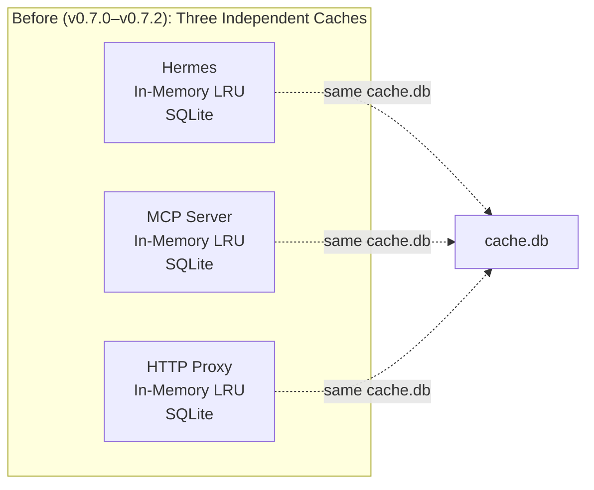
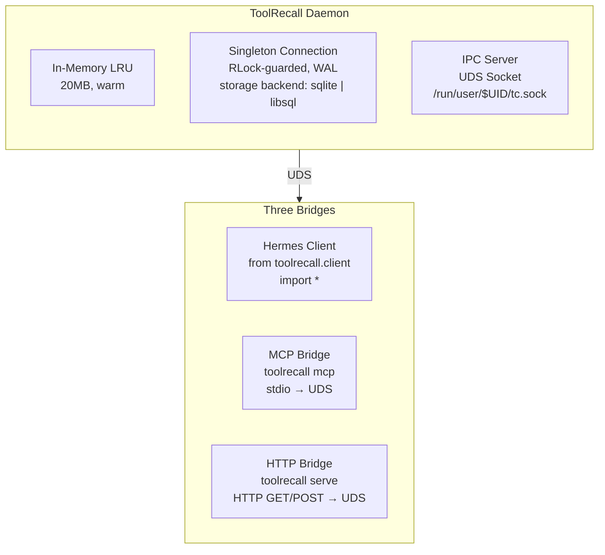
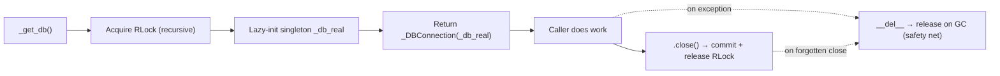
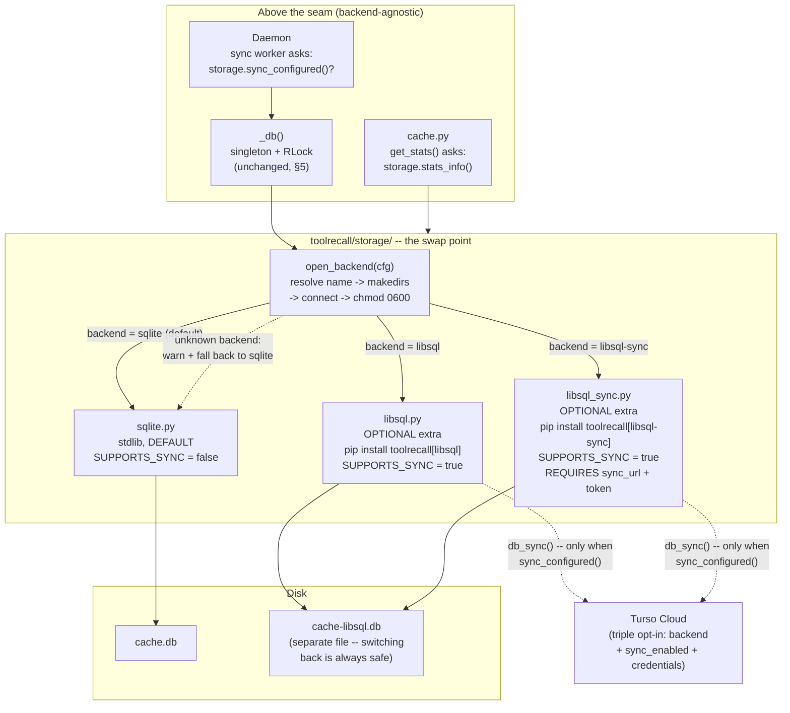

# ToolRecall Daemon Architecture

## 1. The Problem

ToolRecall previously had **three independent access paths** — each with its own caching process:



**Problem:** The three LRUs are *not synchronized*. Hermes caches file A in its LRU. The MCP Server has an empty LRU and reads file A from SQLite (7ms) — even though it could have fetched it in 0.001ms from a shared memory layer.

## 2. The Solution: One Daemon, Three Bridges

> **Tool naming convention:** The MCP bridge exposes native tool names (`read_file`, `write_file`, `patch`, `terminal`) that agents recognize naturally. Internally, these map to daemon commands (`cached_read`, `cached_write`, `cached_patch`, `cached_terminal`). Both names work in the MCP bridge. The Python API (`from toolrecall.client import cached_read`) uses the `cached_*` names directly.



### What exactly happens?

**Daemon** (`toolrecall daemon`):
- A Python process, started with the system (systemd user unit)
- Holds LRU + SQLite + UDS Server
- Processes requests: `{cmd: "read", path: "/x"} → {content: "...", cached: true}`
- Runs for days/weeks — Cache remains warm across sessions

**Hermes Client** (`from toolrecall.client import cached_read`):
- Instead of its own LRU + SQLite: forwards to the Daemon
- `cached_read(path)` → JSON over UDS → Daemon checks LRU → replies
- **Fallback:** If no Daemon is running, uses direct SQLite (legacy behavior)
- Hermes integration is handled by the OS-level .pth shim (`toolrecall/shim.py`),
  not an init script — every Python process auto-caches.

**MCP Bridge** (`toolrecall mcp`):
- Starts instantly (no Python module loading necessary — only socket + json)
- Reads stdin (JSON-RPC), translates to UDS call, writes response to stdout
- **No internal logic** — just protocol translation

**HTTP Bridge** (`toolrecall serve`):
- Same principle: HTTP-Request → UDS call → HTTP-Response
- No internal SQLite, no LRU

## 3. Who is this for?

### Group A: Hermes users with ToolRecall
| Today | Daemon Architecture |
|-------|---------------------|
| Cold cache per session | Cache is always warm (Daemon runs for days) |
| MCP Server needs extra RAM | MCP Bridge is <10MB |
| Hermes Restart = Cache cold | Daemon survives Hermes restarts |

**Value:** noticeable — especially on e2-medium with 4GB RAM. Start Daemon once, never think about caches again.

### Group B: Developers embedding ToolRecall in their own tools
| Today | Daemon Architecture |
|-------|---------------------|
| Must `from toolrecall import cached_read` | Can use UDS from any language (curl, nc, Go, Rust) |
| Python-only | Any language → UDS |

**Value:** ToolRecall becomes language-agnostic. A Go service can use the same cache as a Python script.

### Group C: Claude Code / Cursor / Codex Users (⚠️ limited benefit)
| Today | Daemon Architecture |
|-------|---------------------|
| MCP Server is a distinct process (200ms Startup) | MCP Bridge starts in <10ms |
| Every Claude Code run = new cold cache | Daemon runs, Cache warm |
| "I don't need it, startup is too slow" | "I'll use it because it's instantly available" (multiplex/forward-proxy only) |

> ⚠️ Claude Code and Codex CLI have native state tracking that conflicts with file/terminal caching. Only the MCP multiplex and forward proxy are safe with these agents. See [Agent Compatibility](AGENT_COMPATIBILITY.md).

**Value:** lowers barrier to entry. The Daemon turns ToolRecall into an "always-on" infrastructure on a machine.

### Group D: CI/CD
| Today | Daemon Architecture |
|-------|---------------------|
| Every CI Step starts its own cache | One Daemon per Build Host |
| Cache never gets warm (Steps are short) | Cache persists across Step boundaries |

**Value:** Only relevant in larger CI environments. Likely overkill for GitHub Actions.

## 4. How is this different?

### Different from Today

| Aspect | Today | Daemon | 
|--------|-------|--------|
| **Architecture** | 3 equal processes | 1 Center + 3 Bridges |
| **Cache-Sharing** | Only SQLite (7ms) | LRU + SQLite (0.001ms + 7ms) |
| **RAM** | ~60MB (3 × LRU) | **~11MB idle** (measured), ~130MB with MCP servers loaded |
| **MCP Startup** | ~200ms (uv run python -m ...) | ~5ms (Python stdio → socket) |
| **Language Binding**| Python only | Any language via UDS |
| **Fault Tolerance** | One process dies → others live | Daemon dies → all dead (requires systemd) |
| **Complexity** | 3 Modules side-by-side | 1 Core + 3 thin Bridges |

### Different from an HTTP Proxy

`toolrecall serve` (HTTP Proxy) is already a network bridge. The difference:

- **HTTP Proxy**: HTTP-REST-API, request/response, no Persistent Connection State, every request authenticates anew
- **Daemon + UDS**: Unix Domain Socket, persistent connection, ~10× faster, no network stack, only local communication
- **UDS vs HTTP**: UDS is ~0.1ms per call, HTTP localhost ~0.5ms. UDS has no port conflicts, no firewall, no auth needed (only Filesystem-Permissions)

### Different from direct Python Import

Direct import (`from toolrecall import cached_read`) is the fastest path — 0.001ms plus 0ms overhead. But: per process, no sharing.

The Daemon architecture sacrifices 0.1ms UDS overhead for a Shared Cache. In practice: 0.1ms is nothing — LLM-API calls take 3-10s.

**The question is not "faster or slower". The question is: "Are you using ToolRecall in one or multiple processes?"**

| Scenario | Optimal Path |
|----------|--------------|
| Single Process (only Hermes) | Direct Import — Daemon adds nothing |
| Multi Process (Hermes + MCP + HTTP) | Daemon — otherwise 3× RAM + 3× cold |
| CI/CD / Microservices | Daemon — otherwise never a warm cache |

## 5. Singleton Connection & Thread Safety

The daemon uses a **singleton connection** wrapped in a `_DBConnection` class,
protected by a `threading.RLock()`. The backend storage layer (sqlite by default,
libSQL optional) is isolated in `toolrecall/storage/` — see §5b below.

### Before (v0.7.0–v0.7.2): Connection-per-call

Each function opened its own SQLite connection via `_get_db()`, did work, and closed it.
With the daemon's 16-thread `ThreadPoolExecutor`, this caused:

- **"database is locked"** — multiple connections competing for WAL write-locks
- **Transaction conflicts** — `cannot start a transaction within a transaction`
- **Stats recording failures** — `_record()` used a separate persistent connection
  (`_get_stats_conn`) that never released its write-lock

### After (v0.7.3+): Singleton + RLock



**Design decisions:**

| Decision | Why |
|----------|-----|
| **Singleton** (`_db_real`) | Eliminates WAL lock contention between connections |
| **RLock** not `Lock` | `_record()` / `_persist_file_to_sqlite()` are called from within `cached_read()` which already holds the lock — RLock allows re-entry |
| **`__del__` safety** | If an exception path skips `.close()`, the `_DBConnection` destructor releases the lock. Prevents deadlocked threads |
| **`close()` = commit** | Every caller pattern was `conn.close()`; we repurpose it to `commit + release` instead of actually closing the handle |
| **`_stats_conn` removed** | The old persistent stats connection held its own WAL lock. Now `_record()`/`_record_tokens_saved()` use `_get_db()` like everything else |

**Thread safety guarantees:**
- 16 daemon worker threads → serialized on RLock, no DB-level contention
- One process = one connection = zero "database is locked"
- Direct Python CLI calls (`cached_read()` from terminal) still open their own connection
  and may block — that's by design: the daemon owns the cache


## 5b. Storage Backend Layer (v0.8.14+)

The singleton from §5 no longer opens sqlite3 directly. Connection
creation is delegated to `toolrecall/storage/` — the single swap
point below the singleton. Everything above it (daemon, bridges, all 38
call sites) sees one sqlite3-compatible connection and never imports a
backend module.



**Design decisions:**

| Decision | Why |
|----------|-----|
| Swap at connection creation | The docs' layering (§2, §5) puts one connection under the daemon — so the backend choice belongs exactly there, not in a repository layer the two SQL-compatible backends don't need |
| Lazy backend import | storage/__init__.py imports a backend module only when selected — `pip install toolrecall` never touches libsql-experimental |
| Everything optional | sqlite is the default and always works; libsql is an extra; Turso sync is a further opt-in (`sync_enabled = false` by default) even when libsql is installed and credentialed |
| `sync_configured()` as single source of truth | Daemon and db_sync() ask the same function — the opt-in policy can't drift between call sites |
| Not in `adapters/` | Adapters face frameworks (LangChain, ADK) *above* the daemon; storage faces disk *below* it — separate taxonomy, separate package |
| Separate DB file per backend | cache-libsql.db != cache.db — switching backends can never corrupt the other's file |

**Adding a backend:** one module in storage/ exposing connect(cfg, db_path),
`SUPPORTS_SYNC`, and optionally sync_configured(cfg) / stats_info(cfg),
plus one entry in `_BACKENDS`. daemon.py and cache.py need zero changes.

## 6. OS-level Shim (4th Bridge, added in v0.7.0)

In addition to the three bridged paths, v0.7.0 introduces a **4th access path**: the OS-level shim.

```bash
toolrecall shim --install
```

This installs `tr_shim.pth` into site-packages. Every Python process that starts afterwards auto-imports `toolrecall.shim`, which monkey-patches:

- `builtins.open` → checks `cached_read` before touching disk
- `subprocess.run` → checks `cached_terminal` before forking
- `subprocess.Popen` → checks `cached_shell_exec` (strips agent wrappers) before forking

**Key difference from the three bridges:** The shim works at the Python interpreter level — zero agent-side configuration. Aider, Codex CLI, scripts, even Hermes itself benefit immediately after `toolrecall shim --install`.

```python
# tr_shim.pth contains one line:
import toolrecall.shim

# shim.py then:
#   builtins.open = _shim_open           # routes through cache
#   subprocess.run = _shim_run           # routes through cache
#   subprocess.Popen = _shim_popen       # routes through cached_shell_exec
#   TOOLRECALL_SHIM_DISABLE=1  → skip shim per-process
```

### Comparison: 3 Bridges vs Shim

| Aspect | MCP / HTTP Bridge | OS-level Shim |
|--------|------------------|---------------|
| **Scope** | Agent connects explicitly | All Python processes worldwide |
| **Config** | MCP config per agent | One `toolrecall shim --install` |
| **Control** | Agent chooses to use cached tools | Transparent — agent never knows |
| **Fallback** | Native tools always available | Shim bypasses native tools |
| **Disable** | Remove from MCP config | `TOOLRECALL_SHIM_DISABLE=1` env |

1. **systemd unit** — who manages the Daemon? A: Managed via user systemd (`systemctl --user`).
2. **Fallback behavior** — if Daemon dies, should cached_read fall back to direct SQLite? A: Yes, implemented in `client.py`.
3. **UDS Path** — `/tmp/toolrecall.sock` or `~/.toolrecall/toolrecall.sock`? A: `XDG_RUNTIME_DIR` (e.g., `/run/user/1000/toolrecall.sock`).
4. **Auth** — UDS has only Filesystem-Permissions (`chmod 700`). Is that enough? A: Yes, for single-user dev machines.
5. **Multiuser** — if two users on the machine use ToolRecall, do they need separate sockets? A: Yes, `XDG_RUNTIME_DIR` inherently isolates users.

---

## Appendix: Cache Invalidation Reference

### Cache Invalidation Rules

| Cache Type | Invalidation | How it works |
|------------|-------------|--------------|
| **File cache** | **mtime-based** (automatic) | `os.path.getmtime()` checked on every `cached_read()`. File modified → next read fetches fresh from disk. No user action needed. |
| **Terminal cache** | **TTL-based** | Only cached for the 8 static commands in the allowlist (hostname, whoami, pwd, etc.). Default TTL 300s. |
| **MCP cache** | **TTL-based** | Configurable per server via `servers_config.<name>.ttl`. Default 60s. |
| **Forward proxy** | **Request-body hash** | Same request body → same response. New body = fresh API call. No expiry — cached until overwritten. |
| **Write invalidation** | **Explicit** | Every `cached_write()`, `cached_patch()`, or native `write_file` through the shim immediately deletes stale cache entries. The next read after a write is always a cache miss and fetches fresh data. |

**Stale data cannot persist.** File modifications change mtime, writes invalidate explicitly, TTLs expire automatically. The cache always returns the freshest available data within its invalidation model.

### Full Cache Coverage

| Mechanism | What gets cached | Invalidation | Token saving |
|-----------|----------------|-------------|-----------|
| **File cache** | First disk read per file | `mtime` changes → fresh read | Smaller context → provider prefix-cache discounts |
| **Terminal cache** | Static commands (hostname, whoami, pwd, uname, uptime, df, free, crontab) | TTL-based (default 300s) | Same output never re-sent to LLM |
| **MCP cache** | External MCP server responses (GitHub, time, fetch…) | TTL-based (default 60s, per-server override) | Repeated tool results served from local cache |
| **Script/Code cache** | `cached_run`, `cached_exec` output | `ttl=0` disables caching | Same as file cache |
| **Forward proxy** | Full API responses (chat completions to OpenAI, Anthropic, DeepSeek…) | Body hash — same request → same response | **Zero tokens consumed** — cache hit never reaches the provider |
| **Context Tracker** | Tracks dirty/clean files via checkpoints | In-memory (resets on daemon restart) | **~90% reduction** — drop clean files from context |

### Script & Code Cache (Python API)

`cached_run` and `cached_exec` cache script executions and inline Python code via SQLite:

```python
from toolrecall import cached_run, cached_exec

# Run a script — cached by path+args hash, invalidated on mtime change
result = cached_run("/path/to/script.sh", args="--flag value", ttl=300)
result["output"]    # stdout
result["exit_code"] # return code
result["cached"]    # True if served from cache

# Execute Python code string — cached by content hash
result = cached_exec("print('hello')", ttl=60)
```

| Parameter | Default | Description |
|-----------|---------|-------------|
| `ttl` | `0` | Seconds to cache. `0` = always execute fresh (no caching). |
| `args` | `""` | Arguments passed to the script (shlex-split, no shell). |

Cached results are stored in the same SQLite DB as file/terminal caches, share the same invalidation rules, and count toward the same stats.