# ToolRecall Daemon Architecture

> Covers v0.8.14+ — One daemon, shared cache across any agent, any language, any framework.

## 1. Overview

ToolRecall is a shared caching daemon for LLM agent tools. It pools MCP servers, caches
file reads, terminal output, and API responses, and enforces filesystem/terminal security
policy — all from a single background process.

**Key capabilities:**

| Capability | What it does |
|------------|-------------|
| **Shared warm cache** | One LRU + SQLite store, shared across all processes on a machine |
| **Persistent MCP sessions** | MCP Multiplexer keeps server processes alive — no cold start per call |
| **Forward proxy** | Caches API responses by body hash. Hit = zero tokens to provider |
| **OS-level shim** | `.pth` file patches `open()`, `subprocess.run/Popen` in every Python process |
| **Context Tracker** | Tracks dirty/clean files, auto-hints agents which files to drop from context |
| **Security gate** | Path allowlist, terminal policy, sensitive-file blocklist — framework-agnostic |
| **Framework adapters** | Drop-in wrappers for ADK, LangChain, herdr, Odysseus |
| **Storage backends** | sqlite (default), libsql, or libsql-sync with Turso Cloud |
| **Replay mode** | Record agent sessions, replay deterministically in CI |

## 2. Design Principles

ToolRecall is built on 9 principles that guide every design decision:

| Principle | Meaning | How it's enforced |
|-----------|---------|------------------|
| **Local** | Data stays on your machine unless you explicitly opt into sync | No telemetry, no default cloud. Sync requires triple opt-in (backend + sync_enabled + credentials) |
| **Secure** | Security gate is independent of any identity layer | Path allowlist, terminal allowlist, sensitive-file blocklist work regardless of who's calling |
| **Agnostic** | Works with any agent framework — no framework-specific code | UDS transport, env-var config, MCP bridge, HTTP bridge, Go binary — any language, any agent |
| **0-deps** | Pure Python stdlib, no external dependencies | ~132 KB install. SQLite, threading, http.server, json — all stdlib. libSQL is an optional extra |
| **Deterministic** | Same input always produces the same cache result | Cache keys are pure (path hash, content hash, command hash). Agent_id, timestamps, session IDs excluded |
| **Replayable** | Recorded sessions can be replayed identically | Replay mode reads by cache key. Same keys in replay as recording. No ambient state leaks |
| **Zero-trust** | Caller-provided metadata is never treated as authenticated | Agent_id, source labels are stats-only. Not security primitives, not cache key components |
| **Fail-closed** | If the daemon is unreachable, gated operations are refused | No silent fallback. Terminal, write, and unrestricted reads fail closed |
| **Transparent** | All caching is opt-in and explicit. Nothing happens implicitly | Every cacheable pattern is declared in code. TTLs are configurable. `ttl=0` bypasses caching entirely |

## 3. System Architecture

The daemon sits between agents and the OS, intercepting file I/O, MCP tool calls, and API requests:

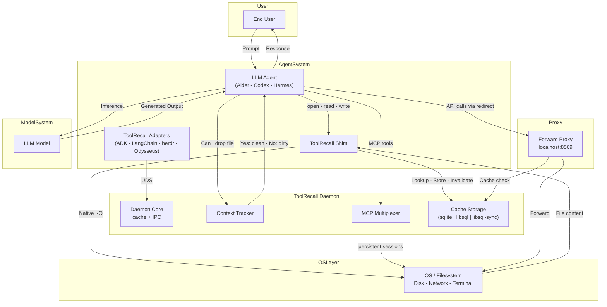

| Component | What it does | Key file |
|-----------|-------------|----------|
| **Daemon Core** | UDS IPC, request dispatch, singleton DB connection, ThreadPoolExecutor | `daemon.py` |
| **Cache Storage** | Hybrid in-memory LRU + SQLite WAL. Default: sqlite. Optional: libsql, libsql-sync + Turso | `cache.py`, `storage/` |
| **Forward Proxy** | Intercepts API calls by URL redirection (`localhost:8569`), caches by body hash, logs usage | `proxy.py` |
| **MCP Multiplexer** | Keeps persistent MCP server sessions — no cold start per tool call | `daemon.py` (class `MCPMultiplexer`) |
| **Context Tracker** | Tracks dirty/clean files, auto-hints agents via MCP bridge | `context_tracker.py` |
| **OS-level Shim** | Patches `builtins.open`, `subprocess.run/Popen` in every Python process | `shim.py`, `tr_shim.pth` |
| **Framework Adapters** | Drop-in wrappers for ADK, LangChain, herdr, Odysseus | `adapters/` |
| **Security Gate** | Path allowlist, terminal policy, sensitive-file blocklist | (embedded in `daemon.py` + config) |

### 3.1 The Problem

Before the daemon, ToolRecall had three independent access paths — each with its own caching process:

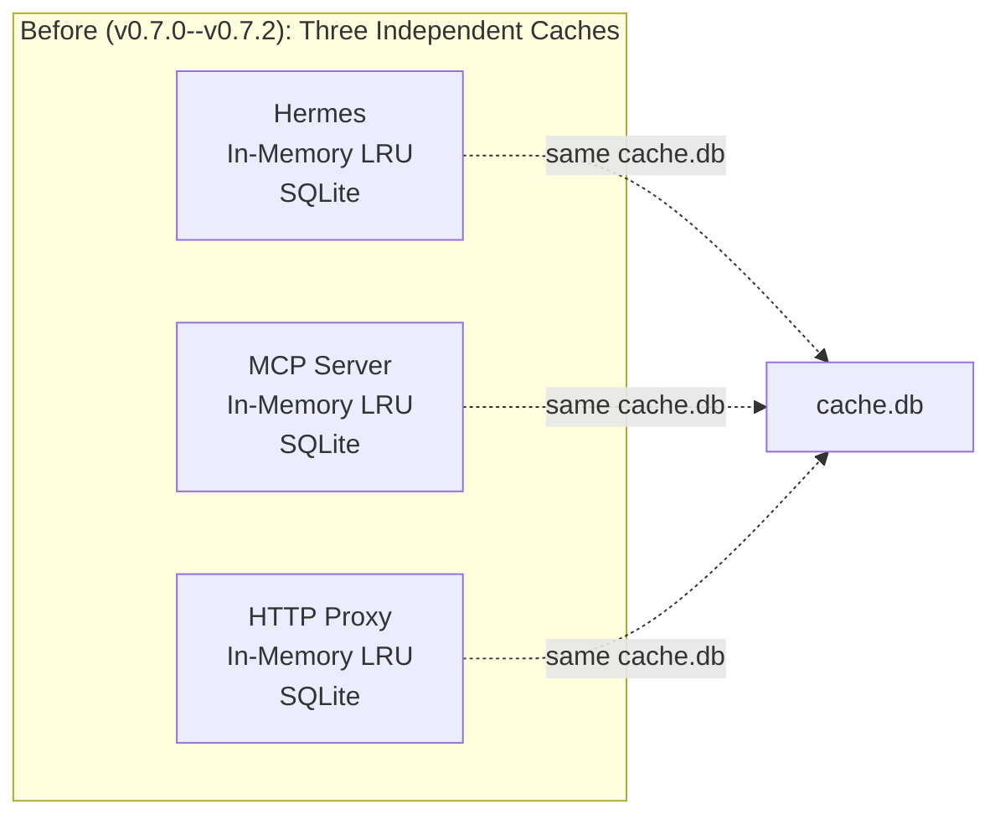

**Problems:**
1. LRUs are *not synchronized*. One process caches file A in-memory; another reads it from SQLite (7ms) despite it being available in 0.001ms.
2. Every process starts cold — three independent LRUs, each warming from scratch.
3. Each MCP server instance loads its own Python + dependencies (~200ms startup, ~60MB RAM combined).

**Today's daemon solves all three with a single warm cache shared across processes.**

### 3.2 The Solution: One Daemon, Five Access Paths

> **Tool naming convention:** The MCP bridge exposes native tool names (`read_file`,
> `write_file`, `patch`, `terminal`) that agents recognize naturally. Internally, these map
> to daemon commands (`cached_read`, `cached_write`, `cached_patch`, `cached_terminal`).
> Both names work in the MCP bridge. The Python API (`from toolrecall.client import cached_read`)
> uses the `cached_*` names directly.

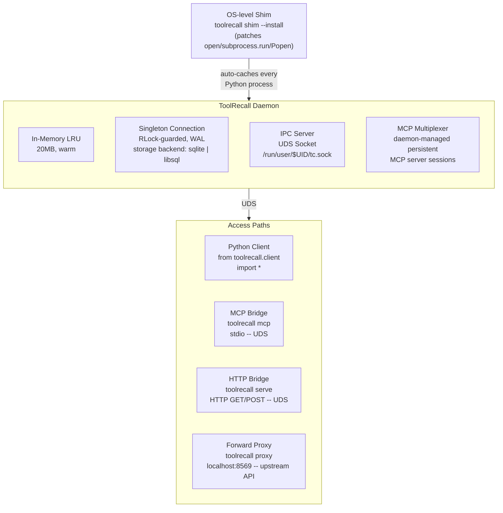

### 3.3 Access Paths

**Daemon** (`toolrecall daemon`):
- A Python process, started with the system (systemd user unit)
- Holds LRU + SQLite + UDS Server + MCP Multiplexer
- Processes requests: `{cmd: "read", path: "/x"} -> {content: "...", cached: true}`
- Optionally manages persistent MCP server sessions (multiplexer)
- Runs for days/weeks — Cache remains warm across sessions

**Python Client** (`from toolrecall.client import cached_*`):
- Forwards to the Daemon instead of maintaining its own LRU + SQLite
- `cached_read(path)` -> JSON over UDS -> Daemon checks LRU -> replies
- **Fallback:** If no Daemon is running, uses direct SQLite (legacy behavior)
- Available functions: `cached_read`, `cached_write`, `cached_patch`, `cached_terminal`,
  `cached_shell_exec`, `cached_run`, `cached_exec`, `cached_skill`, `cached_browser_*`, `cached_api_*`

**MCP Bridge** (`toolrecall mcp`):
- Starts instantly (no Python module loading — only socket + json)
- Reads stdin (JSON-RPC), translates to UDS call, writes response to stdout
- **No internal logic** — just protocol translation
- **Auto-hint mode**: after every `tools/call` response, appends a Context Tracker
  hint (`context_get_hint`) so the agent knows which files to drop from context

**HTTP Bridge** (`toolrecall serve`):
- HTTP-Request -> UDS call -> HTTP-Response
- No internal SQLite, no LRU
- Language-agnostic — any HTTP client can use it

**Forward Proxy** (`toolrecall proxy`):
- Runs on `localhost:8569` — set `OPENAI_BASE_URL=http://localhost:8569/v1`
- Forwards API requests to the real provider, caches responses by body hash
- **Cache hit** -> zero tokens consumed, provider never contacted
- **Cache miss** -> forward to provider, store response, return it
- **Stream passthrough** -> SSE responses relayed chunk-by-chunk; usage data
  extracted from final SSE event for accurate prompt/completion token logging
- **Auth-based routing**: reads Authorization header to determine upstream
- **Path-based routing** fallback: `/v1/chat/completions` -> api.openai.com

**OS-level Shim** (`toolrecall shim --install`):
- Installs `tr_shim.pth` into site-packages. Every Python process auto-caches:
  - `builtins.open` -> `cached_read` before touching disk
  - `subprocess.run` -> `cached_terminal` before forking
  - `subprocess.Popen` -> `cached_shell_exec` (strips agent wrappers) before forking
- Transparent — zero agent-side configuration needed
- Disable per-process with `TOOLRECALL_SHIM_DISABLE=1`

**Comparison: Bridges vs Shim**

| Aspect | MCP / HTTP / Proxy Bridge | OS-level Shim |
|--------|--------------------------|---------------|
| **Scope** | Agent connects explicitly | All Python processes worldwide |
| **Config** | MCP config per agent | One `toolrecall shim --install` |
| **Control** | Agent chooses to use cached tools | Transparent — agent never knows |
| **Fallback** | Native tools always available | Shim bypasses native tools |
| **Disable** | Remove from MCP config | `TOOLRECALL_SHIM_DISABLE=1` env |

## 4. Components

### 4.1 Daemon Core

The daemon uses a singleton connection wrapped in a `_DBConnection` class,
protected by a `threading.RLock()`. The backend storage layer is isolated in `toolrecall/storage/`.

**Before (v0.7.0--v0.7.2): Connection-per-call**

Each function opened its own SQLite connection via `_get_db()`, did work, and closed it.
With the daemon's 16-thread `ThreadPoolExecutor`, this caused:
- "database is locked" — multiple connections competing for WAL write-locks
- Transaction conflicts — `cannot start a transaction within a transaction`
- Stats recording failures — `_record()` used a separate persistent connection that never released its write-lock

**After (v0.7.3+): Singleton + RLock**


**Design decisions:**

| Decision | Why |
|----------|-----|
| **Singleton** (`_db_real`) | Eliminates WAL lock contention between connections |
| **RLock** not `Lock` | `_record()` is called from within `cached_read()` which already holds the lock — RLock allows re-entry |
| **`__del__` safety** | If an exception path skips `.close()`, the destructor releases the lock. Prevents deadlocked threads |
| **`close()` = commit** | Repurpose `conn.close()` to `commit + release` instead of actually closing the handle |
| **`_stats_conn` removed** | Old persistent stats connection held its own WAL lock. Now all recording uses `_get_db()` |

**Thread safety guarantees:**
- 16 daemon worker threads -> serialized on RLock, no DB-level contention
- One process = one connection = zero "database is locked"
- Direct Python CLI calls (`cached_read()` from terminal) still open their own connection and may block — by design: the daemon owns the cache

### 4.2 Storage Backend (v0.8.14+)

Connection creation is delegated to `toolrecall/storage/` — the single swap point below the singleton. Everything above it sees one sqlite3-compatible connection.

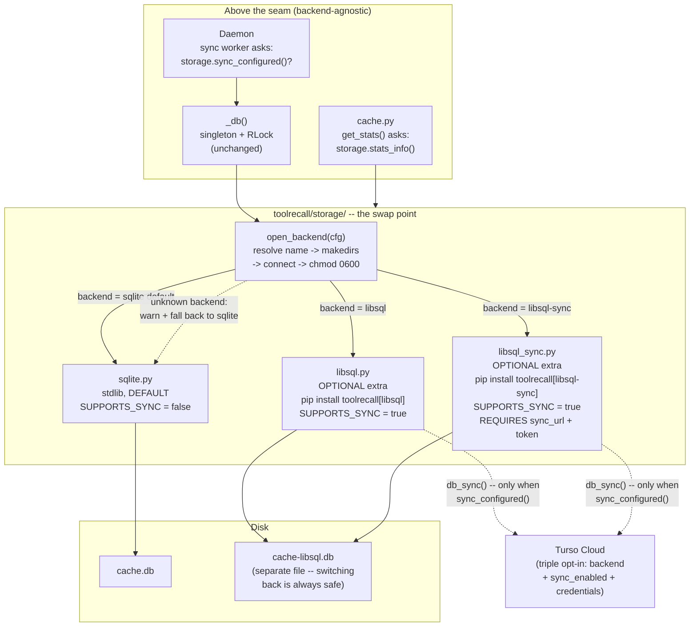

**Design decisions:**

| Decision | Why |
|----------|-----|
| Swap at connection creation | The backend choice belongs at the seam below the singleton — not in a repository layer that backends don't need |
| Lazy backend import | `storage/__init__.py` imports a backend module only when selected |
| Everything optional | sqlite is default; libsql is an extra; Turso sync is further opt-in |
| `sync_configured()` as single source of truth | Daemon and `db_sync()` ask the same function — policy can't drift |
| Not in `adapters/` | Adapters face frameworks *above* the daemon; storage faces disk *below* it |
| Separate DB file per backend | Switching backends can never corrupt the other's file |

**Adding a backend:** one module in `storage/` exposing `connect(cfg, db_path)`,
`SUPPORTS_SYNC`, and optionally `sync_configured(cfg)` / `stats_info(cfg)`,
plus one entry in `_BACKENDS`. `daemon.py` and `cache.py` need zero changes.

### 4.3 OS-level Shim (v0.7.0+)

The OS-level shim provides a 5th access path at the Python interpreter level.

```bash
toolrecall shim --install
```

This installs `tr_shim.pth` into site-packages. Every Python process auto-imports
`toolrecall.shim`, which monkey-patches:

- `builtins.open` -> `cached_read` before touching disk
- `subprocess.run` -> `cached_terminal` before forking
- `subprocess.Popen` -> `cached_shell_exec` (strips agent wrappers) before forking

The `cached_shell_exec` function (v0.8.14+) strips agent-specific shell wrappers
(fabric shell, Claude Code hermetic_run, aider script wrappers) before checking
the cache — so the same command through different agents gets a hit.

```python
# tr_shim.pth contains one line:
import toolrecall.shim

# shim.py then:
#   builtins.open = _shim_open           # routes through cache
#   subprocess.run = _shim_run           # routes through cache
#   subprocess.Popen = _shim_popen       # routes through cached_shell_exec
#   TOOLRECALL_SHIM_DISABLE=1  -> skip shim per-process
```

**Key difference:** The shim works at the interpreter level — zero agent-side
configuration. Aider, Codex CLI, scripts, even Hermes itself benefit immediately.

### 4.4 MCP Multiplexer (v0.8.10+)

The MCP Multiplexer (`MCPMultiplexer` in `daemon.py`) manages persistent MCP
server sessions inside the daemon:

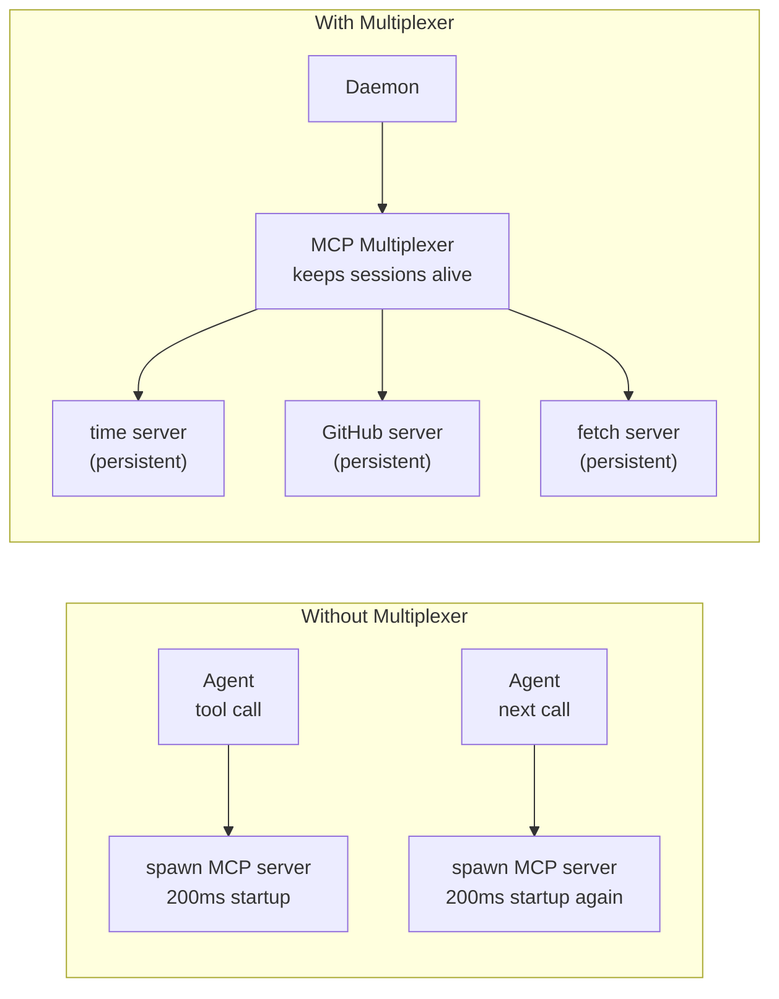

| Feature | Details |
|---------|---------|
| **Persistent sessions** | MCP server processes run inside the daemon — no cold start per call |
| **Transparent cache** | Multiplexed tool results cached with configurable TTL (`default_ttl: 60`) |
| **Idle timeout** | Server auto-terminates after `idle_minutes` of no use (default 15) |
| **Allowlist** | `servers` config restricts which servers the daemon manages |
| **Per-server config** | TTL, args, env overrides per server via `servers_config` |

Configuration:

```toml
[mcp_multiplex]
enabled = true
servers = ["time", "fetch", "github"]
idle_minutes = 15
transparent_cache = true
default_ttl = 60

[mcp_multiplex.servers_config]
time = { ttl = 120 }
fetch = { ttl = 300 }
```

Note: The multiplexer handles `mcp_cache` stats — every tool call through the
multiplexer records hit/miss to `mcp_cache`.

### 4.5 Context Tracker

The Context Tracker (`toolrecall/context_tracker.py`) tracks which files the
agent has read vs. modified. It lives inside the daemon.

| File Status | Meaning | Can drop from context? |
|-------------|---------|----------------------|
| **Clean** | Agent read the file but never wrote to it | Yes — re-read from SQLite (~7ms) |
| **Dirty** | Agent wrote to the file | No — edits must stay in context |
| **Unknown** | File not yet tracked | N/A — first read will cache it |

**How it works:**

When the daemon starts, it sets an auto-checkpoint (`daemon_start`). Agents can query:

| Command | What it does |
|---------|-------------|
| `context_set_checkpoint(name)` | Mark current state as new baseline |
| `context_get_dirty()` | Returns `{dirty: [...], clean: [...], ctx_dropped_tokens: N}` |
| `context_get_hint()` | Returns formatted hint text for agent prompts |
| `context_get_stats()` | Cumulative stats including `ctx_dropped_tokens_total` |
| `context_reset()` | Wipe all tracking state |

**ctx_dropped_tokens (v0.8.12+):**

When clean files are dropped from context, the tracker estimates saved tokens:
```
ctx_dropped_tokens += len(file_content) / 4
```

Exposed in daemon ping response, `--status` output, and `context_get_stats()`.

**Auto-hint through MCP Bridge (v0.8.10+):**

The MCP bridge calls `context_get_hint()` after every `tools/call` response:

```
Clean files (re-read from cache if needed):
  - /app/src/main.py
  - /app/src/utils.py

Dirty files (keep in context -- you edited them):
  - /app/src/api.py
```

**MCP cache stats (v0.8.14+):**

The daemon records `mcp_cache` hits/misses per MCP bridge tool call, independent
of file/terminal cache stats, via `_cache_record("mcp_cache", hit=bool, path=...)`.

### 4.6 Framework Adapters (v0.8.9+)

Drop-in adapters for popular agent frameworks. All communicate with the daemon over UDS:

| Adapter | What it wraps | Setup |
|---------|--------------|-------|
| **Google ADK** | `@cached_tool` decorator for `@FunctionTool` | `pip install toolrecall`, then `@google_adk.cached_tool(ttl=300)` |
| **LangChain / LangGraph** | `ToolRecallCache` (LLM cache) + `ToolRecallCallbackHandler` (tool cache) | `pip install toolrecall[langchain]` |
| **herdr** | `tr` binary + MCP bridge — every pane inherits the cache | Build `tr`, run `toolrecall mcp` |
| **Odysseus** | `install_agent_cache()` + `install_mcp_cache()` | `pip install toolrecall`, then `odysseus.install_agent_cache()` |

See `toolrecall/adapters/README.md` for full documentation.

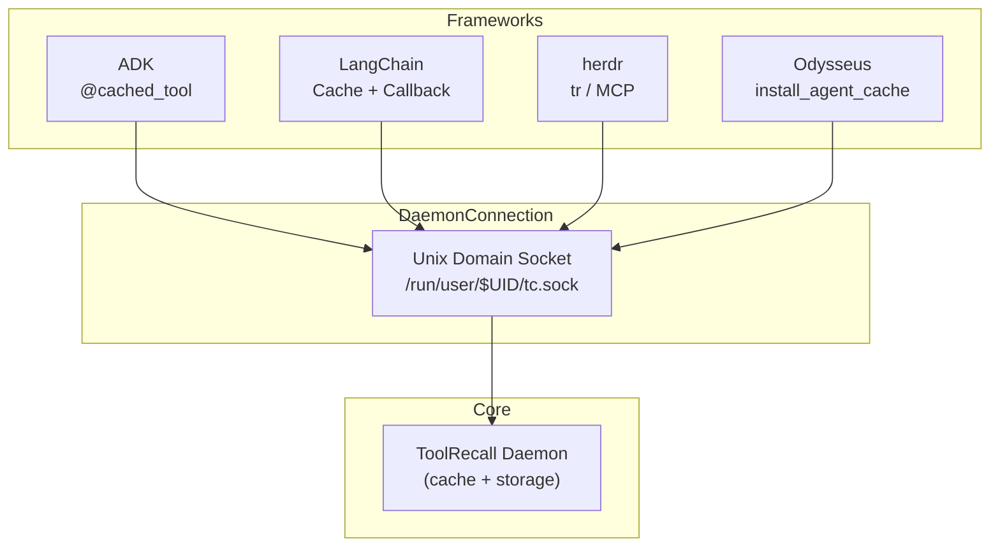

## 5. Data Flow & Costs

### 5.1 Sequence Diagrams

**Scenario 1 — File Read (Cache Hit)**

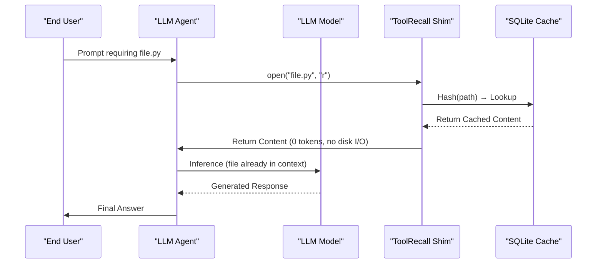

Result: **0 tokens** for the file. ~0.6ms (LRU) / ~7ms (SQLite).

**Scenario 2 — File Read (Cache Miss)**

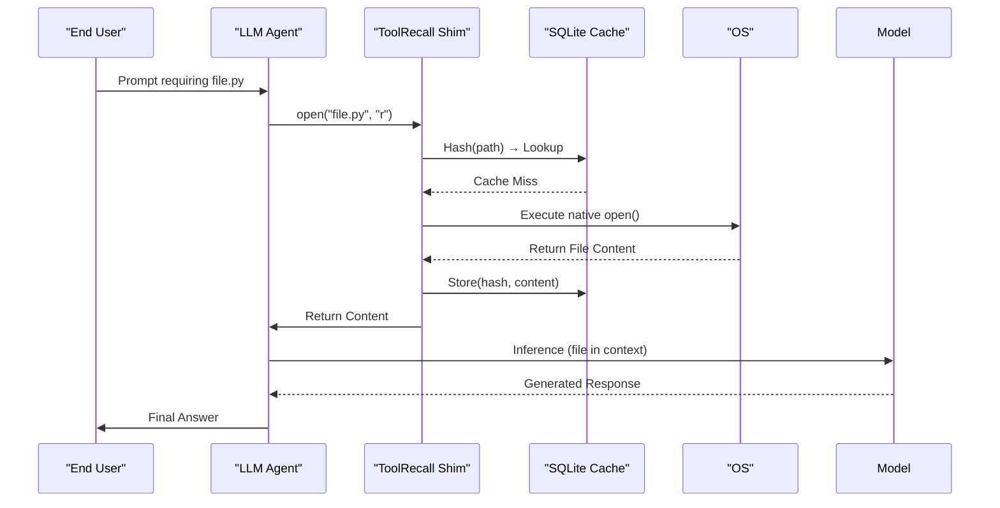

Result: **file_size x ~0.25 tokens** consumed. Disk I/O + first write to cache.

**Scenario 3 — File Write**

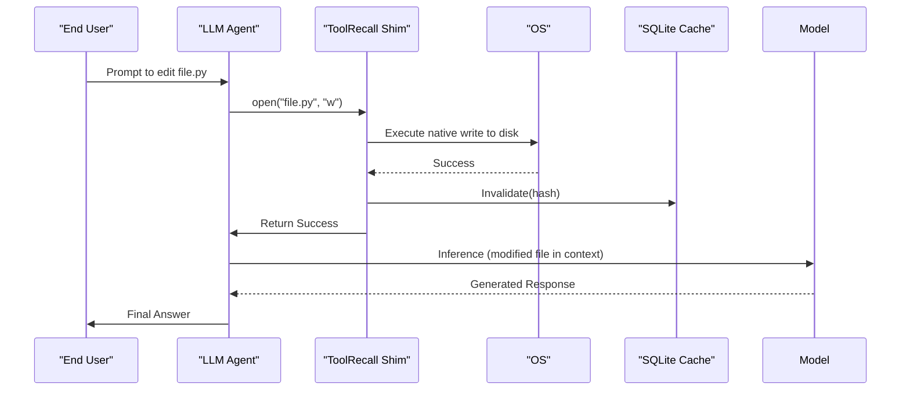

Result: **file_size x ~0.25 tokens** consumed. Cache entry invalidated.

**Scenario 4 — Context Hint (auto-trigger)**

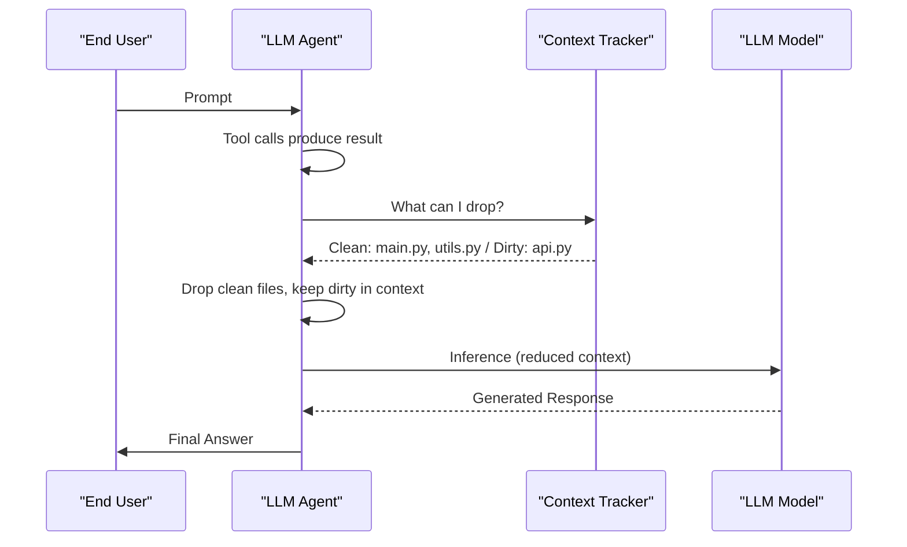

Result: **~90% context reduction** on clean files. Re-read from SQLite if needed (~7ms).

**Scenario 5 — Forward Proxy (API Cache Hit)**

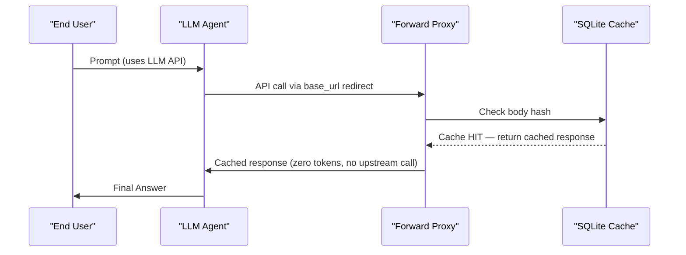

Result: **0 tokens consumed**. Provider never contacted. ~7ms local cache lookup.

**Scenario 6 — Forward Proxy (Stream Passthrough)**

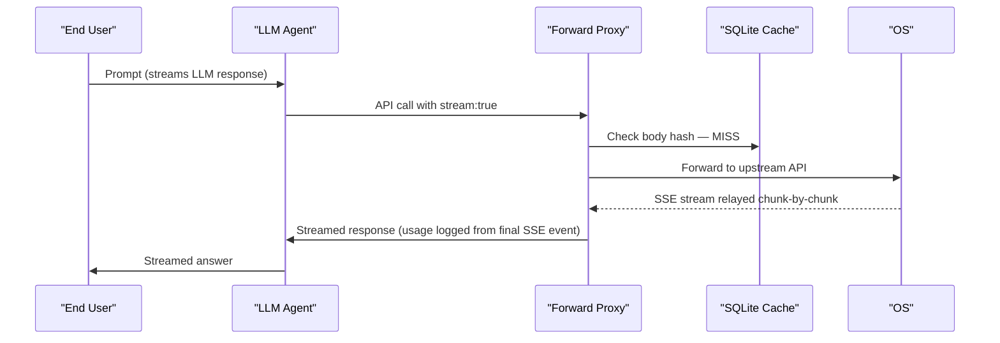

Result: Full token cost. SSE relayed with accurate usage logging from final event.

### 5.2 Token Costs

| Scenario | Token Cost | Latency | Cache type |
|----------|-----------|---------|-----------|
| **File read (Cache Hit)** | **0 tokens** | ~0.6ms (LRU) / ~7ms (SQLite) | file_cache |
| **File read (Cache Miss)** | **file_size x ~0.25 tokens** | File I/O + inference time | file_cache |
| **File write** | **file_size x ~0.25 tokens** | Write + inference time | file_cache |
| **Terminal (Cache Hit)** | **0 tokens** for the output | ~0.6ms | terminal_cache |
| **MCP tool (Cache Hit)** | **0 tokens** for the result | ~7ms | mcp_cache |
| **Browser snapshot (Hit)** | **0 tokens** for the page | ~7ms | browser_cache |
| **API call (Cache Hit)** | **0 tokens -- provider never contacted** | ~7ms | api_cache |
| **API call (Cache Miss)** | Full prompt + completion cost | Upstream API latency | api_cache |
| **API call (Stream passthrough)** | Full prompt + completion cost | SSE stream latency | api_cache (usage logged) |
| **Context drop (clean file)** | ~90% reduction -- re-read from SQLite on next access | ~7ms re-read | context_tracker |

## 6. Target Audience

### 6.1 Hermes users
| Today | Daemon Architecture |
|-------|---------------------|
| Cold cache per session | Cache always warm (Daemon runs for days) |
| MCP Server needs extra RAM | MCP Bridge is <10MB |
| Hermes Restart = Cache cold | Daemon survives Hermes restarts |

### 6.2 Developers embedding ToolRecall
| Today | Daemon Architecture |
|-------|---------------------|
| Must `from toolrecall import cached_read` | Use UDS from any language (curl, nc, Go, Rust) |
| Python-only | Any language via UDS or HTTP bridge |

### 6.3 Framework adapter users (ADK, LangChain, herdr, Odysseus)
| Today | Daemon Architecture |
|-------|---------------------|
| Framework-specific caching per tool | Shared cache across all frameworks |
| Manual cache config per framework | Drop-in adapter -- daemon handles everything |
| No shared state between frameworks | All adapters talk to the same daemon over UDS |

### 6.4 Claude Code / Cursor / Codex (MCP multiplex + forward proxy only)
| Today | Daemon Architecture |
|-------|---------------------|
| MCP Server is a distinct process (200ms) | MCP Bridge starts in <10ms |
| Every run = new cold cache | Daemon runs, cache warm |
| Each tool call spawns a new MCP process | **MCP Multiplexer** keeps persistent sessions |

> MCP Multiplex and forward proxy are safe with these agents. File/terminal caching
> can conflict with native state tracking. See [Agent Compatibility](AGENT_COMPATIBILITY.md).

### 6.5 CI/CD
| Today | Daemon Architecture |
|-------|---------------------|
| Every CI Step starts its own cache | One Daemon per Build Host |
| Cache never gets warm | Cache persists across Step boundaries |

### 6.6 Turso Cloud users
| Today | Daemon Architecture |
|-------|---------------------|
| Local SQLite only | libsql-sync backend + Turso Cloud sync |
| Cache dies with the machine | Sync cache state to Turso, restore on new hosts |

## 7. Comparison

### 7.1 Before vs After
| Aspect | Before (3 independent caches) | After (one daemon) |
|--------|------------------------------|-------------------|
| **Architecture** | 3 equal processes | 1 Center + 4 Bridges + 1 Shim |
| **Cache-Sharing** | Only SQLite (7ms) | LRU + SQLite (0.001ms + 7ms) |
| **RAM** | ~60MB (3 x LRU) | **~11MB idle**, ~130MB with MCP servers |
| **MCP Startup** | ~200ms (uv run python -m ...) | ~5ms (Python stdio -> socket) |
| **MCP Sessions** | Process per call | Persistent multiplex (daemon-managed) |
| **Language Binding** | Python only | Python + MCP + HTTP + Shim (any language via UDS) |
| **Fault Tolerance** | One dies, others live | Daemon dies -> all dead (requires systemd) |
| **Complexity** | 3 Modules side-by-side | 1 Core + 4 thin Bridges + 1 Shim |
| **API caching** | None | Body-hash forward proxy with auth-based routing |
| **Context dropping** | Manual | Auto-checkpoint + auto-hint through MCP bridge |

### 7.2 UDS vs HTTP vs Direct Import

| Approach | Latency | Sharing | Complexity |
|----------|---------|---------|------------|
| **Direct import** (`from toolrecall import cached_read`) | 0.001ms + 0ms overhead | Per process, no sharing | None |
| **Daemon + UDS** | ~0.1ms per call | Shared across all processes | One daemon, UDS socket |
| **HTTP Bridge** | ~0.5ms per call | Any HTTP client | Port-based, network stack |

**Question:** Not "faster or slower" but "one process or multiple?" A daemon is only
needed when multiple processes share the cache. In practice: 0.1ms UDS overhead is
nothing compared to 3-10s LLM API calls.

| Scenario | Optimal Path |
|----------|--------------|
| Single Process (only Hermes) | Direct Import |
| Multi Process (Hermes + MCP + HTTP) | Daemon |
| CI/CD / Microservices | Daemon |

## 8. Deployment & Configuration

### 8.1 Installation

```bash
pipx install toolrecall
toolrecall setup                 # One-shot: config -> systemd -> daemon start
toolrecall daemon --foreground & # Alternative: foreground mode
```

Optional paths:
```bash
# OS-level shim
toolrecall shim --install

# MCP bridge -- add to agent MCP config:
# {
#   "mcpServers": {
#     "toolrecall": {
#       "command": "toolrecall",
#       "args": ["mcp"]
#     }
#   }
# }

# Forward proxy (set OPENAI_BASE_URL=http://localhost:8569/v1)
toolrecall proxy

# Extra storage backends
pip install toolrecall[libsql]       # libSQL local backend
pip install toolrecall[libsql-sync]  # libSQL + Turso Cloud sync
```

### 8.2 Env Overrides

Set these **before starting your agent** (not the daemon):

| Env | Default | Affects | Effect |
|-----|---------|---------|--------|
| `TOOLRECALL_SHIM_DISABLE=1` | *(not set)* | OS-level shim | Disable per-process |
| `TOOLRECALL_TRANSPORT` | UDS auto | Client IPC | Override transport path |
| `TOOLRECALL_FORWARD_PORT=9090` | `8569` | Forward proxy | Change the proxy port |
| `TOOLRECALL_FORWARD_TIMEOUT` | `30` | Forward proxy | Upstream timeout (seconds) |
| `TOOLRECALL_FORWARD_STREAM_TIMEOUT` | `300` | Forward proxy | Streaming timeout (seconds) |
| `TOOLRECALL_MCP_MULTIPLEX_ENABLED` | *(config)* | MCP multiplexer | Enable/disable persistent MCP sessions |
| `TOOLRECALL_MCP_MULTIPLEX_SERVERS` | *(config)* | MCP multiplexer | Server allowlist |
| `TOOLRECALL_MCP_MULTIPLEX_DEFAULT_TTL` | `60` | MCP multiplexer | Default cache TTL for multiplexed tools |
| `TOOLRECALL_MCP_MULTIPLEX_TRANSPARENT_CACHE` | `true` | MCP multiplexer | Enable/disable transparent caching |

### 8.3 Proxy Usage Logging

The forward proxy logs every request to `~/.toolrecall/proxy_usage.csv`:

| Field | Source | Example |
|-------|--------|---------|
| `cache_status` | HIT / MISS / STREAM | HIT |
| `target_host` | Upstream API hostname | api.openai.com |
| `prompt_tokens` | Actual or estimated | 523 |
| `completion_tokens` | From provider usage | 412 |
| `cache_read_tokens` | Provider prefix-cache read | 128 |
| `cache_write_tokens` | Provider prefix-cache write | 0 |

### 8.4 Auth-based Proxy Routing

When `Host` is localhost (SDK redirect), the proxy determines the real upstream:

| Method | Priority | How it works |
|--------|----------|-------------|
| **X-Target-Host header** | 1 (highest) | Explicit override for SDK usage |
| **Authorization header prefix** | 2 | `sk-or-` -> OpenRouter, `sk-ant-` -> Anthropic, `xai-` -> xAI |
| **Path prefix** | 3 | `/v1/chat/completions` -> api.openai.com |
| **Host header** | 4 (lowest) | Direct when not localhost |

## Reference

### A. Cache Invalidation Rules

| Cache Type | Invalidation | How it works |
|------------|-------------|--------------|
| **File cache** | **mtime-based** (automatic) | `os.path.getmtime()` checked on every `cached_read()`. File modified -> next read fetches fresh from disk. |
| **Terminal cache** | **TTL-based** | Only cached for static commands (hostname, whoami, pwd...). Default TTL 300s. |
| **MCP cache** | **TTL-based** | External MCP server responses. Configurable per server. Default 60s. |
| **Browser cache** | **TTL-based** | Browser page snapshots. Default TTL 300s. |
| **Skill cache** | **Content-based** | Skill files cached by name. Invalidated on disk change. |
| **API cache** | **Request-body hash** | Forward proxy responses. Same body -> same response. No expiry. |
| **Write invalidation** | **Explicit** | Every `cached_write()` / `cached_patch()` deletes stale cache entries. |

### B. Full Cache Coverage

| Mechanism | What gets cached | Invalidation | Token saving |
|-----------|----------------|-------------|-----------|
| **File cache** | First disk read per file | `mtime` changes | Smaller context -> provider prefix-cache discounts |
| **Terminal cache** | Static commands (hostname, whoami...) | TTL-based (300s) | Same output never re-sent to LLM |
| **MCP cache** | External MCP server responses | TTL-based (60s default) | Repeated results served from local cache |
| **Browser cache** | Browser page snapshots | TTL-based (300s) | Same page never re-scraped |
| **Skill cache** | Skill files from disk | Content-based | Loaded once, reused across sessions |
| **Script/Code cache** | `cached_run`, `cached_exec` output | `ttl=0` disables caching | Same as file cache |
| **API cache** | Full API responses | Body hash | **Zero tokens consumed** on hit |
| **Forward proxy** | Upstream API replies | Body hash + method routing | Zero provider tokens on hit |
| **Context Tracker** | Dirty/clean file state | In-memory (resets on restart) | ~90% reduction -- drop clean files |

### C. Cache API Reference

**Script & Code Cache:**
```python
from toolrecall import cached_run, cached_exec
result = cached_run("/path/to/script.sh", args="--flag value", ttl=300)
result["output"], result["exit_code"], result["cached"]
result = cached_exec("print('hello')", ttl=60)
```

**Browser Cache:**
```python
from toolrecall import cached_browser_check, cached_browser_store
result = cached_browser_check("browser:page:https_example_com:snapshot")
cached_browser_store("browser:page:https_example_com:snapshot", content)
```

**Skill Cache:**
```python
from toolrecall import cached_skill
skill = cached_skill("my-skill", skill_dirs=["~/.hermes/skills"])
```

**Context Tracker:**
```python
from toolrecall.client import (
    context_set_checkpoint, context_get_dirty,
    context_get_hint, context_get_stats, context_reset,
)
cp = context_set_checkpoint("start")
result = context_get_dirty()  # returns {dirty: [...], clean: [...], ctx_dropped_tokens: N}
hint = context_get_hint()
stats = context_get_stats()
context_reset()
```

See [Context Tracker](CONTEXT_TRACKER.md) for the full workflow.

### D. Key Files

| File | Role |
|------|------|
| `toolrecall/shim.py` | OS-level patch module (patches `builtins.open`, `subprocess.run/Popen`) |
| `toolrecall/tr_shim.pth` | `.pth` file auto-imported by site-packages |
| `toolrecall/cache.py` | In-memory LRU + SQLite cache backend (all cache types) |
| `toolrecall/client.py` | Python client (MCP bridge + direct imports) |
| `toolrecall/context_tracker.py` | Context Tracker (dirty/clean file state + ctx_dropped_tokens) |
| `toolrecall/daemon.py` | Daemon core + MCPMultiplexer + IPC dispatch |
| `toolrecall/proxy.py` | Forward proxy (auth routing, streaming, usage logging) |
| `toolrecall/mcp_bridge.py` | MCP stdio bridge (JSON-RPC to UDS) |
| `toolrecall/storage/` | Storage backend layer (sqlite, libsql, libsql-sync) |
| `toolrecall/transport.py` | UDS transport client/server |
| `toolrecall/security.py` | Security gate, path allowlist, terminal policy |
| `toolrecall/adapters/` | Framework adapters (ADK, LangChain, herdr, Odysseus) |

### E. FAQ

1. **Who manages the Daemon?** Managed via user systemd (`systemctl --user`).
2. **Fallback if daemon dies?** Yes, `cached_read` falls back to direct SQLite, implemented in `client.py`.
3. **UDS Path?** `XDG_RUNTIME_DIR` (e.g., `/run/user/1000/toolrecall.sock`).
4. **Auth?** UDS has only Filesystem-Permissions (`chmod 700`). Enough for single-user dev machines.
5. **Multiuser?** Two users need separate sockets — `XDG_RUNTIME_DIR` inherently isolates users.
