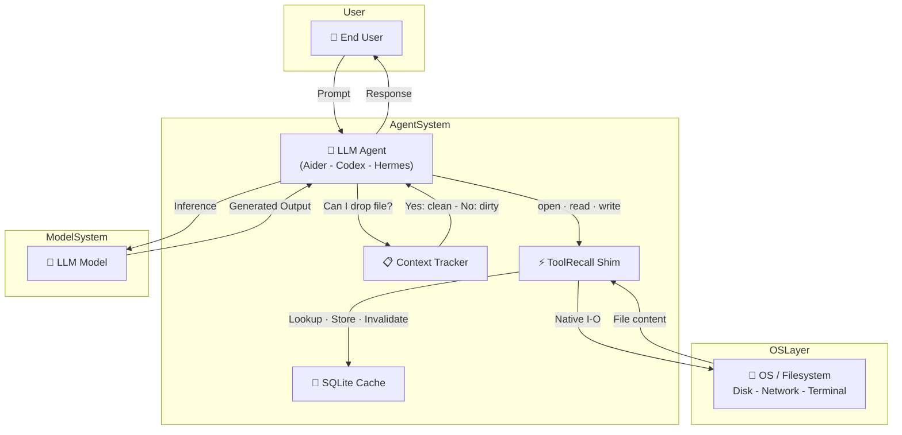
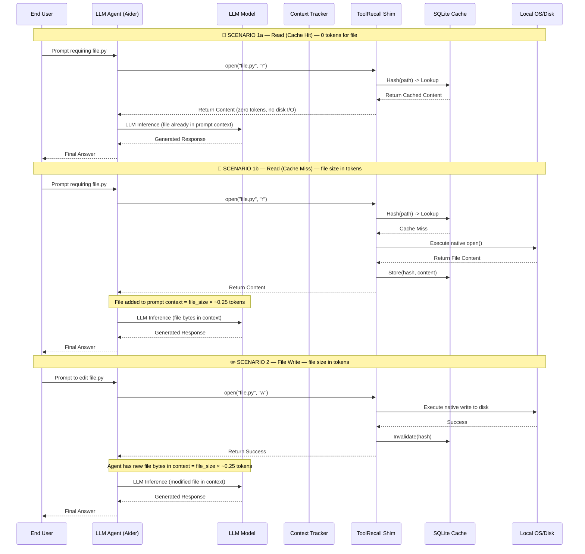

# ToolRecall Caching Architecture

> **Based on:** v0.7.0 (Commit `8757694`)
> **Status:** 28 June 2026

## Overview

ToolRecall is an OS-level transparent cache. It intercepts file I/O at two levels:

| Path | What it caches | Mechanism |
|------|---------------|-----------|
| **MCP bridge** | File reads, terminal output, MCP server responses | Agent connects as MCP client → daemon caches via LRU + SQLite |
| **Forward proxy** | Full HTTP API responses | Body hash → cache hit = zero tokens consumed, provider never contacted |
| **OS-level shim** (`.pth` patch) | `open()` + `subprocess.run()` everywhere | `toolrecall shim --install` → every Python process auto-caches |

All three paths share one daemon with one LRU + one SQLite store.

---

## System Architecture



---

## Sequence Diagram



---

## Token Cost per Scenario

| Scenario | File in Context? | Token Cost | Latency |
|----------|-----------------|------------|---------|
| **Read (Cache Hit)** | Already in context from before | **0 tokens** for the file | ~0.6ms (LRU) / ~7ms (SQLite) |
| **Read (Cache Miss)** | Must be loaded into prompt | **file_size × ~0.25 tokens** | File I/O + inference time |
| **Write** | New bytes held in prompt | **file_size × ~0.25 tokens** | Write + inference time |

> **Note:** The agent may **drop** clean files from context via the Context Tracker. On re-read those incur a Miss cost again — but the data comes from SQLite (~7ms), not from disk.

---

## The Core Principle

**Man-in-the-Middle** for file I/O:

| Operation | Path | What happens | Token/Latency |
|-----------|---|---|:---:|
| **Read (Hit)** | Agent → Shim → SQLite → Agent | SQLite returns cached content. No OS call. | **0 tokens, ~0.6ms** |
| **Read (Miss)** | Agent → Shim → OS → SQLite → Agent | **1.** Shim checks SQLite — no cached entry found. **2.** Shim falls through to real OS: `open()` + `read()` from disk. **3.** Content returned to agent **and** stored in SQLite so the *next* read hits cache. | file_size × ~0.25 tokens, file I/O time (disk read + SQLite write) |
| **Write** | Agent → Shim → OS → SQLite(Invalidate) → Agent | OS writes to disk. SQLite entry deleted — next read is forced Miss. | file_size × ~0.25 tokens, write I/O time |

The contract: **after every write, the cached entry for that file is invalidated** — never stale, never inconsistent.

---

## How the Context Tracker Works

The Context Tracker runs inside the agent's process and tracks which files the agent has read vs. modified:

| File Status | Meaning | Can drop from context? |
|-------------|---------|----------------------|
| **Clean** | Agent read the file but never wrote to it | ✅ Yes — re-read from SQLite (~7ms) |
| **Dirty** | Agent wrote to the file | ❌ No — edits must stay in context |
| **Unknown** | File not yet tracked | N/A — first read will cache it |

When the agent needs to free context window space, it asks the Context Tracker for candidates. Only **clean** files are dropped — dirty files (the agent's own edits) remain in context to prevent loss.

---

## Shim Override: `TOOLRECALL_SHIM_DISABLE`

| Env Variable | Default | Effect |
|-------------|---------|--------|
| `TOOLRECALL_SHIM_DISABLE` | *(not set, shim active)* | When set to `1`, the OS-level shim (`.pth` patch) skips all caching. File operations proceed without interception — useful for debugging, benchmarking without ToolRecall, or processes that should never be cached (e.g. CI runners, build scripts with unique outputs per run). |

Without `TOOLRECALL_SHIM_DISABLE`, every `open()` and `subprocess.run()` in every Python process on the machine is transparently cached. Set it to `1` for a specific process:
```bash
TOOLRECALL_SHIM_DISABLE=1 python my_uncached_script.py
```

---

## Key Files

- `toolrecall/shim.py` — the OS-level patch module (patches `builtins.open` + `subprocess.run`)
- `toolrecall/tr_shim.pth` — `.pth` file auto-imported by site-packages (runs `import toolrecall.shim`)
- `toolrecall/hooks.py` — hook logic for open/subprocess interception
- `toolrecall/store.py` — KV-Store (SQLite FTS5 + in-memory LRU)
- `toolrecall/client.py` — Python client (used by MCP bridge + direct imports)
- `toolrecall/context_tracker.py` — Context Tracker (tracks dirty/clean file state)

---

## Installation

Install ToolRecall and start the daemon:

```bash
pip install toolrecall
toolrecall init                     # Interactive security setup (default-deny paths)
toolrecall daemon --foreground &    # Start cache daemon
```

### Optional: OS-level shim

Every Python process auto-caches `open()` and `subprocess.run()` system-wide:

```bash
toolrecall shim --install
```

### Optional: MCP bridge

Connect any MCP agent (Aider, Codex, Hermes, Cline, Cursor, Claude Code):

```json
{
  "mcpServers": {
    "toolrecall": {
      "command": "toolrecall",
      "args": ["mcp"]
    }
  }
}
```

## Env Overrides

Set these **before starting your agent** (not the daemon). Each targets a specific layer of the ToolRecall stack:

| Env | Default | Affects | Effect |
|-----|---------|---------|--------|
| `TOOLRECALL_SHIM_DISABLE=1` | *(not set)* | OS-level shim (every Python process) | Disable the shim for a specific process: `TOOLRECALL_SHIM_DISABLE=1 python my_script.py` |
| `TOOLRECALL_TRANSPORT=tcp://127.0.0.1:9090` | *(auto: UDS or TCP)* | Daemon client IPC | Override the transport path (see [Transport Layer](#transport-layer) above) |
| `TOOLRECALL_FORWARD_PORT=9090` | `8569` | Forward proxy | Change the proxy port (default: `:8569`) |

---

## Context Tracker

ToolRecall includes a **Context Tracker** — an in-memory checkpoint-based dirty-file tracker that lets agents safely drop clean file content from their context window. This breaks O(n²) attention cost growth.

| Feature | Benefit |
|---------|--------|
| **Set checkpoint** | Mark current state as "clean" |
| **Get dirty/clean** | List files written vs. read since checkpoint |
| **Reset** | Clear all tracking for a fresh cycle |
| **93.8% O(n²) reduction** | Context stays bounded across turns |

See [Context Tracker](CONTEXT_TRACKER.md) for the full workflow.

---

## Transport Layer

ToolRecall's transport layer (`toolrecall/transport.py`) provides platform-agnostic IPC between the daemon and all clients (MCP bridge, forward proxy, Python client, OS-level shim). It auto-selects the transport based on the operating system:

| Platform | Transport | Path | Latency |
|----------|-----------|------|---------|
| **Linux / macOS** | Unix Domain Socket (AF_UNIX) | `~/.toolrecall/toolrecall.sock` (or `$XDG_RUNTIME_DIR`) | ~4µs round-trip |
| **Windows** | TCP (AF_INET) | `tcp://127.0.0.1:8568` | ~0.5ms |

All messages use a length-prefixed JSON protocol (4-byte big-endian header + UTF‑8 payload, max 1 MB). The `TransportClient` handles connection, framing, timeouts, and graceful degradation — if the daemon is unreachable it returns `{"error": "daemon_unavailable"}` instead of crashing.

Override the transport path at runtime:

```bash
export TOOLRECALL_TRANSPORT=/custom/path/tc.sock    # Custom UDS path
export TOOLRECALL_TRANSPORT=tcp://127.0.0.1:9090     # Custom TCP endpoint
```

---

## Deployment (Production)

Minimal startup — only the ToolRecall Daemon runs. No other services needed.

### Persist across reboots

```bash
crontab -e
@reboot /home/yourname/start_services.sh start
```

### Forward proxy (auto-started with daemon)

Point any OpenAI-compatible SDK at the daemon to cache API responses:

```bash
export OPENAI_BASE_URL=http://localhost:8569/v1
```

### Persist across agent sessions

The daemon is an OS process — it survives `/new`, IDE reloads, connection drops.

### What "cache stays warm" means

The daemon holds the **in-memory LRU cache** (~20 MB). When the agent session ends (`/new`, IDE restart), the daemon **keeps running** — its LRU isn't cleared. Next session: no cold start, no re-reads from SQLite for hot files. The SQLite WAL cache on disk is always persistent regardless.
