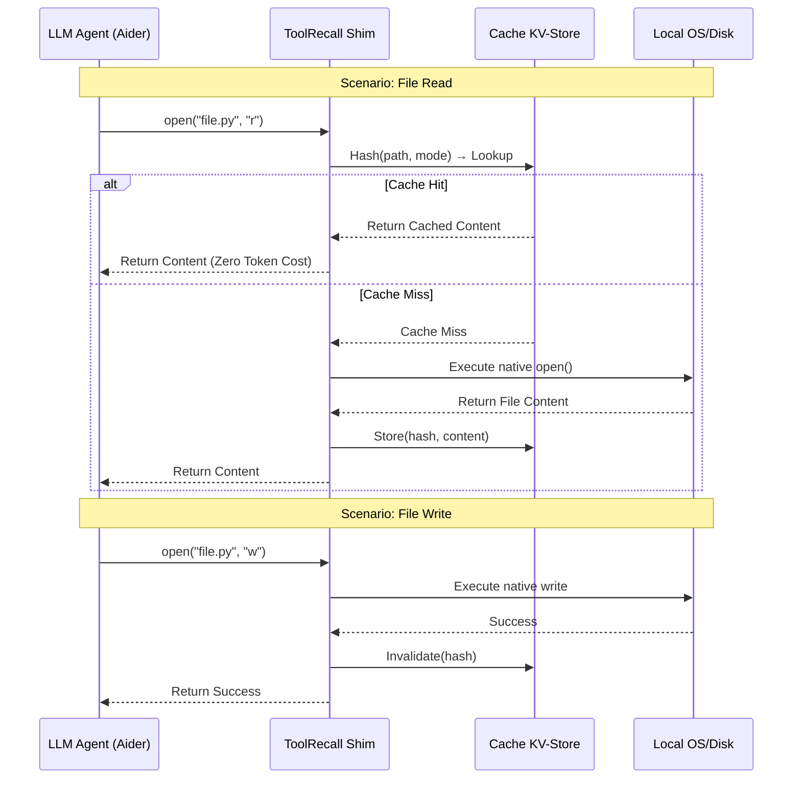

# ToolRecall Caching Architecture

> **Based on:** v0.7.0 (Commit `8757694`)
> **Status:** 28 June 2026

## Overview

ToolRecall is an OS-level transparent cache. It intercepts file I/O at two levels:

| Path | What it caches | Mechanism |
|------|---------------|-----------|
| **MCP bridge** | File reads, terminal output, MCP server responses | Agent connects as MCP client → daemon caches via LRU + SQLite |
| **Forward proxy** | Full HTTP API responses | Body hash → cache hit = zero tokens consumed, provider never contacted |
| **OS-level shim** (`.pth` patch) | `open()` + `subprocess.run()` everywhere | `toolrecall shim --install` → every Python process auto-caches |

All three paths share one daemon with one LRU + one SQLite store.

## Mermaid Sequence Diagram



## The Core Principle

**Man-in-the-Middle** for file I/O:

| Operation | Path | Effect |
|---|---|---|
| Read (Hit) | Agent → Shim → KV → Agent | No disk I/O, 0 tokens |
| Read (Miss) | Agent → Shim → OS → KV → Agent | Disk I/O, then cached |
| Write | Agent → Shim → OS → KV(Invalidate) → Agent | Disk written, cache cleared |

The contract: **after every write, the cached entry for that file is invalidated** — never stale, never inconsistent.

## Key Files

- `toolrecall/shim.py` — the OS-level patch module (patches `builtins.open` + `subprocess.run`)
- `toolrecall/tr_shim.pth` — `.pth` file auto-imported by site-packages (runs `import toolrecall.shim`)
- `toolrecall/hooks.py` — hook logic for open/subprocess interception
- `toolrecall/store.py` — KV-Store (SQLite FTS5 + in-memory LRU)
- `toolrecall/client.py` — Python client (used by MCP bridge + direct imports)

## Installation

```bash
# MCP bridge (any agent)
toolrecall daemon &                  # Start daemon
# Add to MCP config:
# { "mcpServers": { "toolrecall": { "command": "toolrecall", "args": ["mcp"] } } }

# Forward proxy (API-level, auto-started with daemon)
export OPENAI_BASE_URL=http://localhost:8569/v1   # Any OpenAI-compatible SDK

# OS-level shim (patches every Python process system-wide)
toolrecall shim --install
```

## Env Overrides

| Env | Effect |
|-----|--------|
| `TOOLRECALL_SHIM_DISABLE=1` | Disable the OS-level shim at runtime (skip caching) |
| `TOOLRECALL_HERMES_MODE=transparent` | Enable Hermes transparent mode (hermes_init.py bypass) |