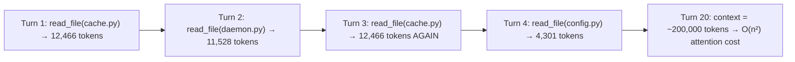
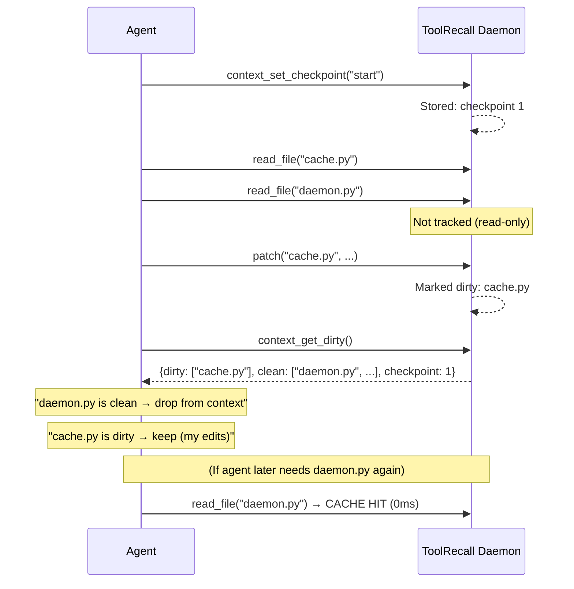
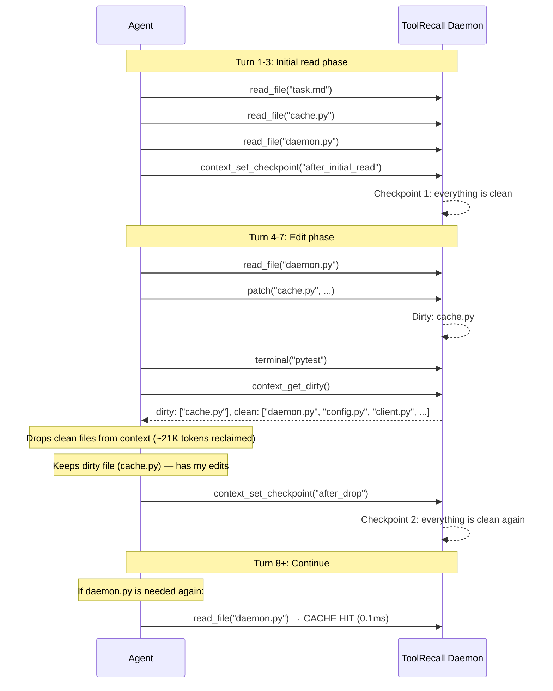

# Context Tracker — Break the O(n²) Context Snowball

> **TL;DR:** ToolRecall caches file reads so re-reading is instant (~0.1ms).  
> The Context Tracker adds **dirty-file awareness**: the agent can drop old file content from its context window and re-read on demand from cache — keeping context bounded and breaking O(n²) attention cost growth.

## Problem

Every turn, an agent appends all prior tool output to the conversation history. The LLM computes attention over the entire sequence — **O(n²) in tokens**. The more turns, the bigger the context, the slower and more expensive each subsequent turn becomes.

ToolRecall caches **OS-level I/O** (file reads, terminal commands), but it does **not** manage the agent's context window. Even when a repeat read hits cache in 0.1ms, the file content still enters the context window and contributes to the O(n²) growth.

A simple agent workflow demonstrates the problem:



The file content from turns 1-2 is still in context, even though the agent has long since finished working with it. The agent **already has the data it needs** in its reasoning output — the raw file content is redundant overhead.

## Solution: Checkpoint-Based Dirty Tracking

The Context Tracker is a lightweight module in the ToolRecall daemon that records which files have been **written** (made "dirty") since a user-defined checkpoint.



### Five MCP Tools + Auto-Hint (Available in the MCP Bridge)

| Tool | Purpose | Request | Response |
|------|---------|---------|----------|
| `context_set_checkpoint` | Mark the current file state as "clean" | `{name?: str}` | `{checkpoint: 2}` |
| `context_get_dirty` | List changed files since last checkpoint | `{checkpoint?: int}` | `{dirty: [...], clean: [...], checkpoint: N, _agent_hint: str}` |
| `context_get_stats` | Full status — current dirty list and checkpoint | `{}` | `{dirty: [...], clean: [...], checkpoint: N, total_files: N}` |
| `context_reset` | Clear all checkpoints and dirty state | `{}` | `{reset: true, checkpoint: 0}` |

### Auto-Hint: Every Tool Response Includes Context Guidance

The MCP bridge automatically calls `context_get_hint` after every tool call (except context tools themselves) and appends the hint to the result. This means **every tool response** tells the agent what to drop from context:

```
🧹 Drop these clean files from context (re-read from cache if needed):
  - /tmp/config.py
📝 Keep dirty files (you edited them):
  - /tmp/cache.py
```

The hint only appears when there's data to report — empty dirty/clean lists produce no hint. The hint is best-effort: if the daemon isn't running, the MCP bridge silently skips it.

The daemon also includes `_agent_hint` in the `context_get_dirty` response directly, so agents that call `context_get_dirty` explicitly get the same guidance.

### What Gets Tracked

| Operation | Tracked as dirty? | Mechanism |
|-----------|------------------|-----------|
| `cached_write(path, content)` | ✅ Yes | File was written by the agent |
| `cached_patch(path, ...)` | ✅ Yes | File was patched by the agent |
| `read_file(path)` / `cached_read(path)` | ❌ No | Read-only — cannot change file state |
| `cached_terminal("git commit")` | ⚠️ No (limitation) | TR can't know which files the command changed |
| `os.system()`, direct file writes | ⚠️ No (limitation) | Outside TR's IPC — TR would detect the mtime change on the *next* read, but the write isn't tracked as dirty because it bypassed the daemon |

**Key insight:** The tracker is conservative. It tracks only writes that go through ToolRecall's IPC (`cached_write`, `cached_patch`). Writes via terminal commands or external editors are not reflected in the dirty list. This is a documented limitation — the agent should call `context_set_checkpoint()` after such an operation to acknowledge the state change.

### Dirty + Clean: The Critical Distinction

The dirty/clean split solves the problem of "what can I safely forget?"

| Category | Meaning | Agent action | Risk if dropped |
|----------|---------|-------------|-----------------|
| **Dirty** | File was modified by the agent since checkpoint | **KEEP** — this is work in progress | Agent loses its own edits |
| **Clean** | File was read but not modified | **DROP from context** — re-read from cache if needed | None — cache hit gives same content in ~0.1ms |
| **Untracked** | File was never read | Not in context — no action needed | None |

### The Agent Pattern (How It Works in Practice)



## Architecture

### Module: `toolrecall/context_tracker.py`

A lightweight in-memory module. No new SQLite tables — checkpoints and dirty state are ephemeral (they reset on daemon restart, which is correct: after a restart, the agent hasn't read or written anything yet).

```python
class ContextTracker:
    """In-memory checkpoint-based dirty-file tracker."""
    
    def __init__(self):
        self._dirty: dict[str, dict] = {}  # path → {mtime, tick}
        self._checkpoint_counter: int = 0
        self._lock = Lock()
    
    def set_checkpoint(self, name: str = "") -> int:
        """Mark current state as clean. Returns checkpoint ID."""
    
    def mark_dirty(self, path: str) -> None:
        """Record a file write. Called by daemon on cached_write/cached_patch."""
    
    def get_dirty(self, checkpoint: int | None = None) -> dict:
        """Return {dirty: [...], clean: [...]} since checkpoint."""
    
    def get_stats(self) -> dict:
        """Full status."""
    
    def reset(self) -> dict:
        """Clear all state."""
```

### Integration Points

| File | Change |
|------|--------|
| `toolrecall/context_tracker.py` | **New file** — the ContextTracker class |
| `toolrecall/daemon.py` | + Import ContextTracker, instantiate in DaemonServer.__init__ | |
| | + Call `self._context.mark_dirty(path)` in `_handle_write` and `_handle_patch` | |
| | + 5 new handlers: `_handle_context_set_checkpoint`, `_handle_context_get_dirty`, `_handle_context_get_stats`, `_handle_context_reset`, `_handle_context_get_hint` | |
| | + 5 new routes in `_route()` | |
| | + `_format_context_hint()` — shared helper for hint generation | |
| `toolrecall/client.py` | + `context_set_checkpoint(name="")`, `context_get_dirty(checkpoint=None)`, `context_get_stats()`, `context_reset()` | |
| `toolrecall/mcp_bridge.py` | + 4 new MCP tools — exposed as MCP tools for any MCP agent | |
| | + Auto-trigger `context_get_hint` after every non-context tool call | |
| `tests/test_context_tracker.py` | **New file** — tests for all tracker operations |
| `hermes-agent` skill | Update pattern section |

### Daemon `_route()` Additions

```python
elif cmd == "context_set_checkpoint":
    return self._handle_context_set_checkpoint(request)
elif cmd == "context_get_dirty":
    return self._handle_context_get_dirty(request)
elif cmd == "context_get_hint":
    return self._handle_context_get_hint(request)
elif cmd == "context_get_stats":
    return self._handle_context_get_stats(request)
elif cmd == "context_reset":
    return self._handle_context_reset(request)
```

## The O(n²) Breakdown

How the Context Tracker + ToolRecall cache together solve the scaling problem —  
**the agent drops clean files every turn**, keeping only dirty (uncommitted) files across turns.

```python
# ── Model ─────────────────────────────────────────────
files_per_turn  = 7         # agent reads ~7 files/turn
avg_file_tokens = 5_000     # each ~5K tokens
read_tokens     = 35_000    # 7 × 5,000
output_tokens   = 15_000    # agent's own reasoning + code output
tokens_per_turn = 50_000    # total per-turn growth in baseline
turns           = 30
num_agents      = 10

# Baseline: everything accumulates
#   context_t = t × tokens_per_turn
#   attention_cost ∝ sum((context_t)^2 for t in 1..T)
baseline_per_agent = sum((t * tokens_per_turn)**2 for t in range(1, turns+1))
#   → ~1.3 × 10^12 attention pairs per agent

# With Context Tracker (every-turn drops):
#   Each turn starts fresh — context = this turn's read + output + dirty files
#   Dirty files = files written by agent but not yet committed
#   Typical: 1-3 dirty files × ~5K = ~15K
#   So per-turn context ≈ read_tokens + output_tokens + dirty_tokens ≈ 65K
#   This is THE SAME on turn 1 and turn 30.
per_turn_bounded = read_tokens + output_tokens + 3 * avg_file_tokens  # ≈ 65K
ct_per_agent = turns * per_turn_bounded**2
#   → ~1.3 × 10^11 attention pairs per agent
#   Reduction: (baseline - ct) / baseline ≈ 90%
```

| Agents × Turns | Baseline (attention pairs) | With Tracker (every-turn drops) | Reduction |
|:---:|:---:|:---:|:---:|
| 1 × 30 | 1.27T | 127B | **90%** |
| 5 × 30 | 6.35T | 635B | **90%** |
| 10 × 30 | 12.7T | 1.27T | **90%** |
| 20 × 30 | 25.4T | 2.54T | **90%** |
| 10 × 100 | 171T | 4.23T | **97.5%** |

The remaining ~10% is irreducibly needed: user instructions, dirty files (work in progress), and the agent's own output from the last turn.

**Key insight:** The 90% reduction is nearly independent of turn count because context is bounded per turn. The tracker prevents the *quadratic* scaling — each additional turn adds a constant, not a growing wedge.

**Without the pattern (agent never drops):**
Same as baseline — the tracker gives you the information, but you have to act on it. The daemon can't force the agent to drop clean files.

**Note:** If the agent writes many files each turn without committing or re-checkpointing, the dirty set grows and the per-turn ceiling drifts upward. The 90% is the *steady-state* figure — the tracker gives you the data to make informed drops, but it's a behavioral pattern, not a system enforcement.

### How ToolRecall and Context Tracker Complement Each Other

```mermaid
flowchart TB
    subgraph Without["Without ToolRecall cache"]
        W1["Agent drops file"]
        W2["Needs it again reads from disk"]
        W3["Cost per re-read: 1.5ms I/O + file content in context"]
        W4["Context drop is PAINFUL: re-read is slow"]
        W1 --> W2 --> W3 --> W4
    end

    subgraph With["With ToolRecall cache"]
        C1["Agent drops file"]
        C2["Needs it again reads from cache"]
        C3["Cost per re-read: 0.1ms + file content in context"]
        C4["Context drop is FREE: re-read is instant"]
        C1 --> C2 --> C3 --> C4
    end

    subgraph NoTracker["Without Context Tracker"]
        N1["Agent doesn't know which files are safe to drop"]
        N2["Keeps EVERYTHING in context just in case"]
        N3["O(n²) growth continues"]
        N1 --> N2 --> N3
    end

    subgraph WithTracker["With Context Tracker"]
        T1["Agent knows: clean = safe to drop, dirty = must keep"]
        T2["Drops all clean files at end of each turn"]
        T3["Context STAYS BOUNDED"]
        T1 --> T2 --> T3
    end
```



## Comparison: Context Tracker vs Other Approaches

| Approach | O(n²) mitigation | Complexity | Requires |
|----------|-----------------|------------|----------|
| **Do nothing** | ❌ None | Zero | — |
| **Manual `/compress`** | ⚠️ One-time reduction | CLI command per session | Hermes only |
| **Context Tracker + TR cache** | ✅ **~90% reduction, bounded context** | ~500 LOC, 4 MCP tools | ToolRecall daemon |
| **Semantic compression** | ⚠️ Depends on quality, loses detail | LLM call per compress | Auxiliary model |
| **Provider-side caching** | ⚠️ Only input token cost, not compute | Zero (automatic) | Byte-identical payloads |
| **Reset session** | ✅ 100% (but start over) | Manual | Start from scratch |

## Limitations

| Limitation | Severity | Mitigation |
|-----------|----------|------------|
| **Terminal writes not tracked:** `git commit`, `rm`, `mv` change files but bypass the daemon's write handlers. The dirty list won't reflect them. | Medium | Agent should call `context_set_checkpoint()` after shell commands that modify files. TR detects the new mtime on next read — so the data is safe, but the dirty list is stale. |
| **External editor writes not tracked:** If the user edits a file outside the agent, TR sees the new mtime on read, but the dirty list from before the edit is inaccurate. | Low | Same as terminal: `context_set_checkpoint()` after external edits. |
| **Checkpoints are in-memory:** They don't survive daemon restart. | Low | On restart, checkpoint resets to 0 and dirty list is empty — the agent hasn't read/written anything yet, so this is correct behavior. |
| **Agent must cooperate:** The dirty/clean distinction only works if the agent actually drops clean files from context. Nothing enforces this. | Medium | This is a behavioral pattern, not a system enforcement. The agent's task instructions drive the behavior. |
| **Content hash vs mtime:** Dirty detection uses mtime (path-based), not content hash. Two writes with identical content that restore the original mtime would not appear dirty. | Very low | Writing identical content is an edge case. Even if it happens, the agent would re-read from cache — same content, no harm. |
| **`cached_terminal` with state-changing commands:** `terraform apply`, `npm install` change many files. TR can't know which ones. | Medium | Documented. Agent should checkpoint after such commands. |
| **Multiple agents sharing one daemon:** If two agents write the same file, both see it as dirty, but each only knows about their own checkpoints. | Low | Multi-agent scenarios must coordinate checkpoints or use separate daemons. |


After implementation, run:

```bash
# 1. Unit tests
python -m pytest tests/test_context_tracker.py -v

# 2. Full test suite (no regressions)
python -m pytest tests/ -v

# 3. Context Tracker specific benchmark
python tests/benchmark_on2.py

# 4. Manual end-to-end with daemon
toolrecall daemon --foreground &
python -c "
from toolrecall.client import *

# Set checkpoint
result = context_set_checkpoint('start')
print('Checkpoint:', result)

# Write a file (makes it dirty)
cached_write('/tmp/test.txt', 'hello world')
result = context_get_dirty()
print('Dirty:', result)

# Reset
context_reset()
result = context_get_dirty()
print('After reset:', result)
"
```
