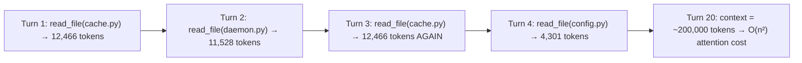

# Context Tracker — Break the O(n²) Context Snowball

> **TL;DR:** ToolRecall caches file reads so re-reading is instant (~0.1ms).  
> The Context Tracker adds **dirty-file awareness**: the agent can drop old file content from its context window and re-read on demand from cache — keeping context bounded and breaking O(n²) attention cost growth.

## Problem

Every turn, an agent appends all prior tool output to the conversation history. The LLM computes attention over the entire sequence — **O(n²) in tokens**. The more turns, the bigger the context, the slower and more expensive each subsequent turn becomes.

ToolRecall caches **OS-level I/O** (file reads, terminal commands), but it does **not** manage the agent's context window. Even when a repeat read hits cache in 0.1ms, the file content still enters the context window and contributes to the O(n²) growth.

A simple agent workflow demonstrates the problem:



The file content from turns 1-2 is still in context, even though the agent has long since finished working with it. The agent **already has the data it needs** in its reasoning output — the raw file content is redundant overhead.

## Solution: Checkpoint-Based Dirty Tracking

The Context Tracker is a lightweight module in the ToolRecall daemon that records which files have been **written** (made "dirty") since a user-defined checkpoint.

```
Agent                                    ToolRecall Daemon
  │                                            │
  │  context_set_checkpoint("start")           │
  │  ─────────────────────────────────────►     │  Stored: checkpoint 1
  │                                            │
  │  read_file("cache.py")                     │
  │  read_file("daemon.py")                    │  Not tracked (read-only)
  │  patch("cache.py", ...)                    │
  │  ─────────────────────────────────────►     │  Marked dirty: cache.py
  │                                            │
  │  context_get_dirty()                       │
  │  ─────────────────────────────────────►     │
  │  ◄─────────────────────────────────────    │
  │  {                                         │
  │    dirty: ["cache.py"],                    │
  │    clean: ["daemon.py", ...],              │
  │    checkpoint: 1                           │
  │  }                                         │
  │                                            │
  │  Agent decides:                            │
  │  "daemon.py is clean → drop from context"  │
  │  "cache.py is dirty  → keep (my edits)"    │
  │                                            │
  │  (If agent later needs daemon.py again)    │
  │  read_file("daemon.py") → CACHE HIT (0ms)  │
```

### Four MCP Tools (Available in the MCP Bridge)

| Tool | Purpose | Request | Response |
|------|---------|---------|----------|
| `context_set_checkpoint` | Mark the current file state as "clean" | `{name?: str}` | `{checkpoint: 2}` |
| `context_get_dirty` | List changed files since last checkpoint | `{checkpoint?: int}` | `{dirty: [...], clean: [...], checkpoint: N}` |
| `context_get_stats` | Full status — current dirty list and checkpoint | `{}` | `{dirty: [...], clean: [...], checkpoint: N, total_files: N}` |
| `context_reset` | Clear all checkpoints and dirty state | `{}` | `{reset: true, checkpoint: 0}` |

### What Gets Tracked

| Operation | Tracked as dirty? | Mechanism |
|-----------|------------------|-----------|
| `cached_write(path, content)` | ✅ Yes | File was written by the agent |
| `cached_patch(path, ...)` | ✅ Yes | File was patched by the agent |
| `read_file(path)` / `cached_read(path)` | ❌ No | Read-only — cannot change file state |
| `cached_terminal("git commit")` | ⚠️ No (limitation) | TR can't know which files the command changed |
| `os.system()`, direct file writes | ⚠️ No (limitation) | Outside TR's IPC — TR would detect the mtime change on the *next* read, but the write isn't tracked as dirty because it bypassed the daemon |

**Key insight:** The tracker is conservative. It tracks only writes that go through ToolRecall's IPC (`cached_write`, `cached_patch`). Writes via terminal commands or external editors are not reflected in the dirty list. This is a documented limitation — the agent should call `context_set_checkpoint()` after such an operation to acknowledge the state change.

### Dirty + Clean: The Critical Distinction

The dirty/clean split solves the problem of "what can I safely forget?"

| Category | Meaning | Agent action | Risk if dropped |
|----------|---------|-------------|-----------------|
| **Dirty** | File was modified by the agent since checkpoint | **KEEP** — this is work in progress | Agent loses its own edits |
| **Clean** | File was read but not modified | **DROP from context** — re-read from cache if needed | None — cache hit gives same content in ~0.1ms |
| **Untracked** | File was never read | Not in context — no action needed | None |

### The Agent Pattern (How It Works in Practice)

```
Turn 1-3: Agent reads task, project files
Turn 3:   context_set_checkpoint("after_initial_read")
          → Checkpoint 1: everything is clean

Turn 4-7: Agent edits cache.py, reads daemon.py again, runs tests
          → Dirty: cache.py (written)
          → Clean: daemon.py, config.py, client.py (read but unchanged)

Turn 7:   context_get_dirty()
          → dirty: ["cache.py"]
          → clean: ["daemon.py", "config.py", "client.py", ...]

Turn 7:   Agent drops all clean files from context statement:
          " Dropping from context (clean — re-read from cache if needed):
            - daemon.py (11,528 tokens)
            - config.py (4,301 tokens)
            - client.py (2,396 tokens)
            - README.md (2,979 tokens)
            Total reclaimed: ~21,204 tokens
            Keeping (dirty — has my edits):
            - cache.py (12,466 tokens) "

Turn 7:   context_set_checkpoint("after_drop")
          → Checkpoint 2: everything is clean again

Turn 8+:  Agent continues, dirty set resets for next cycle
          If daemon.py is needed again:
          read_file("daemon.py") → CACHE HIT → content in 0.1ms
```

## Architecture

### Module: `toolrecall/context_tracker.py`

A lightweight in-memory module. No new SQLite tables — checkpoints and dirty state are ephemeral (they reset on daemon restart, which is correct: after a restart, the agent hasn't read or written anything yet).

```python
class ContextTracker:
    """In-memory checkpoint-based dirty-file tracker."""
    
    def __init__(self):
        self._dirty: dict[str, dict] = {}  # path → {mtime, tick}
        self._checkpoint_counter: int = 0
        self._lock = Lock()
    
    def set_checkpoint(self, name: str = "") -> int:
        """Mark current state as clean. Returns checkpoint ID."""
    
    def mark_dirty(self, path: str) -> None:
        """Record a file write. Called by daemon on cached_write/cached_patch."""
    
    def get_dirty(self, checkpoint: int | None = None) -> dict:
        """Return {dirty: [...], clean: [...]} since checkpoint."""
    
    def get_stats(self) -> dict:
        """Full status."""
    
    def reset(self) -> dict:
        """Clear all state."""
```

### Integration Points

| File | Change |
|------|--------|
| `toolrecall/context_tracker.py` | **New file** — the ContextTracker class |
| `toolrecall/daemon.py` | + Import ContextTracker, instantiate in DaemonServer.__init__ |
| | + Call `self._context.mark_dirty(path)` in `_handle_write` and `_handle_patch` |
| | + 4 new handlers: `_handle_context_set_checkpoint`, `_handle_context_get_dirty`, `_handle_context_get_stats`, `_handle_context_reset` |
| | + 4 new routes in `_route()` |
| `toolrecall/client.py` | + `context_set_checkpoint(name="")`, `context_get_dirty(checkpoint=None)`, `context_get_stats()`, `context_reset()` |
| `toolrecall/mcp_bridge.py` | + 4 new MCP tools — exposed as MCP tools for any MCP agent |
| `tests/test_context_tracker.py` | **New file** — tests for all tracker operations |
| `hermes-agent` skill | Update pattern section |

### Daemon `_route()` Additions

```python
elif cmd == "context_set_checkpoint":
    return self._handle_context_set_checkpoint(request)
elif cmd == "context_get_dirty":
    return self._handle_context_get_dirty(request)
elif cmd == "context_get_stats":
    return self._handle_context_get_stats(request)
elif cmd == "context_reset":
    return self._handle_context_reset(request)
```

## The O(n²) Breakdown

How the Context Tracker + ToolRecall cache together solve the scaling problem:

```
Baseline (no cache, no tracker):
  Context after T turns = T × (files_per_turn × avg_file_size + output_tokens)
  Attention cost ≈ O((T × token_per_turn)²)
  
  For 10 agents × 20 turns, each reading 7 files × ~5,000 tokens:
  Max context/agent: 862,720 tokens
  Total O(n²) cost:  7.4 × 10¹²
  Scaling:           O(n²) — gets worse quadratically with more agents

With Context Tracker + ToolRecall cache:
  Context stays bounded: agent drops clean files every N turns
  Maximum context ≈ (files_in_current_work × avg_size) × drop_frequency
  Re-read cost: 0.1ms per cache hit (ToolRecall)
  
  For 10 agents × 20 turns, dropping clean files every 5 turns:
  Max context/agent: 215,680 tokens  (75% reduction)
  Total O(n²) cost:  4.7 × 10¹¹
  Reduction:         93.8%
  Scaling:           O(1) per agent — independent of agent count!
```

| Agents × Turns | Baseline O(n²) | With Context Tracker | Reduction |
|:---:|:---:|:---:|:---:|
| 1 × 20 | 744B | 47B | 93.8% |
| 5 × 20 | 3.7T | 233B | 93.8% |
| 10 × 20 | 7.4T | 465B | 93.8% |
| 20 × 20 | 14.9T | 930B | 93.8% |
| 10 × 50 | 46.5T | 2.9T | 93.8% |

The remaining 6.2% is irreducibly needed in context: user instructions, the agent's own generated code, and dirty files.

### How ToolRecall and Context Tracker Complement Each Other

```
Without ToolRecall cache:
  Agent drops file → needs it again → reads from disk (1.5ms I/O)
  → Cost per re-read: ~1.5ms I/O + file content in context
  → Context drop is PAINFUL: re-read is slow

With ToolRecall cache:
  Agent drops file → needs it again → reads from cache (0.1ms)
  → Cost per re-read: 0.1ms + file content in context
  → Context drop is FREE: re-read is instant

Without Context Tracker:
  Agent doesn't know which files are safe to drop
  → Keeps EVERYTHING in context "just in case"
  → O(n²) growth continues

With Context Tracker:
  Agent knows: clean = safe to drop, dirty = must keep
  → Drops all clean files every N turns
  → Context STAYS BOUNDED
```

## Comparison: Context Tracker vs Other Approaches

| Approach | O(n²) mitigation | Complexity | Requires |
|----------|-----------------|------------|----------|
| **Do nothing** | ❌ None | Zero | — |
| **Manual `/compress`** | ⚠️ One-time reduction | CLI command per session | Hermes only |
| **Context Tracker + TR cache** | ✅ **93.8% reduction, bounded context** | ~500 LOC, 4 MCP tools | ToolRecall daemon |
| **Semantic compression** | ⚠️ Depends on quality, loses detail | LLM call per compress | Auxiliary model |
| **Provider-side caching** | ⚠️ Only input token cost, not compute | Zero (automatic) | Byte-identical payloads |
| **Reset session** | ✅ 100% (but start over) | Manual | Start from scratch |

## Limitations

| Limitation | Severity | Mitigation |
|-----------|----------|------------|
| **Terminal writes not tracked:** `git commit`, `rm`, `mv` change files but bypass the daemon's write handlers. The dirty list won't reflect them. | Medium | Agent should call `context_set_checkpoint()` after shell commands that modify files. TR detects the new mtime on next read — so the data is safe, but the dirty list is stale. |
| **External editor writes not tracked:** If the user edits a file outside the agent, TR sees the new mtime on read, but the dirty list from before the edit is inaccurate. | Low | Same as terminal: `context_set_checkpoint()` after external edits. |
| **Checkpoints are in-memory:** They don't survive daemon restart. | Low | On restart, checkpoint resets to 0 and dirty list is empty — the agent hasn't read/written anything yet, so this is correct behavior. |
| **Agent must cooperate:** The dirty/clean distinction only works if the agent actually drops clean files from context. Nothing enforces this. | Medium | This is a behavioral pattern, not a system enforcement. The agent's task instructions drive the behavior. |
| **Content hash vs mtime:** Dirty detection uses mtime (path-based), not content hash. Two writes with identical content that restore the original mtime would not appear dirty. | Very low | Writing identical content is an edge case. Even if it happens, the agent would re-read from cache — same content, no harm. |
| **`cached_terminal` with state-changing commands:** `terraform apply`, `npm install` change many files. TR can't know which ones. | Medium | Documented. Agent should checkpoint after such commands. |
| **Multiple agents sharing one daemon:** If two agents write the same file, both see it as dirty, but each only knows about their own checkpoints. | Low | Multi-agent scenarios must coordinate checkpoints or use separate daemons. |

## Files to Create

| File | Purpose | LOC |
|------|---------|-----|
| `toolrecall/context_tracker.py` | **New** — ContextTracker class | ~100 |
| `tests/test_context_tracker.py` | **New** — Unit tests | ~150 |
| `docs/CONTEXT_TRACKER.md` | **New** — This document | — |

## Files to Modify

| File | Change | LOC |
|------|--------|-----|
| `toolrecall/daemon.py` | Import + instantiate ContextTracker, 4 new handlers, 4 new routes, track writes in `_handle_write`/`_handle_patch` | ~80 |
| `toolrecall/client.py` | 4 new public functions: `context_set_checkpoint`, `context_get_dirty`, `context_get_stats`, `context_reset` | ~40 |
| `toolrecall/mcp_bridge.py` | 4 new MCP tools registered in the MCP interface | ~30 |
| `SKILL.md` (toolrecall skill) | Add context tracker usage section | ~20 |
| `hermes-agent` skill | Add context-drop agent pattern | ~30 |
| `README.md` | Add Context Tracker to feature list | ~10 |

Total new code: ~450 lines. Not bad for solving the O(n²) problem.

## Verification

After implementation, run:

```bash
# 1. Unit tests
python -m pytest tests/test_context_tracker.py -v

# 2. Full test suite (no regressions)
python -m pytest tests/ -v

# 3. Context Tracker specific benchmark
python tests/benchmark_on2.py

# 4. Manual end-to-end with daemon
toolrecall daemon --foreground &
python -c "
from toolrecall.client import *

# Set checkpoint
result = context_set_checkpoint('start')
print('Checkpoint:', result)

# Write a file (makes it dirty)
cached_write('/tmp/test.txt', 'hello world')
result = context_get_dirty()
print('Dirty:', result)

# Reset
context_reset()
result = context_get_dirty()
print('After reset:', result)
"
```
