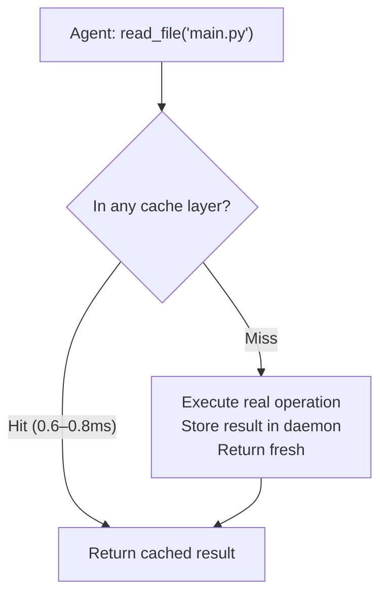

# How ToolRecall Works

One daemon. Four cache layers. One context tracker.

ToolRecall doesn't re-execute tool calls on repeat reads — it serves cached results from a shared daemon. The daemon intercepts file reads, terminal commands, MCP tool responses, and API proxy requests. Each layer has its own cacheability rules and invalidation strategy.

## The Four Cache Layers

| Layer | What it caches | Cache key | Invalidation | Repeat-read speedup |
|-------|---------------|-----------|-------------|---------------------|
| **File cache** | File reads (open/read/close) | File path + mtime | mtime changes → evict + fresh read | ~0.6ms (daemon LRU) vs ~1.5s (subprocess fork) |
| **Terminal cache** | Shell command output | Command string | TTL-based (configurable, sec–hr) | ~0.8ms vs ~1.5s (subprocess fork) |
| **MCP cache** | MCP tool results (search, fetch, docs) | Tool name + arguments | TTL per tool config | depends on tool latency |
| **Forward proxy** | HTTP API responses (provider requests) | Request body SHA256 hash | Body hash — identical request = identical response | Provider prefix caching discount up to 90% |

All four layers share one daemon process (~25 MB RSS) with a single LRU + SQLite backing store.

### File Cache

Every `cached_read()` goes through the daemon:
- **Hit:** LRU lookup (~0.001ms) → return. If evicted from LRU: SQLite lookup (~7ms) → re-prime LRU → return.
- **Miss:** Execute real read → store in LRU + SQLite → return.
- **mtime check:** On every lookup, a lightweight `stat()` (~0.01ms) compares the file's current mtime with the cached mtime. If they differ, the entry is evicted and a fresh read occurs.

Result: **99.3% hit rate** across 239 benchmark turns (3 seeds). Repeat reads are ~1000× faster than a subprocess fork.

### Terminal Cache

Not every command that hits the terminal should be cached. The cache is gated by a configurable allowlist (`[cache] terminal_ttls` in config.toml). Commands outside the allowlist execute fresh every time.

Cacheable commands are stored per TTL:
- `ls -la` → cached 30s
- `git status` → cached 10s
- `pip list --outdated` → cached 1h

### MCP Cache

The daemon includes an MCP multiplexer that lazy-loads MCP server processes. Tool results from those servers (search results, fetch responses, DB lookups) are cached per tool name + argument hash. Idle servers auto-shutdown after 15 min.

### Forward Proxy

Point any OpenAI-compatible SDK at `http://localhost:8569`. The proxy:
1. Hashes the request body (SHA256)
2. Checks the cache
3. On hit: returns cached response — provider never contacted (zero tokens consumed, zero latency)
4. On miss: forwards to provider, caches the response

Because the proxy returns byte-identical responses for identical requests, every API call that hits the cache also qualifies for the provider's prefix caching discount (up to 90%).

## Context Tracker (Overlay)

The Context Tracker is not a cache layer — it's an overlay that tells the agent *what to drop from context*.

It tracks which files are **clean** (read-only) vs **dirty** (written by the agent) since the last checkpoint. The agent can drop clean files from its conversation history after every turn, keeping only dirty files + its own reasoning.

| Mechanism | Effect | Caveat |
|-----------|--------|--------|
| Clean files dropped | Context grows at ~910 tok/turn instead of ~8,000 | Estimations; real growth depends on workload mix |
| Dirty files kept | Agent never loses in-progress edits | Only tracks writes via `cached_write`/`cached_patch` — terminal `git add` bypasses |
| Re-read from cache | Dropped clean files can be re-read at ~0.6ms | Requires ToolRecall daemon running |

In the review benchmark (pure reads, 4 files per turn):
- **Without Context Tracker:** context exhausted at turn 19 (128K harness cap)
- **With Context Tracker:** 140 turns before exhaustion — **7.4× longer**

In the bugfix benchmark (mixed reads + writes, 3 seeds, gpt-4o-mini):
- **Without:** exhausted at turn 28
- **With:** alive at turn 200 — 86% fewer tokens at turn 30

See [CONTEXT_TRACKER.md](CONTEXT_TRACKER.md) for the full API and agent integration pattern.

## The Core Lookup Flow



Per-layer detail:
- **File:** cache check = LRU → SQLite → miss → real read. mtime validated on every hit.
- **Terminal:** cache check = command in allowlist + TTL valid. If yes: return cached. If no: execute.
- **MCP:** cache check = tool name + args hash in SQLite. If yes: return. If no: execute via MCP server.
- **Proxy:** cache check = body SHA256 in SQLite. If yes: return. If no: forward to provider.

## Deterministic Outputs

Every cache layer produces **byte-identical** results for identical inputs. This is not a mechanism — it's a *property* that emerges from the combination of:

1. Content-addressable cache keys (sha256, file path + mtime, command string)
2. No LLM in the caching loop (no AI makes cache-or-execute decisions)
3. mtime-based invalidation (not heuristic expiry)

This property matters because:
- Provider prefix caching (DeepSeek, Anthropic, OpenAI) requires byte-identical prefixes to apply discounts. Because ToolRecall strips clean file content deterministically, the remaining prefix (system prompt + instructions) stays stable across turns.
- Benchmark results are reproducible — same workload, same seeds, same token counts.
- No silent data corruption from an LLM guessing which content to cache.

## What ToolRecall Does Not Do

- **It does not replace provider prefix caching.** They're complementary. TR reduces what you send; provider caching discounts what you're billed.
- **It does not hallucinate or summarize.** There is no LLM in the caching path. `ttl=0` means never cache — binary, no AI middleman.
- **It does not guarantee work completion.** Longer sessions make more work possible, but successful issue resolution depends on the agent, model, and task complexity.
- **It does not enforce context dropping.** The Context Tracker gives the agent information. The agent must act on it.

## Benchmark Caveats

- Review workload (pure reads) is ToolRecall's best case. Real sessions with writes have higher per-turn growth (~910 vs ~580 tok/turn during read-only phases).
- The 140-turn exhaustion uses a 128K harness cap. DeepSeek V4 Flash supports 1.05M context — the harness, not the model, created the ceiling.
- ToolRecall's total cost is higher than naive prefix caching because it completes more work. **Per turn, it is 16% cheaper.** The value proposition is feasibility (longer sessions, less session-switching), not absolute cost reduction.
- Bugfix numbers confirmed across 3 seeds (42, 43, 44). Review numbers from seed=42.

## How to Use

```bash
pipx install toolrecall
toolrecall setup          # starts daemon, caches begin immediately
toolrecall status         # check hit rates, cache sizes

# Optional: install OS-level shim for Python agents
toolrecall shim --install
```

The daemon starts automatically and survives terminal restarts. Connect any MCP-capable agent (Claude Code, Cursor, Cline, Hermes, opencode) via the MCP bridge.

For the Context Tracker, see [CONTEXT_TRACKER.md](CONTEXT_TRACKER.md) for the 5 MCP tools and agent integration pattern.