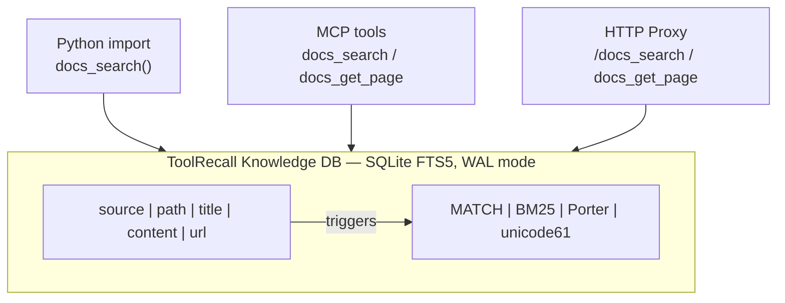

# ToolRecall Knowledge DB — FTS5 Knowledge Base

ToolRecall ships with an embedded **SQLite FTS5 knowledge base** — a zero-dependency,
no-embedding, no-GPU alternative to vector databases for agent knowledge retrieval.

- 🔍 **Full-text search** via FTS5 + BM25 ranking
- 🌍 **Porter stemming** (English + unicode61 for German/CJK)
- 🏷️ **Multi-source** with `source` field for filtered search
- 🔗 **MCP-native** — query via `docs_search()` from any MCP client
- 💾 **Zero external deps** — stdlib only (sqlite3, hashlib)

---

## Quick Start

```bash
# Index Hermes memory stores (MEMORY.md + USER.md)
toolrecall index-memory

# Index an Obsidian vault
toolrecall index-dir ~/Documents/Obsidian\\ Vault

# Index with custom source label
toolrecall index-dir --source my-notes ~/wiki

# Full re-index (skills + scripts + configured sources)
toolrecall index
```

---

## Query Syntax

### Via Python

```python
from toolrecall.docs import docs_search, docs_get_page

# Simple search
print(docs_search("WAF", source="hermes-memory"))

# Across all sources
print(docs_search("deployment"))

# Get a specific page by path
page = docs_get_page("MEMORY.md#fea181d198f6", source="hermes-memory")
```

### Via MCP (from any agent)
```python
mcp_toolrecall_docs_search(query="WAF", source="hermes-memory")
mcp_toolrecall_docs_get_page(path="MEMORY.md#fea181d198f6", source="hermes-memory")
```

### Via HTTP Proxy
```
GET /docs_search?query=WAF&source=hermes-memory
GET /docs_get_page?path=MEMORY.md%23fea181d198f6&source=hermes-memory
```

---

## Sources

Every page is tagged with a `source` field. This lets you scope searches
and keep different knowledge bases cleanly separated.

| Source | Description | CLI Command |
|--------|-------------|-------------|
| `hermes-memory` | MEMORY.md + USER.md (§-delimited) | `toolrecall index-memory` |
| `obsidian` | Obsidian vault (all .md files) | `toolrecall index-dir ~/vault` |
| `my-wiki` | Custom wiki directory | `toolrecall index-dir --source my-wiki ~/wiki` |
| *dir basename* | Default source for `index-dir` | auto |

---

## Configuring Knowledge Sources

In `~/.config/toolrecall/toolrecall.toml`, add your knowledge sources:

```toml
# Indexed on every `toolrecall index`:
[[sources.knowledge]]
path = "~/Documents/Obsidian Vault"
source = "obsidian"
extensions = [".md"]

[[sources.knowledge]]
path = "~/projects/my-wiki"
source = "my-wiki"
extensions = [".md", ".txt"]

# Hermes memory auto-indexing:
[sources.memory]
enabled = true
```

---

## Architecture



**FTS5 Triggers:** `AFTER INSERT`/`UPDATE`/`DELETE` on `pages` auto-sync `pages_fts`,
so the search index is always consistent with the base table.

---

## CLI Reference

```bash
toolrecall index           # Index configured scan_dirs + knowledge sources + memory
toolrecall index-memory    # Index Hermes MEMORY.md + USER.md (§-delimited)
toolrecall index-dir       # Index a directory (e.g. Obsidian vault)
  --source label            # Custom source label (default: dir basename)
```

---

## Comparison

| Feature | ToolRecall Knowledge DB | Vector DB (Chroma, Qdrant) | Mem0 / Supermemory |
|---------|------------------------|----------------------------|-------------------|
| Embeddings | ❌ None needed | ✅ Required | ✅ Required |
| GPU | ❌ No | ✅ Usually | ❌ No |
| External API | ❌ No | ❌ Optional | ✅ Yes |
| Latency | ~1.5ms (FTS5) | ~50-200ms | ~200-500ms |
| Deterministic | ✅ Always | ❌ Probabilistic | ❌ Probabilistic |
| Multi-source | ✅ `source` field | ❌ Collection per source | ✅ User/project |
| MCP access | ✅ Native | ❌ Custom adapter | ❌ REST-only |
| Storage | ~8MB (SQLite) | ~200MB+ | Cloud |
