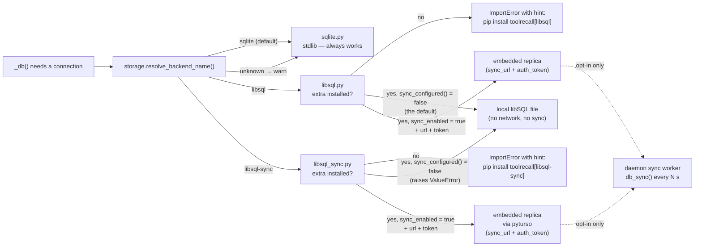

# ToolRecall Storage Backend Comparison

## `sqlite3` (stdlib) vs `libsql-experimental` vs `libsql-sync` (pyturso)

| Dimension | `sqlite3` (stdlib) | `libsql-experimental` | `libsql-sync` (pyturso) |
|---|---|---|---|
| **Package** | stdlib | `pip install toolrecall[libsql]` | `pip install toolrecall[libsql-sync]` |
| **Dependency** | 0 (bundled with Python) | ~5MB wheel (Rust native) | ~27MB wheel (Rust native) |
| **Install** | None (always available) | Optional extra | Optional extra |
| **RAM per connection** | ~2-5MB | ~10-20MB (Rust runtime) | ~10-20MB (sync engine) |
| **Writers** | Single writer (WAL allows concurrent reads) | `BEGIN CONCURRENT` — multi-writer | `BEGIN CONCURRENT` — multi-writer |
| **Cloud sync** | No | Embedded replica sync (via libsql-experimental) | **Turso Cloud sync** via pyturso (`push()`/`pull()`) |
| **Local sqld** | N/A | N/A | Not yet supported (protocol version mismatch) |
| **Requires sync config** | N/A | No (works locally) | **Yes** — raises error without sync_url + token |
| **Maturity** | 30+ years, battle-tested | Pre-1.0 | 0.7.0 (matches Turso Cloud API)

## When to use which

### Use `sqlite3` (default) when:
- Single-machine/single-process usage
- Minimal dependency footprint is critical
- You want zero extra install steps
- Standard FTS5 full-text search is sufficient

### Use `libsql` when:
- Multiple agents or processes write concurrently
- You want the schema ready for future semantic/vector lookup (not implemented yet)
- Local-only libSQL usage (no network needed)
- Your workload benefits from async I/O

### Use `libsql-sync` when:
- Cache is shared across machines via **Turso Cloud**
- You already have a Turso Cloud database with credentials
- You need explicit `push()`/`pull()` control over replication
- You accept that cache contents (file contents, command output) leave the machine

> Note: `libsql-sync` requires `sync_url`, `sync_token`, and `sync_enabled=true`.
> It does **not** work with local sqld (libsql-server) yet due to protocol version
> mismatch. For local-only libSQL, use `backend="libsql"` instead.

## Latency characteristics

Since sync is asynchronous background, local reads are always fast:

| Operation | Latency | Blocking? |
|---|---|---|
| Local cache read (hit) | ~0.6ms | No |
| Local cache read (miss → disk) | ~1.5s | Yes (normal) |
| Sync push (background) | ~50-500ms | No — async thread |
| Sync pull (background) | ~50-500ms | No — async thread |
| Remote query (future) | ~10-50ms | Opt-in only |

**Principle:** Local first, sync in background. Network never blocks a cache read.

> **Note:** Latency figures above are approximate (measured on a single Linux VM with ext4). Your results vary with hardware, filesystem, and libSQL version. The 0.6ms hit figure is for daemon-internal LRU lookup only — UDS round-trip adds ~0.1ms. The sync range (50-500ms) depends on network latency to Turso Cloud and DB size.

## How the backend is selected (everything optional)



Three independent switches, each defaulting to the safe side: the
backend (default `sqlite`), the dependency (optional extra), and sync
(`sync_enabled = false`). You can run libSQL purely locally forever —
the Turso path never activates on its own.

## ⚠️ Security: what sync uploads

**Sync is disabled by default** and stays off until you set
`sync_enabled = true` (or run `toolrecall turso enable`). Configuring
`sync_url`/`sync_token` alone does **not** start sync.

When enabled, the embedded replica pushes the **entire cache** to Turso
Cloud. That includes:

- `file_cache.content` — full contents of every cached file
- `terminal_cache` — stdout/stderr of cached commands
- `mcp_cache` — MCP tool responses

The sensitive-file blocklist is *name-based*: a `config.yaml` containing
API keys is cached like any other file and would be replicated. Only
enable sync if you accept that this data leaves the machine. Tokens
written by `toolrecall turso init` default to expiring (`30d`) and the
config files are written with `0600` permissions.

## Configuration

Set the backend in `config.toml`:

```toml
[storage]
backend = "libsql"  # or "sqlite" (default), or "libsql-sync" (sync via pyturso)
# libsql_db = "~/.toolrecall/cache.db"

# Sync to Turso Cloud (optional, OFF by default — see security note above)
# sync_enabled = false  # master switch: must be explicitly true for sync to run
# sync_url = "libsql://my-db.turso.io"
# sync_token = "..."   # Turso auth token
# sync_interval = 60    # seconds between syncs, 0 = disabled
# turso_api_base = "https://api.turso.tech"  # customizable (self-hosted/proxy)
```

Or via environment variables:

```bash
export TOOLRECALL_STORAGE_BACKEND=libsql       # or libsql-sync
export TOOLRECALL_LIBSQL_DB_PATH=~/.toolrecall/cache.db
export TOOLRECALL_SYNC_ENABLED=true   # required — sync is opt-in
export TOOLRECALL_SYNC_URL=libsql://my-db.turso.io
export TOOLRECALL_SYNC_TOKEN=...
export TOOLRECALL_SYNC_INTERVAL=60
```

## Schema compatibility

Both backends share the same SQL schema. The `embedding BLOB` column on `file_cache` and `terminal_cache` is automatically added by the migration in `_init()` regardless of backend choice — it is a *reserved* column for future vector search. **No ToolRecall code currently writes or queries embeddings** — semantic lookup is not implemented yet.
