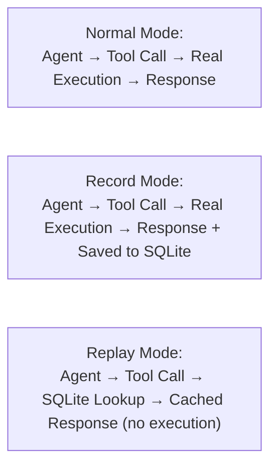

# Replay Mode — Agent Simulation & Replay

> **Introduced in v0.9.0** — Experimental feature. Enable via `toolrecall replay record <name>`.

## What It Is

Replay mode records live tool outputs to SQLite on the first run, then replays them on subsequent runs — enabling **deterministic, offline, zero-cost testing** of agent tool chains.

Think of it like [VCR.py (the HTTP recording library)](https://github.com/kevin1024/vcrpy) for HTTP requests, but for **agent tool calls** (file reads, terminal commands, MCP tool invocations).

## Use Cases

| Use Case | How |
|----------|-----|
| **CI/CD agent tests** | Record a scenario in dev, commit it to git, replay in CI — no network, no API costs, no flakiness |
| **Debugging** | Record the exact tool trace that caused a bug, replay to reproduce deterministically |
| **Demos** | Run a live-looking demo without API keys or network access |
| **Offline development** | Work on an agent on a plane — all tool calls replay from local cache |
| **Bisect tool interactions** | Record a failing scenario, replay with tweaked parameters to find the exact call that broke |

## How It Works



### Recording

Start recording mode, then use your agent normally:

```bash
toolrecall replay record my-scenario
# ... run your agent, make tool calls ...
toolrecall replay stop
```

Every tool call is recorded as a `(tool_name, normalized_args_hash, response)` tuple in the Replay scenarios table. Arguments are normalized (sorted keys, stripped whitespace, removed timestamps/session IDs) so replay matches are broader.

### Replaying

Start replay mode, then use your agent the same way:

```bash
toolrecall replay replay my-scenario
# ... run your agent — matching tool calls are served from cache ...
toolrecall replay stop
```

Tool calls that match a recorded response are served instantly from SQLite — **no real execution, no network, no API costs**. Calls that don't match return a miss (the daemon handles this gracefully).

## CLI Reference

```bash
toolrecall replay record <scenario>    # Start recording mode
toolrecall replay replay <scenario>    # Start replay mode
toolrecall replay stop                 # Stop Replay mode
toolrecall replay status               # Show current Replay mode
toolrecall replay list                 # List recorded scenarios
toolrecall replay show <scenario>      # Show recorded calls
toolrecall replay export <scenario>    # Export as JSON (git-committable)
toolrecall replay import <file.json>   # Import from JSON
toolrecall replay delete <scenario>    # Delete a scenario
```

### Examples

```bash
# Record a debugging session
toolrecall replay record debug-session-1
# ... reproduce the bug ...
toolrecall replay stop

# Export for CI
toolrecall replay export debug-session-1 > tests/fixtures/bug-auth-flow.json

# Import on another machine
toolrecall replay import tests/fixtures/bug-auth-flow.json

# Replay to verify the fix
toolrecall replay replay debug-session-1
# ... run the same steps ...
toolrecall replay stop
```

## JSON Export Format

Exported scenarios are portable JSON that can be committed to git:

```json
{
  "toolrecall_replay_export": true,
  "version": 1,
  "scenario_name": "auth-flow",
  "exported_at": 1760000000.0,
  "call_count": 3,
  "calls": [
    {
      "call_index": 0,
      "tool_name": "cached_read",
      "args": {"path": "/etc/config.yaml"},
      "response": {"output": "key: value", "cached": false}
    },
    {
      "call_index": 1,
      "tool_name": "cached_terminal",
      "args": {"command": "hostname"},
      "response": {"output": "server-01", "exit_code": 0}
    }
  ]
}
```

## Integration with CI/CD

The standard pattern for deterministic agent tests:

```yaml
# .github/workflows/agent-tests.yml
steps:
  - run: pip install toolrecall
  - run: toolrecall daemon start
  - run: toolrecall replay import tests/fixtures/auth-flow.json
  - run: toolrecall replay replay auth-flow
  - run: your-agent-test-command.sh
  - run: toolrecall replay stop
```

Benefits:
- **No API keys needed** in CI — all tool responses are cached
- **No network flakiness** — tests never reach external services
- **Deterministic results** — every run produces the same tool outputs
- **Zero cost** — no LLM API calls, no cloud compute for tool execution

## What Gets Normalized

Arguments are normalized before hashing (same logic as the Cache Key Normalizer):

- **JSON keys sorted** — `{"b":2, "a":1}` → `{"a":1, "b":2}`
- **Whitespace stripped** — `"  /tmp  "` → `"/tmp"`
- **Noise keys removed** — timestamps, session IDs, request IDs, trace IDs, nonces, span IDs, correlation IDs

This means a recorded call with `{"path": "/tmp", "timestamp": "..."}` matches a replay with `{"path": "/tmp", "session_id": "..."}`.

## Technical Details

### Storage

Replay scenarios are stored in the same SQLite database as the regular cache (`~/.toolrecall/cache.db`), in a separate `replay_scenarios` table. They persist across daemon restarts and share the same WAL-mode concurrency.

### Mode State

Replay mode is a **module-level singleton** — `_active` in `toolrecall.replay`. When the daemon processes a tool call, it checks this singleton via `intercept_call()` before executing. This means:

- Replay mode affects **all tool calls** going through the daemon while active
- Mode changes are **instant** — no restart needed
- Recording and replaying are **mutually exclusive** — starting one stops the other

### Data Structure & What's Recorded

### Current recording format

Each tool call is stored as a single row in the `replay_scenarios` table:

| Field | Type | Example |
|-------|------|---------|
| scenario_name | TEXT | `"auth-flow"` |
| call_index | INTEGER | `0`, `1`, `2` |
| tool_name | TEXT | `"cached_read"` |
| args_hash | TEXT | `"a1b2c3d4e5f6g7h8"` |
| args_json | TEXT | `{"path": "/etc/config.yaml"}` |
| response_json | TEXT | `{"output": "key: value", "cached": false}` |
| recorded_at | REAL | `1760000000.0` |

This is a flat list of tool call → response pairs. It's enough for:

- **Deterministic replay** — same tool + same args → same response
- **Debugging** — inspect what was called and what came back
- **Export/import** — portable JSON across machines and CI

### What's NOT recorded (currently)

Replay mode does NOT capture:

- **Turn boundaries** — no concept of agent→assistant→tool→assistant structure
- **Session context** — no prompt, no LLM response, no decision trace
- **Ordering semantics** — calls are indexed sequentially but there's no grouping by turn

For **training agent models** you'd need session-level traces with full turn context. That's the domain of framework-level recording (ADK, LangChain, etc.), not the daemon-level tool cache. The exported JSON is a good building block — it's clean, structured, and can be integrated into a training pipeline, but it's not a training dataset on its own.

## Integration with herdr

[herdr](https://herdr.dev) is a Rust-based terminal multiplexer for managing parallel AI coding agents. ToolRecall integrates with it in two ways:

1. **Via the existing Go client (`tr`)** — Agents running inside herdr can call `tr read`, `tr term`, `tr status` directly from shell. The `tr` binary connects to the ToolRecall daemon via UDS. No Rust plugin needed.

2. **Via MCP bridge** — If herdr agents support MCP, add `toolrecall mcp` as the MCP entry point. All tool calls are transparently cached through the shared multiplexer.

The Go client is already built. No additional Rust or Go code is required to use ToolRecall inside herdr today.

### What's Recorded vs What's Not

| Call Type | Recorded? | Notes |
|-----------|-----------|-------|
| File reads (cached_read) | ✅ | Full content + metadata recorded |
| Terminal commands (cached_terminal) | ✅ | stdout + exit_code recorded |
| MCP tool calls (cached_mcp_check) | ✅ | Full server response recorded |
| Forward proxy responses | ❌ | Not integrated yet |
| File writes (cached_write) | ❌ | State-changing — not recorded |

## Limitations

- **Experimental** — Replay mode is new in v0.9.0. The API may change.
- **Daemon required** — Replay mode intercepts tool calls at the daemon level. Direct SQLite operations bypass replay.
- **No semantic matching** — Replay is exact-hash only (after normalization). A future version may add semantic similarity for broader matches.
- **Forward proxy not recorded** — Replay currently only records tool-level calls, not HTTP API responses through the forward proxy.
- **Model determinism not guaranteed** — Replay caches tool *outputs* but does not control the LLM that drives the agent. For fully deterministic CI runs, pin the agent's model and temperature (`temperature=0`) during replay. Different models or temperatures may produce different agent behaviors even when tool outputs match.
- **Timing-sensitive agents** — Agents that branch on execution time, wall-clock duration, or timestamps may produce different tool sequences on replay. Record/Replay assumes the agent follows the same code path — if the agent's logic diverges (e.g., "if cached: skip" vs "if fresh: run"), unmatched tool calls fall through to real execution.