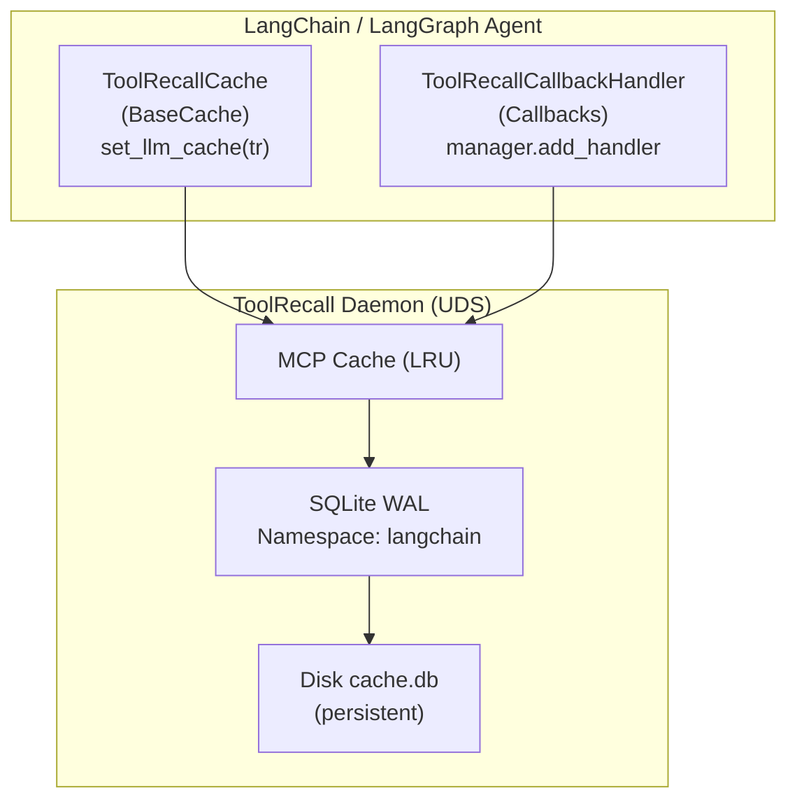

# ToolRecall + LangChain / LangGraph

> **Date:** July 2026 · `langchain-core` v0.3+
> **Principle:** ToolRecall extends LangChain's existing cache abstraction — no framework changes needed.

## Table of Contents

- [Overview](#overview)
- [Installation](#installation)
- [LLM Cache (BaseCache)](#llm-cache-basecache)
- [Tool Cache (Callback Handler)](#tool-cache-callback-handler)
- [LangGraph Support](#langgraph-support)
- [Architecture](#architecture)
- [Comparison: TR vs LangChain's Built-in Caches](#comparison-tr-vs-langchains-built-in-caches)
- [Limitations](#limitations)

---

## Overview

ToolRecall provides two integration points for LangChain:

| Integration | What it caches | Setup |
|------------|---------------|-------|
| **`ToolRecallCache`** (BaseCache) | LLM responses — any provider (OpenAI, Anthropic, local) | `set_llm_cache(ToolRecallCache())` |
| **`ToolRecallCallbackHandler`** | Tool execution results | Add to callback manager |

Both work with LangGraph's state-based execution. The cache is persistent SQLite — survives process restarts and is shared across all agents on the machine.

---

## Installation

```bash
# Option A: Install with LangChain extras
pip install toolrecall[langchain]

# Option B: Install LangChain separately
pip install langchain langchain-core
# ToolRecall adapter auto-detects langchain_core at runtime
```

The adapter module is importable without LangChain installed — it only raises `ImportError` when you actually try to use it. This means `pip install toolrecall` (base) doesn't pull in LangChain.

---

## LLM Cache (BaseCache)

ToolRecall implements LangChain's `BaseCache` interface, so any `set_llm_cache()` call works:

```python
from langchain.globals import set_llm_cache
from toolrecall.adapters.langchain import ToolRecallCache

# One line: every LLM call now checks ToolRecall's SQLite cache first
set_llm_cache(ToolRecallCache())

# Cache hit:  returns instantly, zero tokens consumed
# Cache miss: calls the LLM, stores the result
```

### How it works

- **Key:** `llm:{prompt}:{model_identifier}` — collisions only on identical prompts to the same model
- **Storage:** Namespaced under `"langchain"` server in ToolRecall's MCP cache
- **TTL:** Configurable via `ToolRecallCache(ttl=3600)`. Default: daemon's MCP default (~3600s)
- **Lifecycle:** Survives process restarts — SQLite is persistent

### Full example with any provider

```python
from langchain.globals import set_llm_cache
from langchain_openai import ChatOpenAI
from langchain.schema import HumanMessage
from toolrecall.adapters.langchain import ToolRecallCache

# Enable ToolRecall caching
set_llm_cache(ToolRecallCache())

# First call: cache miss, contacts OpenAI
llm = ChatOpenAI(model="gpt-4")
result1 = llm.invoke([HumanMessage(content="What is the capital of France?")])

# Second call: cache HIT, returns instantly from SQLite
result2 = llm.invoke([HumanMessage(content="What is the capital of France?")])
# result2 is identical to result1, but sub-ms latency and zero API cost
```

---

## Tool Cache (Callback Handler)

For caching tool execution results (function calls), use `ToolRecallCallbackHandler`:

```python
from langchain.callbacks.base import BaseCallbackManager
from toolrecall.adapters.langchain import ToolRecallCallbackHandler

callback = ToolRecallCallbackHandler()
manager = BaseCallbackManager()
manager.add_handler(callback)

# Tool execution results are cached under their tool name + args hash.
# Same tool + same args → cached result from ToolRecall's MCP cache.
```

### What gets cached

- **Tool output** — keyed by tool name + input string hash
- **TTL:** Configurable via `ToolRecallCallbackHandler(ttl=300)`. Default: daemon MCP default
- **Errors are NOT cached** — `on_tool_error` marks the tool as errored, the next call will re-execute

### Combined usage

```python
from langchain.globals import set_llm_cache
from langchain.callbacks.base import BaseCallbackManager
from langchain.agents import AgentExecutor, create_react_agent
from toolrecall.adapters.langchain import ToolRecallCache, ToolRecallCallbackHandler

# Cache LLM responses
set_llm_cache(ToolRecallCache())

# Cache tool execution results
callback = ToolRecallCallbackHandler()
manager = BaseCallbackManager()
manager.add_handler(callback)

# Use in your agent
agent = create_react_agent(llm, tools, prompt)
agent_executor = AgentExecutor(agent=agent, tools=tools, callbacks=[callback])
```

---

## LangGraph Support

ToolRecall works with LangGraph's state-based execution out of the box:

| LangGraph Feature | Works? | How |
|:---|:---:|:---|
| **State checkpointing** | ✅ | ToolRecallCache persists across graph checkpoints — LLM calls are cached regardless of state |
| **Conditional edges** | ✅ | Tool result caching works via callback handler — same edge + same node inputs = cached |
| **Parallel node execution** | ✅ | All nodes share the same daemon — cache hits from one node benefit others |
| **Subgraphs** | ✅ | Parent and child graphs share the same SQLite cache |

No LangGraph-specific code changes needed. Both `ToolRecallCache` and `ToolRecallCallbackHandler` work within any LangGraph node.

### Manual invalidation in a graph

```python
from toolrecall.adapters.langchain import ToolRecallCache

cache = ToolRecallCache()

# In a graph node, clear the LLM cache when state changes significantly:
def process_results(state):
    if state.get("reset_cache"):
        cache.clear()
    # ... rest of the node logic
```

---

## Architecture



Both adapter components talk to the same daemon over the same UDS socket. The daemon manages the SQLite connection — the adapter never opens a direct DB connection, avoiding lock contention. The namespace `"langchain"` separates LangChain cache entries from entries created by other frameworks (ADK) or the shim.

---

## Comparison: TR vs LangChain's Built-in Caches

LangChain ships with several cache backends. Here's how ToolRecall compares:

| Feature | ToolRecallCache | LangChain SQLiteCache | LangChain RedisCache | LangChain InMemoryCache |
|---------|:---------------:|:--------------------:|:--------------------:|:---------------------:|
| **Persistence** | ✅ SQLite WAL | ✅ SQLite | ✅ Redis | ❌ In-memory only |
| **Shared across agents** | ✅ Same daemon, same SQLite | ❌ Per-process | ✅ (if same Redis) | ❌ |
| **Setup complexity** | ⭐ 1 line | ⭐⭐ Schema management | ⭐⭐⭐ Redis infra | ⭐ None |
| **TTL** | ✅ Configurable | ❌ No TTL | ✅ via Redis TTL | ❌ No TTL |
| **Lock contention** | ✅ Daemon-managed | ⚠️ SQLite locking | ✅ Redis handles it | ✅ None |
| **Extra deps** | ❌ Zero (stdlib) | ❌ Zero | ✅ redis-py | ❌ Zero |
| **MCP awareness** | ✅ Can cache MCP tool results | ❌ | ❌ | ❌ |
| **Namespace isolation** | ✅ Per-framework (langchain/adk) | ❌ Single table | ✅ via Redis key prefix | ❌ |

ToolRecall's edge: zero extra dependencies, daemon-managed concurrency, MCP-aware caching, and persistence across process and agent boundaries.

---

## Limitations

1. **Requires running daemon** — ToolRecallCache returns `None` (cache miss) when the daemon isn't reachable. It never blocks or crashes your LangChain agent.
2. **No streaming cache** — LLM streaming responses are not cached. Only `invoke()` (complete response) goes through BaseCache.
3. **Serialization overhead** — Cache hits involve JSON deserialization + ChatGeneration reconstruction. Overhead is ~0.5ms vs a direct in-memory cache, but negligible compared to LLM latency (~1-30s).
4. **Prompt-level granularity** — The cache key is the full prompt string. Minor whitespace differences produce cache misses. Use the ToolRecall normalizer (`[norm].enabled = true`) for deterministic key generation that strips formatting noise.
5. **LangSmith tracing** — Cached LLM responses skip LangSmith's run tracking (they never reach the LLM). Tool calls cached via `ToolRecallCallbackHandler` are tracked normally since the handler wraps the existing tool pipeline.